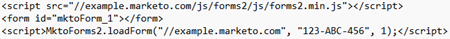

# Instance héritée : liste de contrôle du studio de conception {#inherited-instance-design-studio-checklist}

La structuration des modèles et la création de formulaires globaux, de fragments de code et d’images et de fichiers permettent de minimiser les erreurs de données et de rationaliser le workflow de la création de votre programme. N’oubliez pas de [télécharger les listes de contrôle](/help/marketo/getting-started/inheriting-a-marketo-engage-instance/assets/adobe-marketo-engage-inherited-instance-admin-checklist.xlsx) et de suivre vos progrès.

## Pages de destination {#landing-pages}

<table style="table-layout:auto">
 <tbody>
  <tr>
   <th style="width:20%">Zone</th>
   <th>Vérifier le focus</th>
  </tr>
  <tr>
   <td>Pages de destination internationales</td>
   <td><li>Combien de <a href="/help/marketo/product-docs/demand-generation/landing-pages/understanding-landing-pages/understanding-free-form-vs-guided-landing-pages.md" target="_blank">landing pages</a> globales avez-vous ? Sont-ils utilisés par les programmes?</li>
   <li>Avez-vous un <a href="https://experienceleague.adobe.com/docs/marketo-learn/tutorials/lead-and-data-management/subscription-center-learn.html?lang=fr" target="_blank">centre d’abonnement</a> configuré ?
         Sinon, envisagez d’en créer un.</li></td>
  </tr>
  <tr>
   <td>Modèles</td>
   <td><li>Combien y a-t-il de <a href="/help/marketo/product-docs/demand-generation/landing-pages/landing-page-templates/edit-a-marketo-landing-page-template.md" target="_blank">modèles de page de destination</a> ? Est-ce qu'ils sont utilisés?</li></td>
  </tr>
  <tr>
   <td>Groupes de test</td>
   <td><li>Combien de <a href="/help/marketo/product-docs/demand-generation/landing-pages/understanding-landing-pages/landing-page-test-groups.md" target="_blank">groupes de test de la page de destination</a> sont-ils ? Sont-elles toutes toujours pertinentes ?</li></td>
  </tr>
   <tr>
   <td>Confidentialité et conformité</td>
   <td><li>Toutes vos pages de destination comportent-elles les pieds de page appropriés ?</li></td>
  </tr>
 </tbody>
</table>

## Images et fichiers {#images-and-files}

<table style="table-layout:auto">
 <tbody>
  <tr>
   <th style="width:20%">Zone</th>
   <th>Vérifier le focus</th>
  </tr>
  <tr>
   <td>Conventions de dénomination</td>
   <td><li>Les <a href="/help/marketo/product-docs/demand-generation/images-and-files/add-images-and-files-to-marketo.md" target="_blank">images et fichiers</a> ont-ils des conventions de dénomination cohérentes ?</li></td>
  </tr>
  <tr>
   <td>Structure de dossiers</td>
   <td><li>Les images et les fichiers <a href="/help/marketo/product-docs/demand-generation/images-and-files/organize-your-images-and-files-using-folders.md" target="_blank">organisés de manière appropriée</a> sont-ils faciles à rechercher ?</li></td>
  </tr>
  <tr>
   <td>Images et fichiers</td>
   <td><li>Les images ou fichiers <a href="/help/marketo/product-docs/demand-generation/images-and-files/find-the-url-of-an-uploaded-image-or-file.md" target="_blank">référencés sur les pages web</a> doivent-ils être mis à jour ?
   
Exemple : il se peut que la structure d’URL codée en dur <a href="https://nation.marketo.com/t5/product-documents/upcoming-changes-to-design-studio-urls/ta-p/306632#_Toc54870361" target="_blank">doit être mise à jour</a> comme <code>http://na-sj01.marketo.com/rs/123-ABC-456/images/puppy.png</code>.
   
Contactez votre développeur web pour déterminer où effectuer les mises à jour.</li></td>
  </tr>
 </tbody>
</table>

## Formulaires {#forms}

<table style="table-layout:auto">
 <tbody>
  <tr>
   <th style="width:20%">Zone</th>
   <th>Vérifier le focus</th>
  </tr>
  <tr>
   <td>Formulaires internationaux</td>
   <td><li>Combien y a-t-il de <a href="/help/marketo/product-docs/demand-generation/forms/creating-a-form/create-a-form.md" target="_blank">formulaires</a> globaux ?</li>
<li>La plupart des programmes utilisent-ils des formulaires globaux ou locaux ?</li>
<li>Tous les formulaires collectent-ils les données appropriées pour le marketing et les ventes ?</li>
<li>Les valeurs masquées sont-elles utilisées de manière appropriée ?</li>
<li>Des formulaires Marketo Engage sont-ils utilisés sur des pages de destination autres que Marketo Engage ? Comment sont-ils référencés ?</li>

CONSEIL : mise à jour des pages sur lesquelles vous incorporez des formulaires Marketo Engage avec le nouveau code incorporé introduit (nécessite des pages de destination sécurisées).

</td>
  </tr>
  <tr>
   <td>Normalisation Des Données</td>
   <td><li>Vos <a href="/help/marketo/product-docs/demand-generation/forms/form-fields/add-a-fieldset-to-a-form.md" target="_blank">champs de formulaire</a> sont-ils principalement des listes de sélection ou des champs de texte ouverts ?</li>

CONSEIL : s’il s’agit de champs de texte ouverts, pensez à les remplacer par des listes de sélection pour éviter le désordre des données.</td>
  </tr>
  <tr>
   <td>Confidentialité et conformité</td>
   <td><li>Votre stratégie de formulaire est-elle conforme aux exigences de confidentialité et d’opt-in de vos données d’entreprise ?
         Tenez compte du <a href="https://business.adobe.com/fr/resources/ebooks/the-gdpr-and-the-marketer.html" target="_blank">Règlement général sur la protection des données (RGPD)</a> de la Loi canadienne anti-pourriel (LCAP), du Controlling the Assault of Non-Solicited Pornography and Marketing Act of 2003 (CAN-SPAM), du California Consumer Privacy Act (CCPA), etc., pour la conformité à la réglementation.</li>

CONSEIL : N'oubliez pas de toujours consulter votre équipe juridique sur ces questions. Renseignez-vous auprès de votre équipe au sujet des initiatives précédentes pour maintenir la conformité avant d’apporter des modifications.</td>
  </tr>
 </tbody>
</table>

## E-mails {#emails}

<table style="table-layout:auto">
 <tbody>
  <tr>
   <th style="width:20%">Zone</th>
   <th>Vérifier le focus</th>
  </tr>
  <tr>
   <td>E-mails internationaux</td>
   <td><li>Combien y a-t-il d’e-mails globaux <a href="/help/marketo/product-docs/email-marketing/general/creating-an-email/create-an-email.md" target="_blank">e-mails</a> ? Sont-ils utilisés par les programmes?</li></td>
  </tr>
  <tr>
   <td>Modèles</td>
   <td><li>Combien y a-t-il de <a href="/help/marketo/product-docs/email-marketing/general/email-editor-2/create-an-email-template.md" target="_blank">modèles d’e-mail</a> ? Est-ce qu'ils sont utilisés?</li></td>
  </tr>
  <tr>
   <td>Test d’e-mail</td>
   <td><li>Comment utilisez-vous <a href="/help/marketo/product-docs/email-marketing/email-programs/email-program-actions/email-test-a-b-test/understanding-email-testing-options.md" target="_blank">test d’e-mail</a> ? Votre méthode est-elle toujours efficace ?</li></td>
  </tr>
  </tr>
  <tr>
   <td>Confidentialité et conformité</td>
   <td><li>Tous vos e-mails ont-ils le pied de page approprié ? Prenez le RGPD, la LCAP, le CAN-SPAM, le CCPA, etc. pour les implications de conformité.</li>

CONSEIL : N’oubliez pas de toujours consulter votre équipe juridique sur ces problèmes de conformité. Renseignez-vous auprès de votre équipe au sujet des initiatives précédentes pour maintenir la conformité avant d’apporter des modifications.</td>
  </tr>
 </tbody>
</table>

## Extraits {#snippets}

<table style="table-layout:auto">
 <tbody>
  <tr>
   <th style="width:20%">Zone</th>
   <th>Vérifier le focus</th>
  </tr>
  <tr>
   <td>Extraits</td>
   <td><li>Combien de <a href="/help/marketo/product-docs/personalization/segmentation-and-snippets/snippets/create-a-snippet.md" target="_blank">fragments de code</a> y a-t-il ? Sont-ils utilisés?
         Dans le cas contraire, pensez à les utiliser pour <a href="/help/marketo/product-docs/email-marketing/general/functions-in-the-editor/add-a-snippet-to-an-email.md" target="_blank">e-mail</a> <a href="/help/marketo/product-docs/demand-generation/landing-pages/personalizing-landing-pages/add-a-snippet-to-a-landing-page.md" target="_blank">page de destination</a> contenu du pied de page, logos, etc.</li></td>
  </tr>
 </tbody>
</table>

## Tous les Assets {#all-assets}

<table style="table-layout:auto">
 <tbody>
  <tr>
   <th style="width:20%">Zone</th>
   <th>Vérifier le focus</th>
  </tr>
  <tr>
   <td>Statut de la ressource</td>
   <td><li>Combien de ressources ont le statut <i>Brouillon</i> et <i>Approuvé avec le brouillon</i> (par exemple, <a href="/help/marketo/product-docs/email-marketing/general/creating-an-email/approve-an-email.md" target="_blank">e-mails</a>, <a href="/help/marketo/product-docs/demand-generation/landing-pages/understanding-landing-pages/approve-unapprove-or-delete-a-landing-page.md#approve-a-landing-page" target="_blank">Landing Pages</a>, <a href="/help/marketo/product-docs/demand-generation/forms/creating-a-form/approve-a-form.md" target="_blank">forms</a>, <a href="/help/marketo/product-docs/personalization/segmentation-and-snippets/snippets/approve-a-snippet.md" target="_blank">snippets</a>) ?
         S’il y en a plusieurs, pensez à les supprimer ou à les approuver.</li></td>
  </tr>
  <tr>
   <td>Partage de ressources</td>
   <td><li>Quelles ressources sont <a href="/help/marketo/product-docs/administration/workspaces-and-person-partitions/understanding-workspaces-and-person-partitions.md#sharing-across-workspaces" target="_blank">partagées dans les espaces de travail</a> ?</li>
   
 REMARQUE : il est important de le savoir, car les actions entreprises dans un Workspace peuvent entraîner l’inaccessibilité d’une ressource dans un autre Workspace pour un autre utilisateur.</td>
  </tr>
 </tbody>
</table>
