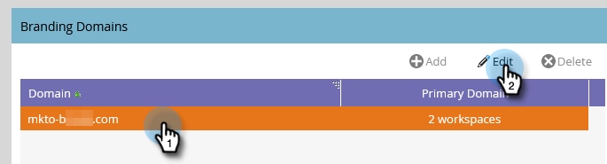

# Étapes de configuration {#setup-steps}

**Bienvenue dans Adobe Marketo Engage !**

Avant de passer à l’utilisation de Marketo, vous devez suivre quelques étapes.

Ces étapes sont les suivantes :

* Configuration de compte de base
* Valorisation de la marque sur vos URL de page de destination et liens d’e-mail pour améliorer la confiance et la délivrabilité
* Synchronisation de votre CRM
* Ajout d’un code de suivi au site web de votre entreprise

>[!NOTE]
>
>Vous ne devez effectuer ces étapes que si votre société **débute avec Marketo**. Si ce n’est pas le cas, la configuration est peut-être déjà terminée.

Certaines étapes nécessitent l’aide de votre équipe informatique.

>[!TIP]
>
>Si vous [imprimez cette liste de contrôle](/help/marketo/getting-started/initial-setup/setup-checklist.md){target="_blank"}, vous pouvez cocher les éléments au fur et à mesure de leur réalisation.

## Connexion et création d’utilisateurs Marketo supplémentaires {#log-in-and-create-additional-marketo-users}

>[!IMPORTANT]
>
>Si votre abonnement Marketo a été créé le/après le 31 juillet 2023 ou a déjà été migré vers [Adobe Identity Management](/help/marketo/product-docs/administration/marketo-with-adobe-identity/adobe-identity-management-overview.md){target="_blank"}, les étapes d’ajout d’un utilisateur décrites ci-dessous ne vous concernent pas. Consultez [cet article](/help/marketo/product-docs/administration/marketo-with-adobe-identity/add-or-remove-a-user.md){target="_blank"} à la place.

Connectez-vous à Marketo [ici](https://app.marketo.com/){target="_blank"} à l’aide des informations d’identification que vous avez reçues par e-mail.

Félicitations ! Vous êtes maintenant dans Marketo et pouvez commencer à explorer. Vous pouvez inviter vos collègues de l’équipe marketing à vous rejoindre. Vous pouvez le faire en ajoutant de nouveaux utilisateurs.

Accédez à la zone **[!UICONTROL Admin]**.

>[!TIP]
>
>Pendant que vous êtes ici, vous pouvez cliquer sur **[!UICONTROL Mon compte]** pour modifier les paramètres de votre compte et de votre emplacement, ainsi que définir un nouveau nom d’abonnement.

>[!NOTE]
>
>**Autorisations d’administrateur requises**

Cliquez sur **[!UICONTROL Utilisateurs et rôles]**.

Cliquez sur **[!UICONTROL Inviter un nouvel utilisateur]**.

Renseignez l’adresse e-mail, le prénom et le nom de votre collègue. _La définition d’une date d’expiration de l’accès est facultative_. Cliquez sur **[!UICONTROL Suivant]**.

>[!TIP]
>
>Une date d’expiration est idéale pour les parties prenantes externes à court terme ou les consultants qui n’ont besoin d’un accès à Marketo que pendant une courte période.

>[!NOTE]
>
>Lorsque la date d’expiration est atteinte, l’utilisateur reçoit une notification d’expiration et le compte est verrouillé.

Sélectionnez un rôle et cliquez sur **[!UICONTROL Suivant]**. Les utilisateurs standard ont accès à toutes les zones, à l’exception de Admin.

>[!NOTE]
>
>Outre les cinq rôles intégrés, vous pouvez également créer des rôles personnalisés. En savoir plus sur [Gestion des rôles utilisateur et des autorisations](/help/marketo/product-docs/administration/users-and-roles/managing-user-roles-and-permissions.md){target="_blank"}.

N’hésitez pas à ajuster le texte de l’invitation. Cliquez sur **Envoyer**.

Le nouvel utilisateur est désormais répertorié dans l’onglet **[!UICONTROL Utilisateurs]** et doit recevoir un e-mail contenant un lien pour créer un mot de passe et un nom d’utilisateur. Prochaine étape !

## Configurer Vos Contacts D’Assistance Autorisés {#set-up-your-authorized-support-contacts}

Vous avez peut-être reçu un e-mail de l’assistance Marketo vous indiquant que vous êtes l’administrateur du service clientèle Marketo de votre société. Si tel est le cas, vous pouvez configurer des **contacts d’assistance autorisés** pour votre équipe. Seuls les contacts d’assistance autorisés peuvent contacter directement le service clientèle de Marketo par le biais du portail d’assistance Marketo [&#128279;](https://support.marketo.com){target="_blank"}.

>[!NOTE]
>
>Le nombre de contacts d’assistance que vous pouvez créer est déterminé par le package que vous avez acheté. Cette limite est spécifiée dans votre e-mail à partir de l’assistance Marketo.

Les documents de contact d’assistance autorisés ont été déplacés vers la communauté Marketo. Voir [cet article](https://nation.marketo.com/t5/Knowledgebase/Managing-Authorized-Support-Contacts/ta-p/254341){target="_blank"}.

>[!NOTE]
>
>Seules les personnes qui se sont connectées à la communauté Marketo apparaissent dans la liste. Si vous ne trouvez pas la personne, assurez-vous qu’elle se connecte d’abord à la communauté .

## Personnaliser vos URL de page de destination avec un CNAME {#customize-your-landing-page-urls-with-a-cname}

>[!NOTE]
>
>Êtes-vous client ou cliente d’un pack de lancement ? Vous pouvez ignorer cette étape. Votre consultant vous fournira un document d’instructions de configuration informatique lors de votre appel de lancement.

>[!NOTE]
>
>**Autorisations d’administrateur requises**

Choisissez un CNAME pour vos pages de destination. Voici quelques exemples :

    * **go**.[CompanyDomain].com
    * **www2**.[CompanyDomain].com
    * **lp**.[CompanyDomain].com

>[!TIP]
>
>Sois bref ! Les URL plus courtes sont plus faciles à mémoriser. Nous suggérons d’utiliser le domaine « go ».

La première partie (en gras) est la `[LandingPageCNAME]`. Vous en aurez besoin à l&#39;étape 5.

Pour récupérer l’identifiant Munchkin que vous allez remplacer par le CNAME de votre page de destination, accédez à la zone Admin .

Cliquez sur **Mon compte**.

Copiez la [!UICONTROL Chaîne de compte] depuis les paramètres de la page de destination.

C&#39;est le `[Munchkin ID]`. Enregistrez-le. Vous devrez le donner au service informatique à l&#39;étape 5.

Configurez les paramètres de votre domaine afin que les pages de destination utilisent le domaine de votre société au lieu de Marketo (où elles sont hébergées).

## Garantir la délivrabilité des e-mails {#ensure-email-deliverability}

>[!NOTE]
>
>Êtes-vous client ou cliente d’un pack de lancement ? Vous pouvez ignorer cette étape. Votre consultant vous fournira un document d’instructions de configuration informatique lors de votre appel de lancement.

Vous pouvez prendre plusieurs mesures pour vous assurer que les e-mails atteignent le plus grand nombre possible de vos utilisateurs.

* **Marque de vos liens de suivi**. Vous pouvez choisir un CNAME pour utiliser votre propre domaine (au lieu du Marketo) dans les liens que vous incluez dans les e-mails provenant de Marketo. Cela renforce l’image de marque de votre domaine et accroît la confiance et la délivrabilité avec vos destinataires.
* **Ajouter Marketo placer sur la liste autorisée à l’e-mail d’entreprise** Il est recommandé d’envoyer des e-mails de test à vos comptes de test avant d’envoyer des e-mails à des personnes réelles. Placer sur la liste autorisée En utilisant Marketo, vous pouvez empêcher le blocage de ces e-mails de test ou leur marquage comme spam.
* **Configurez SPF et DKIM.** Ces technologies garantissent à vos destinataires que vos e-mails Marketo ne sont pas du spam. Pour empêcher les filtres de spam des destinataires de rejeter vos e-mails Marketo, procédez comme suit pour [Configurer un SPF et un DKIM pour la délivrabilité de vos e-mails](/help/marketo/product-docs/email-marketing/deliverability/set-up-spf-and-dkim-for-your-email-deliverability.md).
* **Configurer un enregistrement MX pour votre domaine.** Un enregistrement MX vous permet de recevoir des e-mails du domaine depuis lequel vous envoyez des e-mails afin de traiter les réponses et les répondeurs automatiques. Si vous effectuez un envoi à partir de votre domaine d’entreprise, il est probable que vous ayez déjà configuré ce paramètre. Sinon, vous pouvez généralement configurer pour qu’il soit mappé à l’enregistrement MX de votre domaine d’entreprise.
* **Paramètres recommandés pour l’adresse d’expédition.** Vous devez utiliser un domaine d’e-mail valide, existant et fonctionnel dans l’adresse d’expédition dans toutes les campagnes par e-mail. Il peut s’avérer bénéfique de configurer un sous-domaine de votre domaine d’entreprise plutôt que d’effectuer des envois à partir de votre domaine d’entreprise. Vous aurez ainsi la garantie que les problèmes de votre flux de messagerie d&#39;entreprise n&#39;auront pas d&#39;impact sur votre flux de messagerie Marketo et vice versa. De plus, l’envoi d’e-mails à partir de `something@nonexistentdomain.com` entraîne le filtrage ou le blocage des e-mails. Tout domaine utilisé dans l&#39;adresse d&#39;expédition de l&#39;expéditeur doit disposer d&#39;un compte de maître de poste@ et d&#39;abus@ valide et fonctionnel.

Si vous utilisez des applications Google pour héberger les e-mails de votre entreprise, vous ne pourrez pas créer d&#39;e-mails « abus » ou « maître de poste » sous votre domaine. Pour contourner ce problème, vous devez créer des groupes nommés « abus » et « maître de poste ». Les utilisateurs qui sont membres de ces groupes recevront des e-mails envoyés à ces adresses (par exemple, <postmaster@domain.com>). Vous trouverez des instructions détaillées sur la création de groupes [ici](https://support.google.com/a/answer/33343#adminconsole){target="_blank"}.

Choisissez un CNAME pour les liens de tracking e-mail (choisissez-en un _différent_ à partir du CNAME de la page de destination que vous avez choisi à l’étape 3). Voici quelques exemples :

* allez-y2.[CompanyDomain].com
* em.[CompanyDomain].com
* wow.[CompanyDomain].com

La première partie est le CNAME de tracking e-mail, `[EmailTrackingCNAME]`. Vous devrez le donner au service informatique à l’étape 5.

>[!CAUTION]
>
>Les CNAME d’e-mail et de page de destination doivent être différents. Évitez également les CNAME tels que « suivi » ou « lien ». Il est souvent marqué comme spam

Pour trouver votre lien de tracking Marketo, accédez à la zone **[!UICONTROL Admin]**.

Cliquez sur **[!UICONTROL Email]**.

Copiez le [!UICONTROL lien de suivi] à partir des paramètres d’e-mail.

Le [!UICONTROL lien de suivi] se présente sous la forme : `mkto-[a-z][4 digits].com`.

C&#39;est votre `[MktoTrackingLink]`. Enregistrez-le. Vous devrez le donner au service informatique à l&#39;étape 5.

Collectez les domaines « De ». Créez une liste de tous les domaines « De » (comme dans `[Sender]@[FromDomain].com`) que vous prévoyez d’utiliser pour envoyer des e-mails à partir de Marketo. Pour la plupart, il n&#39;y en a qu&#39;un.

Par exemple, « marketo.com », « info.marketo.com ». Il s’agit de `[FromDomain1]`,`[FromDomain2]`, etc. Enregistrez-les. Vous devrez les donner au service informatique à l&#39;étape 5.

Vous disposez maintenant de toutes les informations nécessaires pour envoyer votre demande au service informatique !

## Demander au service informatique de configurer les protocoles {#ask-it-to-configure-protocols}

>[!NOTE]
>
>Êtes-vous client ou cliente d’un pack de lancement ? Vous pouvez ignorer cette étape. Votre consultant vous fournira un document d’instructions de configuration informatique lors de votre appel de lancement.

Une fois que vous avez rassemblé toutes les informations nécessaires, vous êtes prêt à envoyer une demande au service informatique. Vous pouvez utiliser le texte ci-dessous comme modèle, en remplaçant le texte en gras par vos propres informations.

[Incluez un lien vers cet article](/help/marketo/getting-started/initial-setup/configure-protocols-for-marketo.md).

Collez ce texte dans l’e-mail et remplacez les espaces réservés en gras :

>[!NOTE]
>
>Reportez-vous aux étapes 3 et 4 ci-dessus pour déterminer le texte à remplacer par les espaces réservés. Souvenez-vous que `[LandingPageCNAME]` et `[EmailTrackingCNAME]` doivent être différents.

`----------------------------------------------`

Cher Administrateur informatique,

Notre équipe marketing utilise désormais la plateforme Marketo pour communiquer avec nos équipes. Pour garantir une délivrabilité optimale des e-mails, nous devons effectuer les modifications suivantes :

`1)` Pour nos landing pages, ajoutez une entrée DNS (CNAME) pour **[LandingPageCNAME]**.**[CompanyDomain]**.com, pointant vers **[Munchkin ID]**.mktoweb.com.

`2)` Pour nos liens de tracking dans les emails, ajoutez une Entrée DNS (CNAME) pour **[EmailTrackingCNAME]**.**[CompanyDomain]**.com, pointant vers **[MktoTrackingLink]**.

placer sur la liste autorisée `3)` Marketo.

    * Si nous utilisons des adresses IP dans notre Place sur la liste autorisée e-mail, ajoutez les adresses IP répertoriées ci-dessous :
    199.15.212.0/22
    
    192.28.144.0/20
    
    192.28.160.0/19
    
    185.28.196.0/22
    
    130.248.172.0/24
    
    130.248.173.0/24
    
    103.237.104.0/22
    
    94.236.119.0/26

>[!NOTE]
>
>Contactez l’assistance Marketo si vous souhaitez obtenir une liste abrégée d’adresses IP à placer sur la liste autorisée spécifique à votre environnement.

    * Si notre système anti-spam utilise des domaines From, ajoutez-les :

**`[FromDomain1]`**
**`[FromDomain2]`**

`4)` Nous devons configurer SPF et DKIM pour que Marketo soit autorisé à envoyer des e-mails signés en notre nom.

`a.` Pour configurer SPF, ajoutez la ligne suivante à vos entrées DNS :

EN TXT **[À partir du domaine]** : v=spf1 mx ip4:**[IP d’entreprise)]**
 include: mktomail.com ~all

Si nous avons déjà un enregistrement SPF existant dans notre entrée DNS, ajoutez simplement ce qui suit :

include:mktomail.com

`[`Remplacez **De domaine** par votre adresse e-mail de domaine (company.com, par exemple) et **CorpIP** par l’adresse IP du serveur de messagerie de votre entreprise (255.255.255.255, par exemple).  Si vous prévoyez d’envoyer des e-mails à partir de plusieurs domaines via Marketo, demandez à votre personnel informatique d’ajouter cette ligne pour chaque domaine (sur une seule ligne).`]`

`b.` Pour DKIM, créez des enregistrements de ressources DNS pour chaque domaine que nous voulons configurer. Vous trouverez ci-dessous les enregistrements d’hôtes et les valeurs TXT pour chaque domaine pour lequel nous allons signer :

**`[DKIMDomain1]`** : l’enregistrement hôte est **`[HostRecord1]`** et la valeur TXT est **[TXTValue1]**.

**`[DKIMDomain2]`** : l’enregistrement hôte est **`[HostRecord2]`** et la valeur TXT est **`[TXTValue2]`**.

`[`Copiez les **HostRecord** et **TXTValue** pour chaque **DKIMDomain** que vous avez configuré après avoir suivi les [instructions ici](/help/marketo/product-docs/email-marketing/deliverability/set-up-a-custom-dkim-signature.md). N’oubliez pas de vérifier chaque domaine dans **Admin > Email > DKIM** une fois que votre personnel informatique a terminé cette étape.`]`

`5)` Nous devons nous assurer qu’il existe un enregistrement MX valide pour nos domaines FROM **[FromDomain1]**, **[FromDomain2]**, etc. Pouvez-vous confirmer ? Si ce n’est pas le cas, configurez pour mapper à notre enregistrement MX de domaine d’entreprise. Nous pourrons ainsi traiter les réponses/répondeurs automatiques à nos publipostages Marketo.

Prévenez-moi lorsque vous avez terminé ces étapes, afin que je puisse terminer le processus de configuration avec Marketo.

Merci ! Tu es le meilleur !

Amour,

**`[Your Name]`**

`----------------------------------------------`

Envoyez l’e-mail au service informatique. Nous comprenons que le service informatique peut prendre un certain temps pour effectuer ces tâches. Vous pouvez passer à l’étape 7, mais n’oubliez pas que vous devez revenir à l’étape 6 pour terminer la configuration de Marketo.

## Terminez la configuration de Marketo une fois l’ingénierie informatique terminée. {#complete-your-marketo-setup-after-it-finishes}

Une fois que le service informatique a terminé ses tâches, procédez comme suit pour ajouter vos CNAME de page de destination et d’e-mail, et pour activer la signature DKIM.

Accédez à la zone **[!UICONTROL Admin]** pour ajouter votre page de destination CNAME.

Sélectionnez Pages de destination et cliquez sur **[!UICONTROL Modifier]** dans la zone [!UICONTROL Paramètres].

Saisissez votre nouveau nom de domaine dans le champ **[!UICONTROL Nom de domaine pour les landing pages]**. Elle doit se présenter comme suit :

`[LandingPageCNAME].[CompanyDomain].com`

Dans le champ **[!UICONTROL Page de secours]**, saisissez l’URL à laquelle les personnes doivent accéder si une page de destination n’est pas disponible. Vous pouvez utiliser la page d’accueil de votre entreprise si vous ne disposez pas d’une page de secours. Dans le champ **[!UICONTROL Page d’accueil]**, saisissez le site web de votre société.

Dans la zone [!UICONTROL Admin], sélectionnez **[!UICONTROL E-mail]** pour ajouter votre CNAME d’e-mail

Faites défiler jusqu’à [!UICONTROL Domaines de marque]. Sélectionnez votre domaine et cliquez sur **[!UICONTROL Modifier]**.

Dans le champ Domaine , saisissez votre domaine de tracking e-mail. Elle doit se présenter comme suit :

`[EmailTrackingCNAME].[CompanyDomain].com`. Cliquez sur **[!UICONTROL Enregistrer]**

## Intégration de votre CRM {#integrate-your-crm}

Il s’agit probablement de l’étape la plus passionnante de votre configuration. Il est temps de remplir Marketo avec tous les prospects et contacts que vous avez stockés dans votre CRM.

Choisissez l’une des options suivantes, en fonction du CRM utilisé par votre entreprise.

    * [Intégrer Marketo à  [!DNL Salesforce.com]](/help/marketo/product-docs/crm-sync/salesforce-sync/understanding-the-salesforce-sync.md)
    * [Intégrer Marketo à  [!DNL Microsoft Dynamics]](/help/marketo/product-docs/crm-sync/microsoft-dynamics-sync/understanding-the-microsoft-dynamics-sync.md)

>[!NOTE]
>
>Vous avez besoin de l’aide de l’administrateur CRM de votre entreprise pour effectuer ces étapes.

## Ajout d’un code de suivi à votre site web {#add-tracking-code-to-your-website}

>[!NOTE]
>
>Êtes-vous un client [!DNL Launch Pack] ? Vous pouvez ignorer cette étape. Votre consultant vous fournira des instructions de code [!DNL Munchkin] dans votre document d’instructions de configuration informatique.

Marketo dispose d’un JavaScript de suivi personnalisé ([!DNL Munchkin]) que vous pouvez utiliser pour effectuer le suivi des activités des personnes sur n’importe quelle page web. [!DNL Munchkin] est nécessaire pour intégrer votre site web dans Marketo. Pour [Ajouter [!DNL Munchkin] code de suivi à votre site web](/help/marketo/product-docs/administration/additional-integrations/add-munchkin-tracking-code-to-your-website.md){target="_blank"}, procédez comme suit.

>[!NOTE]
>
>Expérience avec HTML requise pour ajouter le code de suivi.

## Attentes en matière de performances {#performance-expectations}

À quoi pouvez-vous vous attendre en termes de performances de la part de Marketo ? Elle peut varier en fonction de la taille et de la complexité de vos campagnes marketing. Mais vous pouvez vous attendre à des niveaux de performances comparables à ceux indiqués dans la colonne « Standard » de plusieurs tableaux figurant dans la description du produit [Marketo Engage](https://helpx.adobe.com/legal/product-descriptions/adobe-marketo-engage---product-description.html){target="_blank"}. Les colonnes « Performances » et « Performance Plus » font référence aux packages de niveau de performances qui fournissent des [niveaux de performances supérieurs](https://nation.marketo.com/t5/product-documents/marketo-engage-performance-tiers/ta-p/328835){target="_blank"}.

Toutes vos étapes de configuration sont terminées. Il ne reste plus qu’à plonger et utiliser Marketo !
