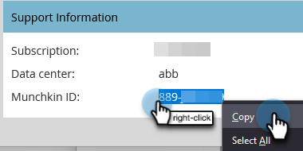

# Étapes de configuration {#setup-steps}

**Bienvenue dans Adobe Marketo Engage !**

Avant d’utiliser Marketo, vous devez effectuer quelques étapes.

Ces étapes incluent :

* Configuration de compte de base
* Identifier les URL de votre landing page et les liens des emails pour améliorer la confiance et la délivrabilité
* Synchronisation de votre CRM
* Ajout de code de suivi au site web de votre entreprise

>[!NOTE]
>
>Vous devez effectuer ces étapes uniquement si votre société est **nouvel accès à Marketo**. Si ce n’est pas le cas, la configuration peut déjà être effectuée.

Certaines étapes nécessitent l’aide de votre équipe informatique.

>[!TIP]
>
>Si vous [imprimer cette liste de contrôle](/help/marketo/getting-started/initial-setup/setup-checklist.md){target="_blank"}, vous pouvez désactiver des éléments lorsque vous les terminez.

## Connexion et création d’utilisateurs Marketo supplémentaires {#log-in-and-create-additional-marketo-users}

>[!IMPORTANT]
>
>Si votre abonnement Marketo a été créé le 31 juillet 2023 ou a déjà été migré vers [Adobe Identity Management](/help/marketo/product-docs/administration/marketo-with-adobe-identity/adobe-identity-management-overview.md){target="_blank"}, the steps for adding a user outlined below will not apply to you. Please see [this article](/help/marketo/product-docs/administration/marketo-with-adobe-identity/add-or-remove-a-user.md){target="_blank"} au lieu de .

Connexion à Marketo [here](https://app.marketo.com/){target="_blank"} à l’aide des informations d’identification que vous avez reçues par courrier électronique.

Félicitations ! Vous êtes maintenant dans Marketo et pouvez commencer à explorer. Vous pouvez inviter vos collègues de l’équipe marketing à vous rejoindre. Pour ce faire, ajoutez de nouveaux utilisateurs.

Accédez au **[!UICONTROL Administration]** zone.

>[!TIP]
>
>Lorsque vous êtes ici, vous pouvez cliquer sur **[!UICONTROL Mon compte]** pour modifier les paramètres de votre compte et de votre emplacement, ainsi qu’un nouveau nom d’abonnement.

>[!NOTE]
>
>**Autorisations d’administrateur requises**

Cliquez sur **[!UICONTROL Utilisateurs et rôles]**.

Cliquez sur **[!UICONTROL Inviter un nouvel utilisateur]**.

Renseignez l’adresse électronique, le prénom et le nom de votre collègue. _La définition d’une date d’expiration d’accès est facultative._. Cliquez sur **[!UICONTROL Suivant]**.

>[!TIP]
>
>Une date d’expiration est idéale pour les parties prenantes externes à court terme ou les consultants qui n’ont besoin de l’accès à Marketo que pour une courte période.

>[!NOTE]
>
>Lorsque la date d’expiration arrive, l’utilisateur reçoit une notification d’expiration et le compte est verrouillé.

Sélectionnez un rôle et cliquez sur **[!UICONTROL Suivant]**. Les utilisateurs standard ont accès à toutes les zones, à l’exception d’Admin.

>[!NOTE]
>
>Outre les cinq rôles intégrés, vous pouvez également créer des rôles personnalisés. En savoir plus sur [Gestion des rôles et des autorisations des utilisateurs](/help/marketo/product-docs/administration/users-and-roles/managing-user-roles-and-permissions.md){target="_blank"}.

N’hésitez pas à modifier le texte de l’invitation. Cliquez sur **Envoyer**.

Le nouvel utilisateur est maintenant répertorié dans la variable **[!UICONTROL Utilisateurs]** et doit recevoir un courrier électronique contenant un lien pour créer un mot de passe et un identifiant. Étape suivante !

## Configuration des contacts d’assistance autorisés {#set-up-your-authorized-support-contacts}

Vous avez peut-être reçu un courrier électronique du service clientèle de Marketo vous indiquant que vous êtes l’administrateur du service clientèle de Marketo pour votre entreprise. Si tel est le cas, vous pouvez configurer **contacts d’assistance autorisés** pour votre équipe. Seuls les contacts d’assistance autorisés peuvent contacter le service clientèle de Marketo directement via la [Portail d’assistance Marketo](https://support.marketo.com){target="_blank"}.

>[!NOTE]
>
>Le nombre de contacts d’assistance que vous pouvez créer est déterminé par le package que vous avez acheté. Cette limite est spécifiée dans votre email auprès du support Marketo.

Les documents de contact de l’assistance autorisés ont été déplacés dans la communauté Marketo. Veuillez consulter [cet article](https://nation.marketo.com/t5/Knowledgebase/Managing-Authorized-Support-Contacts/ta-p/254341){target="_blank"}.

>[!NOTE]
>
>Seules les personnes qui se sont connectées à la communauté Marketo apparaissent dans la liste. Si vous ne trouvez pas la personne, assurez-vous qu’elle se connecte d’abord à la communauté.

## Personnalisation des URL de votre page d’entrée avec un CNAME {#customize-your-landing-page-urls-with-a-cname}

>[!NOTE]
>
>Êtes-vous client de Launch Pack ? Vous pouvez ignorer cette étape. Votre consultant vous fournira un document d’instructions de configuration informatique pendant votre appel de lancement.

>[!NOTE]
>
>**Autorisations d’administrateur requises**

Sélectionnez un CNAME pour vos landing pages. Quelques exemples :

    * **go**.[CompanyDomain].com
    * **www2**.[CompanyDomain].com
    * **lp**.[CompanyDomain].com

>[!TIP]
>
>Reste court ! Les URL plus courtes sont plus faciles à mémoriser. Nous suggérons &quot;go&quot; comme domaine.

La première partie (en gras) est la `[LandingPageCNAME]`. Vous en aurez besoin à l’étape 5.

Pour récupérer l’ID Munchkin que vous allez remplacer par votre CNAME de page d’entrée, accédez à la zone d’administration.

Cliquez sur **Mon compte**.

Copiez le [!UICONTROL Chaîne de compte] dans les paramètres de la landing page.

Il s’agit de la variable `[Munchkin ID]`. Enregistrez-le. Vous devrez le donner au service informatique à l’étape 5.

Configurez les paramètres de votre domaine de sorte que les landing pages utilisent le domaine de votre entreprise au lieu de Marketo (où elles sont hébergées).

## Assurer la délivrabilité des emails {#ensure-email-deliverability}

>[!NOTE]
>
>Êtes-vous client de Launch Pack ? Vous pouvez ignorer cette étape. Votre consultant vous fournira un document d’instructions de configuration informatique pendant votre appel de lancement.

Vous pouvez prendre plusieurs mesures pour vous assurer que les emails atteignent le plus grand nombre possible de vos destinataires.

* **Marque vos liens de suivi**. Vous pouvez choisir un CNAME pour utiliser votre propre domaine (au lieu de Marketo) dans les liens que vous incluez dans les courriers électroniques de Marketo. Cela renforce la marque de votre domaine et accroît la confiance et la délivrabilité de vos destinataires.
* **Ajoutez Marketo à la liste autorisée de messagerie de votre entreprise.** Il est recommandé d’envoyer des emails de test à vos comptes de test avant d’envoyer des emails à des personnes réelles. En plaçant sur la liste autorisée Marketo, vous pouvez empêcher que ces emails de test ne soient bloqués ou marqués comme spam.
* **Configurez SPF et DKIM.** Ces technologies assurent vos destinataires que vos emails Marketo ne sont pas des spams. Pour empêcher les filtres anti-spam des destinataires de rejeter les emails Marketo, procédez comme suit pour [Configuration d’un SPF et DKIM pour la délivrabilité de vos emails](/help/marketo/product-docs/email-marketing/deliverability/set-up-spf-and-dkim-for-your-email-deliverability.md).
* **Configurez un enregistrement MX pour votre domaine.** Un enregistrement MX vous permet de recevoir du courrier électronique vers le domaine à partir duquel vous envoyez le courrier électronique pour traiter les réponses et les réponses automatiques. Si vous envoyez depuis votre domaine d’entreprise, il est probable que celui-ci soit déjà configuré. Si ce n’est pas le cas, vous pouvez généralement configurer pour mapper l’enregistrement MX de votre domaine d’entreprise.
* **Paramètres recommandés pour l’adresse de l’expéditeur.** Vous devez utiliser un domaine d’adresse électronique valide, existant et opérationnel dans l’ adresse de l’expéditeur de toutes les campagnes par e-mail. Il peut être bénéfique de configurer un sous-domaine de votre domaine d’entreprise plutôt que de l’envoyer depuis votre domaine d’entreprise. Cela permet de s’assurer que les problèmes provenant de votre flux de messagerie d’entreprise n’ont pas d’incidence sur votre flux de messagerie Marketo et vice versa. De plus, envoyer du courrier depuis `something@nonexistentdomain.com` entraînera le filtrage ou le blocage des emails. Tout domaine utilisé dans l’adresse de l’expéditeur doit disposer d’un compte Postmaster@ et abuse@ valide.

Si vous utilisez les applications Google pour héberger votre adresse électronique d’entreprise, vous ne pourrez pas créer d’adresse électronique abuse@ ou postmaster@ sous votre domaine. Pour contourner ce problème, vous devez créer des groupes nommés &quot;abus&quot; et &quot;postmaster&quot;. Les utilisateurs membres de ces groupes recevront des emails envoyés à ces adresses (par exemple, postmaster@domain.com). Vous trouverez des instructions détaillées sur la création de groupes. [here](https://support.google.com/a/answer/33343#adminconsole){target="_blank"}.

Choisissez un CNAME pour les liens de suivi des emails (choisissez un CNAME) _différent_ à partir du CNAME de la page d’entrée que vous avez choisi à l’étape 3). Quelques exemples :

* go2.[CompanyDomain].com
* em.[CompanyDomain].com
* wow.[CompanyDomain].com

La première partie est le CNAME de tracking des emails, `[EmailTrackingCNAME]`. Vous devrez le donner au service informatique à l’étape 5.

>[!CAUTION]
>
>Les CNAME de courrier électronique et de page d’entrée doivent être différents. Évitez également les CNAME tels que &quot;track&quot; ou &quot;link&quot;. Il est souvent signalé comme indésirable

Pour trouver votre lien de suivi Marketo, accédez au **[!UICONTROL Administration]** zone.

Cliquez sur **[!UICONTROL Email]**.

Copiez le [!UICONTROL Lien de suivi] de vos paramètres de courrier électronique.

La variable [!UICONTROL Lien de suivi] est au format : `mkto-[a-z][4 digits].com`.

C&#39;est votre `[MktoTrackingLink]`. Enregistrez-le. Vous devrez le donner au service informatique à l’étape 5.

Collectez les domaines &quot;From&quot;. Liste de tous les domaines &quot;De&quot; (comme dans, `[Sender]@[FromDomain].com`) que vous prévoyez d’utiliser pour envoyer des emails à partir de Marketo. Pour la plupart, il n&#39;y en a qu&#39;un.

Par exemple, &quot;marketo.com&quot;, &quot;info.marketo.com&quot;. Voici les `[FromDomain1]`,`[FromDomain2]`, etc. Enregistrez-les. Vous devrez les transmettre à l’informatique à l’étape 5.

Vous disposez maintenant de toutes les informations dont vous avez besoin pour envoyer votre demande à l’informatique !

## Demander à l’informatique de configurer des protocoles {#ask-it-to-configure-protocols}

>[!NOTE]
>
>Êtes-vous client de Launch Pack ? Vous pouvez ignorer cette étape. Votre consultant vous fournira un document d’instructions de configuration informatique pendant votre appel de lancement.

Une fois que vous avez collecté toutes les informations nécessaires, vous êtes prêt à envoyer une demande au service informatique. Vous pouvez utiliser le texte ci-dessous comme modèle, en remplaçant le texte en gras par vos propres informations.

[Inclure un lien vers cet article](/help/marketo/getting-started/setup/configure-protocols-for-marketo.md).

Collez ce texte dans l’email et remplacez les espaces réservés en gras :

>[!NOTE]
>
>Voir les étapes 3 et 4 ci-dessus pour déterminer le texte à remplacer par les espaces réservés. N’oubliez pas que `[LandingPageCNAME]` et `[EmailTrackingCNAME]` doit être différent.

`----------------------------------------------`

Cher administrateur informatique génial,

Notre équipe marketing utilise désormais la plateforme Marketo pour communiquer avec nos clients. Pour garantir une bonne délivrabilité des emails, nous devons apporter les modifications suivantes :

`1)` Pour nos landing pages, ajoutez une entrée DNS (CNAME) pour **[LandingPageCNAME]**.**[CompanyDomain]**.com, pointant vers **[Munchkin ID]**.mktoweb.com.

`2)` Pour nos liens de suivi dans les emails, ajoutez une entrée DNS (CNAME) pour **[EmailTrackingCNAME]**.**[CompanyDomain]**.com, pointant vers **[MktoTrackingLink]**.

`3)` Placez sur la liste autorisée Marketo.

    * Si nous utilisons des adresses IP dans notre Liste autorisée de courriel, ajoutez les adresses IP répertoriées ci-dessous :
    199.15.212.0/22
    
    192.28.144.0/20
    
    192.28.160.0/19
    
    185.28.196.0/22
    
    130.248.172.0/24
    
    130.248.173.0/24
    
    103.237.104.0/22
    
    94.236.119.0/26

>[!NOTE]
>
>Contactez l’assistance Marketo si vous souhaitez obtenir une liste abrégée d’adresses IP à placer sur la liste autorisée spécifique à votre environnement.

    * Si notre système anti-spam utilise les domaines From, ajoutez ces éléments :

**`[FromDomain1]`**
**`[FromDomain2]`**

`4)` Nous devons configurer SPF et DKIM afin que Marketo soit autorisé à envoyer des emails signés en notre nom.

`a.` Pour configurer SPF, ajoutez la ligne suivante à nos entrées DNS :

DANS TXT **[De domaine]**: v=spf1 mx ip4 :**[IP d’entreprise]**
 include : mktomail.com ~all

Si nous avons déjà un enregistrement SPF existant dans notre entrée DNS, ajoutez-y simplement les éléments suivants :

include:mktomail.com

`[`Remplacer **De domaine** avec votre adresse électronique de domaine (ex : company.com) et **CorpIP** avec l’adresse IP de votre serveur de messagerie d’entreprise (ex : 255.255.255.255).  Si vous allez envoyer des emails à partir de plusieurs domaines via Marketo, votre personnel informatique doit ajouter cette ligne pour chaque domaine (sur une seule ligne).`]`

`b.` Pour DKIM, créez des enregistrements de ressource DNS pour chaque domaine que nous souhaitons configurer. Vous trouverez ci-dessous les enregistrements d’hôte et les valeurs TXT pour chaque domaine pour lequel nous allons signer :

**`[DKIMDomain1]`**: l’enregistrement de l’hôte **`[HostRecord1]`** et la valeur TXT est **[TXTValue1]**.

**`[DKIMDomain2]`**: l’enregistrement de l’hôte **`[HostRecord2]`** et la valeur TXT est **`[TXTValue2]`**.

`[`Copiez le **HostRecord** et **TXTValue** pour chaque **DKIMDome** après avoir suivi la [instructions ici](/help/marketo/product-docs/email-marketing/deliverability/set-up-a-custom-dkim-signature.md). N’oubliez pas de vérifier chaque domaine dans **Admin > Email > DKIM** une fois que votre personnel informatique a terminé cette étape.`]`

`5)` Nous devons nous assurer qu’il existe un enregistrement MX valide pour nos domaines FROM **[FromDomain1]**, **[FromDomain2]**, etc. Pouvez-vous confirmer ? Si ce n’est pas le cas, configurez pour mapper à notre enregistrement MX de domaine d’entreprise. Cela nous permettra de traiter les réponses/réponses aux messages Marketo.

Faites-moi savoir quand vous avez terminé ces étapes, de sorte que je puisse terminer le processus de configuration avec Marketo.

Merci ! Tu es la meilleure !

L&#39;amour,

**`[Your Name]`**

`----------------------------------------------`

Envoyez l’e-mail au service informatique. Nous comprenons qu’il peut s’écouler un certain temps avant que l’informatique puisse réaliser ces tâches. Vous pouvez passer à l’étape 7, mais n’oubliez pas que vous devez renvoyer l’étape 6 pour terminer la configuration de Marketo.

## Terminer la configuration de Marketo une fois l’informatique terminée {#complete-your-marketo-setup-after-it-finishes}

Une fois les tâches du service informatique terminées, procédez comme suit pour ajouter votre landing page et vos CNAME de messagerie, et activer la signature DKIM.

Accédez au **[!UICONTROL Administration]** zone pour ajouter votre CNAME de page d’entrée

Sélectionnez Landing Pages , puis cliquez sur **[!UICONTROL Modifier]** dans le [!UICONTROL Paramètres] zone.

Entrez votre nouveau nom de domaine dans le champ . **[!UICONTROL Nom de domaine pour les pages d’entrée]**. Cela doit se présenter comme suit :

`[LandingPageCNAME].[CompanyDomain].com`

Dans le **[!UICONTROL Secours]** , saisissez l’URL à laquelle vous souhaitez que les utilisateurs accèdent en cas d’indisponibilité d’une landing page. Vous pouvez utiliser la page d’accueil de votre société si vous ne disposez pas d’une page de secours. Dans le **[!UICONTROL Page d’accueil]** , saisissez le site web de votre société.

Dans le [!UICONTROL Administration] zone, sélectionnez **[!UICONTROL Email]** pour ajouter votre CNAME de messagerie

Faites défiler jusqu’à [!UICONTROL Domaines de marque]. Sélectionnez votre domaine et cliquez sur **[!UICONTROL Modifier]**.

Dans le champ Domaine , saisissez votre domaine de tracking email. Cela doit se présenter comme suit :

`[EmailTrackingCNAME].[CompanyDomain].com`. Cliquez sur **[!UICONTROL Enregistrer]**.

## Intégration de votre CRM {#integrate-your-crm}

C’est probablement l’étape la plus passionnante de votre configuration. Il est temps de remplir Marketo avec tous les contacts et prospects que vous avez stockés dans votre CRM !

Choisissez l’un des éléments suivants, en fonction du CRM utilisé par votre entreprise.

    * [Intégration de Marketo avec [!DNL Salesforce.com]](/help/marketo/product-docs/crm-sync/salesforce-sync/understanding-the-salesforce-sync.md)
    * [Intégration de Marketo avec [!DNL Microsoft Dynamics]](/help/marketo/product-docs/crm-sync/microsoft-dynamics-sync/understanding-the-microsoft-dynamics-sync.md)

>[!NOTE]
>
>Pour effectuer ces étapes, vous avez besoin de l’aide de l’administrateur CRM de votre entreprise.

## Ajout du code de suivi à votre site web {#add-tracking-code-to-your-website}

>[!NOTE]
>
>Êtes-vous un [!DNL Launch Pack] client ? Vous pouvez ignorer cette étape. Votre conseiller vous fournira [!DNL Munchkin] instructions de code dans le document d’instructions de configuration informatique.

Marketo possède un code JavaScript de suivi personnalisé (appelé [!DNL Munchkin]) que vous pouvez utiliser pour effectuer le suivi des activités de personnes sur n’importe quelle page web. [!DNL Munchkin] est nécessaire pour intégrer votre site web à Marketo. Suivez ces étapes pour [Ajouter [!DNL Munchkin] Code de suivi sur votre site web](/help/marketo/product-docs/administration/additional-integrations/add-munchkin-tracking-code-to-your-website.md){target="_blank"}.

>[!NOTE]
>
>Expérience avec HTML requise pour ajouter le code de suivi.

## Attentes en termes de performances {#performance-expectations}

À quoi pouvez-vous vous attendre en termes de performances de Marketo ? Il peut varier en fonction de la taille et de la complexité de vos campagnes marketing. Mais vous pouvez vous attendre à des niveaux de performance équivalents à ceux décrits dans la colonne &quot;Standard&quot; de plusieurs des tableaux figurant dans la variable [Description du produit Marketo Engage](https://helpx.adobe.com/legal/product-descriptions/adobe-marketo-engage---product-description.html){target="_blank"}. The "Performance" and "Performance Plus" columns refer to performance tier packages that provide [higher performance levels](https://nation.marketo.com/t5/product-documents/marketo-engage-performance-tiers/ta-p/328835){target="_blank"}.

Toutes les étapes de configuration sont terminées. Il ne reste plus qu&#39;à plonger et à utiliser Marketo !
