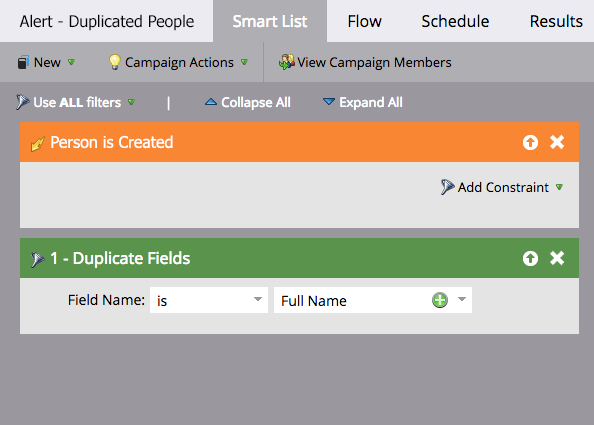
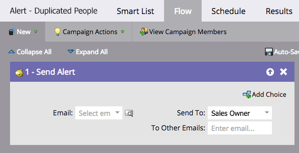
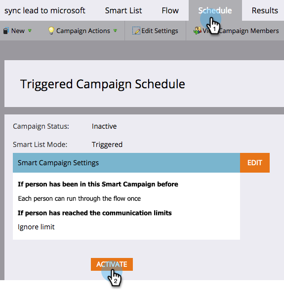

# Automatiser une alerte de personnes potentiellement en double {#automate-an-alert-for-possible-duplicate-people}

Vous souhaitez recevoir une alerte chaque fois qu’un doublon est créé ? Voici comment configurer une campagne intelligente pour y parvenir.

1. [Créer une campagne intelligente](/help/marketo/product-docs/core-marketo-concepts/smart-campaigns/creating-a-smart-campaign/create-a-new-smart-campaign.md){target="_blank"}. Définissez la liste dynamique suivante :

* Déclencheur : **[!UICONTROL Personne créée]**
* Filtre : **[!UICONTROL champs en double]**. Nom du champ **[!UICONTROL is] [!UICONTROL Nom complet]**

  

  >[!TIP]
  >
  >Faites preuve de créativité. Testez différents champs pour obtenir de meilleurs résultats de filtrage.

1. À l’étape de flux, choisissez l’action de flux [[!UICONTROL Envoyer l’alerte]](/help/marketo/product-docs/core-marketo-concepts/smart-campaigns/flow-actions/send-alert.md){target="_blank"}.

   

   >[!TIP]
   >
   >Utilisation du [jeton Envoyer les informations d’alerte](/help/marketo/product-docs/email-marketing/general/using-tokens/use-the-send-alert-info-token.md){target="_blank"} pour inclure un lien vers la personne dans votre CRM.

   >[!CAUTION]
   >
   >Si vous importez une liste volumineuse, vous risquez de recevoir un grand nombre de ces alertes en même temps.
   >
   >De plus, deux personnes portant le même nom ne signifient pas automatiquement qu’elles sont la même personne.

1. Activez la campagne dans l&#39;onglet **[!UICONTROL Planning]**.

   

Cette campagne dynamique se déclenche chaque fois qu’une nouvelle personne portant un nom complet existant est créée dans Marketo.

>[!MORELIKETHIS]
>
>[Rechercher et fusionner des personnes en double](/help/marketo/product-docs/core-marketo-concepts/smart-lists-and-static-lists/managing-people-in-smart-lists/find-and-merge-duplicate-people.md){target="_blank"}
