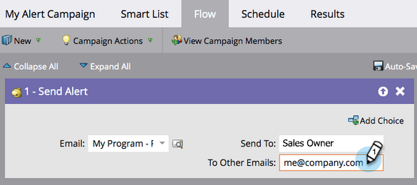
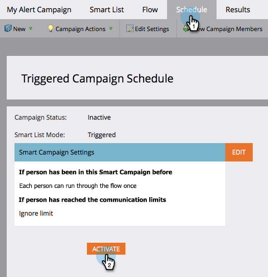

# Prévenir un représentant commercial {#alert-the-sales-rep}

## Mission : Alerter le représentant commercial lorsqu&#39;une personne remplit un formulaire sur votre site Web {#mission-alert-the-sales-rep-when-a-person-fills-out-a-form-on-your-web-site}

Pour envoyer automatiquement des e-mails d’alerte aux représentants commerciaux, vous avez besoin d’un e-mail d’alerte et d’une campagne par e-mail. Voici comment procéder.

>[!PREREQUISITES]
>
>[ Page de destination avec un formulaire ](/help/marketo/getting-started/quick-wins/landing-page-with-a-form.md){target="_blank"}

## Étape 1 : créer un e-mail d’alerte {#step-create-an-alert-email}

1. Accédez à la zone **[!UICONTROL Activités marketing]**.

   

1. Sélectionnez **Mon programme** que vous avez créé dans le [Page de destination avec un formulaire](/help/marketo/getting-started/quick-wins/landing-page-with-a-form.md){target="_blank"} pour un gain rapide, puis sous **[!UICONTROL Nouveau]** cliquez sur **[!UICONTROL Nouvelle ressource locale]**.

   

1. Cliquez sur **[!UICONTROL Email]**.

   

1. **Nom** dans l’e-mail « Mon alerte par e-mail », sélectionnez un modèle, puis cliquez sur **[!UICONTROL Créer]**.

   

1. Saisissez les **Nom de l&#39;expéditeur**, **E-mail de l&#39;expéditeur**, **[!UICONTROL Réponse]** et **[!UICONTROL Objet]** que votre équipe commerciale doit consulter.

   

1. Double-cliquez pour modifier le texte de l’e-mail.

   

1. Saisissez le contenu de l’e-mail.

   

1. Placez le curseur à l&#39;endroit où vous souhaitez insérer les coordonnées de la personne, puis cliquez sur l&#39;icône **Insérer un jeton**.

   

1. Recherchez et sélectionnez le `{{SP_Send_Alert_Info}}` **[!UICONTROL Jeton]**, puis cliquez sur **[!UICONTROL Insérer]**.

   

   >[!NOTE]
   >
   >{{SP_Send_Alert_Info}} est un jeton spécial pour les e-mails d’alerte. Pour en savoir plus, voir [ Utilisation du jeton d’envoi d’informations d’alerte ](/help/marketo/product-docs/email-marketing/general/using-tokens/use-the-send-alert-info-token.md){target="_blank"}{target="_blank"}.

1. Cliquez sur **[!UICONTROL Enregistrer]**.

   

1. Cliquez sur la liste déroulante **[!UICONTROL Actions liées à l’e-mail]** et sélectionnez **[!UICONTROL Approuver et fermer]**.

   

## Étape 2 : créer une campagne de déclenchement d’alerte {#step-create-an-alert-trigger-campaign}

1. Sélectionnez **Mon programme** créé précédemment, puis sous **[!UICONTROL Nouveau]** cliquez sur **[!UICONTROL Nouvelle campagne intelligente]**.

   

1. **Nommez** la campagne « Ma campagne d&#39;alerte » et cliquez sur **[!UICONTROL Créer]**.

   

1. Sous l’onglet **[!UICONTROL Liste dynamique]**, recherchez et faites glisser le déclencheur **[!UICONTROL Remplit le formulaire]** vers la zone de travail.

   

1. Sélectionnez le formulaire que nous avons créé précédemment.

   

1. Sous l’onglet **[!UICONTROL Flux]**, recherchez et faites glisser l’action de flux **[!UICONTROL Envoyer l’alerte]** vers la zone de travail.

   

1. Sélectionnez **[!UICONTROL Mon e-mail d’alerte]** créé précédemment et conservez **[!UICONTROL Envoyer à]** en tant que **[!UICONTROL Propriétaire des ventes]**.

   

1. Saisissez votre adresse e-mail dans le champ **[!UICONTROL À d’autres e-mails]**.

   

1. Accédez à l’onglet **[!UICONTROL Planning]** et cliquez sur le bouton **[!UICONTROL Activer]**.

   

   >[!TIP]
   >
   >Définissez la variable **[!UICONTROL Règles de qualification]** sur **[!UICONTROL à chaque fois]** (en modifiant la campagne intelligente) pour permettre à la même personne de déclencher des alertes plusieurs fois.

1. Cliquez sur **[!UICONTROL Activer]** dans l’écran de confirmation.

   

## Étape 3 : Testez-La ! {#step-test-it-out}

1. Sélectionnez votre page de destination et cliquez sur **[!UICONTROL Afficher la page approuvée]**.

   

   >[!NOTE]
   >
   >N’oubliez pas d’approuver les pages de destination ; elles ne sont pas mises en ligne tant qu’elles ne sont pas approuvées.

1. Remplissez le formulaire et cliquez sur **[!UICONTROL Envoyer]**.

   

1. Vous devriez recevoir votre e-mail sous peu. Une fois que vous avez vérifié que tout fonctionne comme prévu, supprimez votre adresse e-mail du flux Envoyer une alerte (voir l’étape 2.7 ci-dessus).

   >[!NOTE]
   >
   >Cliquez sur l’onglet **[!UICONTROL Informations sur la personne]** dans Marketo pour afficher les informations de contact.

## Mission terminée ! {#mission-complete}

  

[◄ Mission 7 : Personnaliser un e-mail](/help/marketo/getting-started/quick-wins/personalize-an-email.md)

[Mission 9 : Mettre à jour les ► de données sur les personnes](/help/marketo/getting-started/quick-wins/update-person-data.md)
