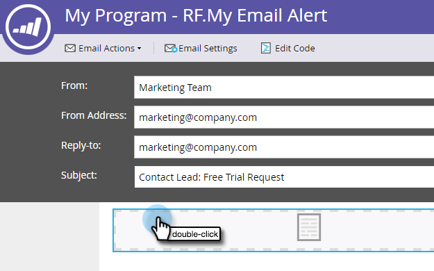
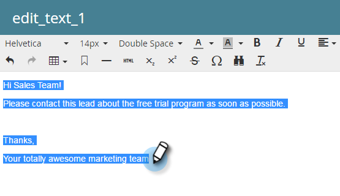
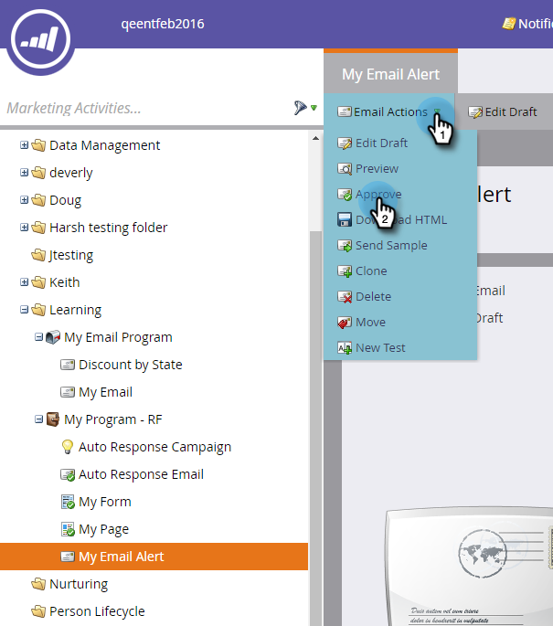

# Alerter le représentant commercial {#alert-the-sales-rep}

## Mission : Alerter le représentant commercial lorsqu&#39;une personne remplit un formulaire sur votre site Web {#mission-alert-the-sales-rep-when-a-person-fills-out-a-form-on-your-web-site}

Pour envoyer automatiquement des e-mails d&#39;alerte aux représentants commerciaux, il vous suffit d&#39;envoyer un courriel d&#39;alerte et une campagne par courriel. Voici comment le faire.

>[!NOTE]
>
>**FYI**
>
>Marketo est maintenant en train de normaliser la langue dans tous les abonnements. Vous pouvez donc voir des pistes dans votre abonnement et des personnes/personnes dans docs.marketo.com. Ces termes signifient la même chose ; cela n&#39;a aucune incidence sur les instructions relatives aux articles. Il y a aussi d&#39;autres changements. [En savoir plus](http://docs.marketo.com/display/DOCS/Updates+to+Marketo+Terminology).

>[!PREREQUISITES]
>
>* [landing page avec un formulaire](landing-page-with-a-form.md)

>

## Étape 1 : Créer un courriel d’alerte {#step-create-an-alert-email}

1. Accédez à la zone Activités **** marketing.

   

1. Sélectionnez **Mon Programme** que vous avez créé dans le [Landing page avec un formulaire](landing-page-with-a-form.md) Quick win, puis sous **Nouveau** , cliquez sur **Nouveau fichier local.**

   

1. Cliquez sur **Courriel**.

   

1. **Nommez** le courrier électronique &quot;Mon alerte par courriel&quot;, sélectionnez un modèle et cliquez sur **Créer**.

   

1. Saisissez le nom **** de l&#39;équipe commerciale **, le** courriel **, la** réponse à **et lesujet que votre équipe commerciale doit consulter.**

   

1. Cliquez sur le doublon pour modifier le texte du courrier électronique.

   

1. Tapez le contenu du message.

   

1. Placez le curseur à l’endroit où vous souhaitez insérer les coordonnées de la personne et cliquez sur l’icône **Insérer un jeton** .

   

1. Recherchez et sélectionnez le `{{SP_Send_Alert_Info}}`**jeton** , puis cliquez sur **Insérer**.

   

   >[!NOTE]
   >
   >{{SP_Send_Alert_Info}} est un jeton spécial pour les messages d&#39;alerte. Voir [Utilisation du jeton](../../product-docs/email-marketing/general/using-tokens/use-the-send-alert-info-token.md) Envoyer des informations d’alerte pour en savoir plus.

1. Cliquez sur **Enregistrer**.

   

1. Fermez l’onglet/la fenêtre de l’éditeur de courrier électronique.

   

1. Sous Actions **** par courriel, cliquez sur **Approuver**.

   

## Étape 2 : Création d’un déclencheur d’alerte Campaign {#step-create-an-alert-trigger-campaign}

1. Sélectionnez **Mon Programme** créé précédemment, puis sous **Nouveau **cliquez sur **Nouveau Campaign** dynamique.

   

1. **Nommez** la campagne &quot;My Alert Campaign&quot;, puis cliquez sur **Create**.

   

1. Sous l’onglet Liste **** intelligente, recherchez et faites glisser le déclencheur **Remplir le formulaire** sur le canevas.

   

1. Sélectionnez le formulaire que nous avons créé précédemment.

   

1. Sous l&#39;onglet **Flux** , recherchez et faites glisser l&#39;action de flux **Envoyer une alerte** sur la trame.

   

1. Sélectionnez **Mon e-mail** d&#39;alerte créé précédemment et laissez **Envoyer à** en tant que **** vendeur.

   

1. Tapez votre adresse électronique dans le champ **À d’autres adresses électroniques** .

   

1. Accédez à l&#39;onglet **Planification** et cliquez sur le bouton **Activer **bouton.

   

   >[!TIP]
   >
   >
   >Définissez les règles **de** qualification sur à **chaque fois** (en modifiant la Campaign intelligente) pour permettre à la même personne de déclencher des alertes à plusieurs reprises.

1. Cliquez sur **Activer** dans l’écran de confirmation.

   

## Étape 3 : Testez-Le ! {#step-test-it-out}

1. Sélectionnez votre landing page et cliquez sur Page **approuvée** Vue.

   

   >[!NOTE]
   >
   >**Rappel**
   >
   >
   >N&#39;oubliez pas d&#39;approuver les landings page ; ils ne sont pas en direct avant d&#39;être approuvés.

1. Renseignez le formulaire et cliquez sur **Envoyer**.

   

1. Vous devriez recevoir votre courriel sous peu. Une fois que vous avez vérifié que tout fonctionne comme il se doit, supprimez votre adresse électronique du flux Envoyer l&#39;alerte (voir l&#39;étape 2.7 ci-dessus).

   >[!NOTE]
   >
   >Cliquez sur l’onglet Informations **** personnelles dans Marketing pour afficher les coordonnées.

## Mission terminée ! {#mission-complete}

  

[Mission 7 : Personnaliser une](personalize-an-email.md) mission de courriel [9 : Mettre à jour les données de piste ►](update-person-data.md)