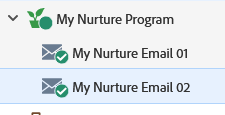

# Marketing goutte à goutte et fidélisation {#drip-drip-nurture}

## Mission : Nouer les personnes qui ont assisté à votre récente exposition {#mission-nurture-the-people-who-attended-your-recent-tradeshow}

Vous pouvez facilement créer un système d’alimentation avancé et sophistiqué dans Marketo. Voilà comment !

>[!PREREQUISITES]
>
>* [Configuration et ajout d’une personne](/help/marketo/getting-started/quick-wins/get-set-up-and-add-a-person.md){target=&quot;_blank&quot;}
>* [Importation d’une liste de personnes](/help/marketo/getting-started/quick-wins/import-a-list-of-people.md){target=&quot;_blank&quot;}

## Étape 1 : Création d’un programme d’engagement {#step-create-an-engagement-program}

1. Accédez au **Activités marketing** zone.

   

1. Sélectionnez la **Formation** , cliquez sur le dossier **Nouveau** et sélectionnez **Nouveau programme**.

   

1. Saisissez un **Nom** et sélectionnez **Engagement** pour le **Type de programme**.

   

1. Assurez-vous que la variable **Canal** est **Infirmière** et cliquez sur **Créer**.

   

   Vous avez maintenant créé un programme d’engagement.

## Étape 2 : Créer un e-mail {#step-create-an-email}

1. Sélectionnez votre programme d’engagement, puis cliquez sur **Nouveau** et sélectionnez **Nouvelle ressource locale**.

   

1. Cliquez sur **Email**.

   

1. Saisissez un **Nom**, sélectionnez la variable **Modèle** à utiliser, puis cliquez sur **Créer**.

   

   >[!NOTE]
   >
   >Vous ne voyez pas l’éditeur d’email ? Votre navigateur a probablement bloqué la fenêtre. Activation des fenêtres contextuelles à partir de `app.marketo.com` dans votre navigateur, puis cliquez sur **Modifier le brouillon** dans la barre de menu supérieure.

1. Saisissez un objet.

   

1. Sélectionnez la zone de l&#39;email à modifier, cliquez sur l&#39;icône d&#39;engrenage et sélectionnez **Modifier**.

   

1. Modifiez votre email et cliquez sur **Enregistrer**.

   

1. Sous **Actions de courrier électronique**, cliquez sur **Approuver et fermer**.

   

   >[!NOTE]
   >
   >N&#39;oubliez pas de valider vos emails, sinon vous ne pourrez pas les activer plus tard.

1. Créez maintenant un autre email en répétant les actions des étapes 2 à 7.

   

## Étape 3 : Ajout de contenu à votre diffusion {#step-add-content-to-your-stream}

Il est maintenant temps de créer un flux de contenu pour votre programme d’engagement à l’aide des emails que vous avez créés.

1. Sélectionnez votre programme d’engagement et cliquez sur le bouton **Flux** .

   

1. Cliquez sur le bouton **Ajouter du contenu** dans le flux.

   

   >[!TIP]
   >
   >Vous pouvez également utiliser la variable **+** icône .

1. Laissez le type &quot;Email&quot; sélectionné. Recherchez et sélectionnez les deux emails que vous avez créés.

   

## Étape 4 : Activation du contenu de diffusion {#step-activate-stream-content}

1. Activez tout le contenu à la fois en cliquant sur l’icône d’engrenage de la diffusion, puis cliquez sur **Activer tout le contenu**.

   

   >[!NOTE]
   >
   >Vous ne pouvez pas activer le contenu sans d’abord l’approuver.

   Bon travail ! Une étape de plus et le programme d&#39;engagement est prêt.

## Étape 5 : Définition de l’cadence de diffusion {#step-set-the-stream-cadence}

1. Cliquez sur **Définition de la cadence de diffusion**.

   

1. Modifiez les paramètres pour qu’ils correspondent à la planification souhaitée, puis cliquez sur **Enregistrer**.

   

   Votre programme d&#39;engagement est prêt. Ajoutons maintenant une personne test à votre programme.

   >[!NOTE]
   >
   >La personne test est la personne qui vérifie votre programme d’engagement pour vérifier que c’est correct avant de l’envoyer aux clients.

## Étape 6 : Ajout d’une personne test à votre programme d’engagement {#step-add-a-test-person-to-your-engagement-program}

1. Accédez au **Base** zone.

   

1. Recherchez votre personne chargée du test.

   

   >[!NOTE]
   >
   >Assurez-vous que la personne effectuant le test possède une adresse électronique valide afin que vous puissiez confirmer la réception des emails lors du test.

1. Cliquez avec le bouton droit sur la personne, puis cliquez sur **Programmes** et **Ajout au programme Engagement**.

   

1. Sélectionnez votre **Programme** et **Diffusion**, puis cliquez sur **Exécuter maintenant**.

   

1. Mission accomplie!

1. Vous devriez recevoir un courrier électronique à l’heure et à la cadence que vous avez spécifiées.

   >[!NOTE]
   >
   >En savoir plus sur [Programmes d&#39;engagement](/help/marketo/product-docs/email-marketing/drip-nurturing/creating-an-engagement-program/understanding-engagement-programs.md){target=&quot;_blank&quot;}.

## Mission accomplie! {#mission-complete}

  

[◄ Mission 5 : Importation d’une liste de personnes](/help/marketo/getting-started/quick-wins/import-a-list-of-people.md)

[Mission 7 : Personnaliser un e-mail ►](/help/marketo/getting-started/quick-wins/personalize-an-email.md)
