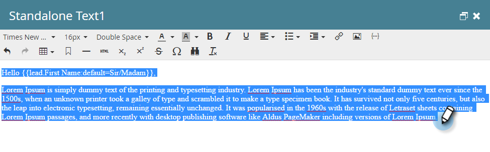
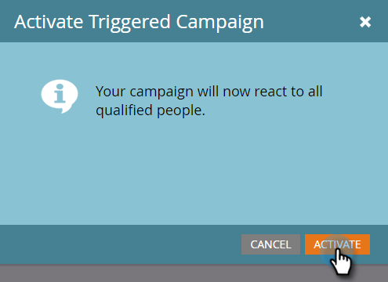

# Réponse automatique du courriel {#email-auto-response}

## Mission : Envoyer un e-mail de remerciement lorsqu’une personne remplit un formulaire {#mission-send-out-a-thank-you-email-when-a-person-fills-out-a-form}

>[!NOTE]
>
>**FYI**
>
>Marketo est maintenant en train de normaliser la langue dans tous les abonnements. Vous pouvez donc voir des pistes dans votre abonnement et des personnes/personnes dans docs.marketo.com. Ces termes signifient la même chose ; cela n&#39;a aucune incidence sur les instructions relatives aux articles. Il y a aussi d&#39;autres changements. [En savoir plus](http://docs.marketo.com/display/DOCS/Updates+to+Marketo+Terminology).

>[!NOTE]
>
>**Conditions préalables**
>
>* [Configurer et Ajouter une personne](get-set-up-and-add-a-person.md)
>* [landing page avec un formulaire](landing-page-with-a-form.md)

>

## Étape 1 : Créer un courriel {#step-create-an-email}

1. Accédez à la zone Activités marketing.

   

1. Sélectionnez Mon Programme dans le menu de gauche, cliquez sur la liste déroulante Nouveau, puis sélectionnez Nouveau fichier local.

   

1. Cliquez sur Courriel.

   

1. Nommez votre adresse électronique &quot;Courriel de réponse automatique&quot;, choisissez un modèle et cliquez sur Créer.

   

   Un éditeur de courrier électronique s’ouvre dans une nouvelle fenêtre ou un nouvel onglet. Si les fenêtres contextuelles sont bloquées, cliquez sur** Modifier le brouillon** sur la page de résumé des ressources pour accéder au courrier électronique.

1. Entrez un objet, puis cliquez sur la zone modifiable du courrier électronique en maintenant le doublon enfoncé.

   

   Un éditeur de texte enrichi s’ouvre au-dessus de l’éditeur de courrier électronique.

1. Mettez en surbrillance le contenu du courrier électronique existant.

   

1. Saisissez votre contenu de courrier électronique et cliquez sur Enregistrer.

   

1. Vos modifications sont enregistrées automatiquement. Fermez l’onglet/la fenêtre de l’éditeur de courrier électronique.

   

1. Sélectionnez votre nouveau courriel. Sous Actions par courrier électronique, cliquez sur Approuver.

   

## Étape 2 : Créer une Campaign intelligente {#step-create-a-smart-campaign}

1. Cliquez avec le bouton droit sur **Mon Programme** et cliquez sur **Nouvelle Campaign** intelligente.

   

1. **Nommez** votre campagne &quot;Campaign de réponse automatique&quot; et cliquez sur **Créer**.

   

1. Accédez à l&#39;onglet **Smart Liste **.

   

   Nous configurons cette campagne pour qu’elle s’exécute chaque fois qu’une personne remplit le formulaire que vous avez créé en [**Landing page avec un formulaire**](landing-page-with-a-form.md).

1. Recherchez et faites glisser le déclencheur **Remplir le formulaire** sur le canevas de gauche.

   

1. Sélectionnez **Mon formulaire** dans la liste déroulante. Cliquez sur l&#39;onglet **Flux **.

   

1. Faites glisser l&#39;action **Envoyer un e-mail **flow vers le canevas de gauche.

   

1. Sélectionnez votre courriel **de réponse** automatique et accédez à l&#39;onglet **Planification **onglet.

   

1. Cliquez sur **Modifier**.

   
Sélectionnez chaque fois et cliquez sur Enregistrer.
   

1. Cliquez sur **Activer**.

   

1. Cliquez sur **Activer **dans l’écran de confirmation.

   

>[!NOTE]
>
>Une fois principale, cette campagne s’exécute chaque fois qu’une personne remplit le formulaire spécifié. La campagne continue à s’exécuter jusqu’à ce qu’elle soit désactivée.

## Étape 3 : Remplir le formulaire {#step-fill-out-the-form}

1. Sélectionnez **Ma page**. Cette opération a été créée dans le [Landing page avec une victoire rapide sur le formulaire](landing-page-with-a-form.md) .

   

1. Cliquez sur Page **Approuvée** Vue.

   

   Votre landing page &quot;Essai gratuit&quot; s’ouvre dans un nouvel onglet.

1. Renseignez le formulaire avec votre prénom, votre nom et votre adresse électronique, puis cliquez sur **Envoyer**.

   

>[!NOTE]
>
>Veillez à utiliser votre adresse électronique réelle pour obtenir le courriel.

## Fin de la mission {#mission-complete}

En quelques minutes, vous devriez voir le courriel de réponse automatique dans votre boîte de réception. Super boulot !

  

[Mission 3 : Score simple](simple-scoring.md) [Mission 5 : Importer une Liste de pistes ►](import-a-list-of-people.md)