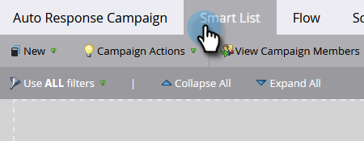
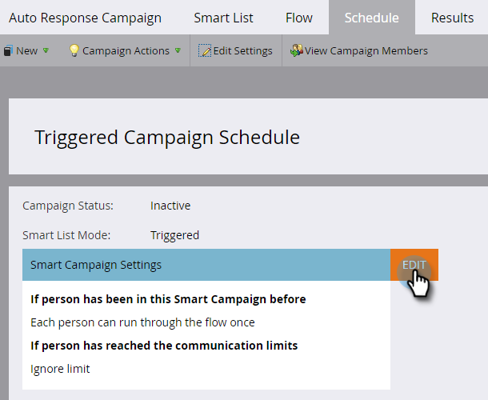

# E-mail à réponse automatique {#email-auto-response}

## Mission : envoyer un e-mail de remerciements quand une personne remplit un formulaire. {#mission-send-out-a-thank-you-email-when-a-person-fills-out-a-form}

>[!PREREQUISITES]
>
>* [Préparer sa configuration et ajouter une personne](/help/marketo/getting-started/quick-wins/get-set-up-and-add-a-person.md){target="_blank"}
>* [Page de destination avec un formulaire](/help/marketo/getting-started/quick-wins/landing-page-with-a-form.md){target="_blank"}

## Étape 1 : créer un e-mail {#step-create-an-email}

1. Accédez à la zone [!UICONTROL Activités marketing].

   

1. Sélectionnez votre programme dans le menu de gauche, cliquez sur le menu déroulant **[!UICONTROL Nouveau]**, puis sélectionnez **[!UICONTROL Nouvelle ressource locale]**.

   

1. Sélectionnez **[!UICONTROL E-mail]**.

   

1. Nommez votre e-mail « E-mail de réponse automatique », choisissez un modèle, puis cliquez sur **[!UICONTROL Créer]**.

   

   Un éditeur d’e-mail s’ouvre dans une nouvelle fenêtre ou un nouvel onglet. Si les fenêtres contextuelles sont bloquées, cliquez sur **[!UICONTROL Modifier le brouillon]** sur la page de résumé de la ressource pour accéder à l’e-mail.

1. Saisissez l’objet, puis double-cliquez sur la zone modifiable de l’e-mail.

   

   _Un éditeur de texte enrichi s’ouvre au-dessus de l’éditeur d’e-mail._

1. Mettez en surbrillance le contenu de l’e-mail existant.

   

1. Saisissez le contenu de l’e-mail, puis cliquez sur **[!UICONTROL Enregistrer]**.

   

1. Cliquez sur la liste déroulante **[!UICONTROL Actions d’e-mail]** et sélectionnez **[!UICONTROL Approuver et fermer]**.

   

## Étape 2 : créer une campagne intelligente {#step-create-a-smart-campaign}

1. Sélectionnez votre programme, cliquez sur la liste déroulante **[!UICONTROL Nouveau]** et sélectionnez **[!UICONTROL Nouvelle campagne intelligente]**.

   

1. **Nommez** votre campagne intelligente « Campagne de réponse automatique », puis cliquez sur **[!UICONTROL Créer]**.

   

1. Accédez à l’onglet **[!UICONTROL Liste intelligente]**.

   

   Nous mettons en place cette campagne afin qu’elle soit exécutée chaque fois qu’une personne remplit le formulaire que vous avez créé dans [**Page de destination avec un formulaire**](/help/marketo/getting-started/quick-wins/landing-page-with-a-form.md){target="_blank"}.

1. Recherchez le déclencheur **[!UICONTROL Remplit le formulaire]** et faites-le glisser vers la zone de travail.

   

1. Sélectionnez **[!UICONTROL Mon formulaire]** dans la liste déroulante. Cliquez ensuite sur l’onglet **[!UICONTROL Flux]**.

   

1. Faites glisser l’action de flux **[!UICONTROL Envoyer un e-mail]** vers l’espace de travail de gauche.

   

1. Sélectionnez votre **E-mail de réponse automatique**. Cliquez ensuite sur l’onglet **[!UICONTROL Planifier]**.

   

1. Cliquez sur **[!UICONTROL Modifier]**.

   

1. Sélectionnez **[!UICONTROL à chaque fois]** et cliquez sur **[!UICONTROL Enregistrer]**.

   

1. Cliquez sur **[!UICONTROL Activer]**.

   

1. Cliquez sur **[!UICONTROL Activer]** sur l’écran de confirmation.

   

>[!NOTE]
>
>Une fois activée, cette campagne s’exécutera chaque fois qu’un lead remplit le formulaire spécifié. La campagne sera opérationnelle jusqu’à ce qu’elle soit désactivée.

## Étape 3 : remplir le formulaire {#step-fill-out-the-form}

1. Sélectionnez **Ma page** (celle-ci a été créée dans la solution rapide [Page de destination avec un formulaire](/help/marketo/getting-started/quick-wins/landing-page-with-a-form.md){target="_blank"}) et cliquez sur **[!UICONTROL Aperçu]**.

   

   _Votre page de destination « Essai gratuit » s’ouvre dans un nouvel onglet._

1. Remplissez le formulaire avec votre prénom, votre nom et votre adresse e-mail, puis cliquez sur **[!UICONTROL Envoyer]**.

   

>[!NOTE]
>
>Indiquez une adresse e-mail valide pour être sûr de bien recevoir l&#39;e-mail.

## Mission accomplie {#mission-complete}

En quelques minutes, l’e-mail de réponse automatique devrait s’afficher dans votre boîte de réception.

[◄ Mission 3 : évaluation simple](/help/marketo/getting-started/quick-wins/simple-scoring.md)

[Mission 5 : importer une liste de personnes ►](/help/marketo/getting-started/quick-wins/import-a-list-of-people.md)
