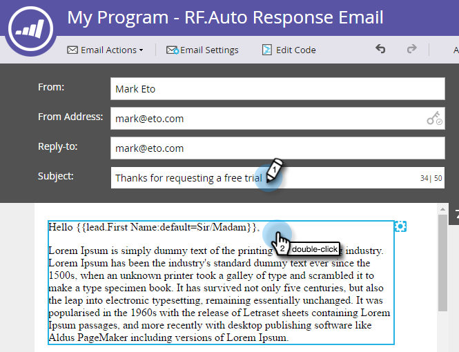

# Réponse e-mail automatique {#email-auto-response}

## Mission : Envoyer un email de remerciement lorsqu’une personne remplit un formulaire {#mission-send-out-a-thank-you-email-when-a-person-fills-out-a-form}

>[!PREREQUISITES]
>
>* [Configuration et ajout d’une personne](/help/marketo/getting-started/quick-wins/get-set-up-and-add-a-person.md){target=&quot;_blank&quot;}
>* [Page d’entrée avec un formulaire](/help/marketo/getting-started/quick-wins/landing-page-with-a-form.md){target=&quot;_blank&quot;}

## Étape 1 : Créer un e-mail {#step-create-an-email}

1. Accédez à la zone Activités marketing .

   

1. Sélectionnez votre programme dans le menu de gauche, cliquez sur le bouton **Nouveau** , puis sélectionnez **Nouvelle ressource locale**.

   

1. Sélectionner **Email**.

   

1. Nommez votre email &quot;Email de réponse automatique&quot;, choisissez un modèle, puis cliquez sur **Créer**.

   

   Un éditeur de courrier électronique s’ouvre dans une nouvelle fenêtre ou un nouvel onglet. Si les fenêtres contextuelles sont bloquées, cliquez sur **Modifier le brouillon** sur la page de résumé de la ressource pour accéder au courrier électronique.

1. Entrez un objet, puis double-cliquez sur la zone modifiable de l’email.

   

   _Un éditeur de texte enrichi s’ouvre en haut de l’éditeur d’email._

1. Mettre en surbrillance le contenu de l&#39;email existant.

   

1. Saisissez votre contenu d’email et cliquez sur **Enregistrer**.

   

1. Cliquez sur le bouton **Actions de courrier électronique** et sélectionnez **Approuver et fermer**.

   

## Étape 2 : Créer une campagne intelligente {#step-create-a-smart-campaign}

1. Sélectionnez votre programme, cliquez sur le bouton **Nouveau** et sélectionnez **Nouvelle campagne dynamique**.

   

1. **Nom** votre campagne dynamique &quot;Campagne de réponse automatique&quot;, puis cliquez sur **Créer**.

   

1. Cliquez sur l&#39;onglet **Liste intelligente**.

   

   Nous configurons cette campagne pour qu’elle s’exécute chaque fois qu’une personne remplit le formulaire que vous avez créé dans [**Page d’entrée avec un formulaire**](/help/marketo/getting-started/quick-wins/landing-page-with-a-form.md){target=&quot;_blank&quot;}.

1. Recherchez et faites glisser le **Remplir le formulaire** se déclenche dans la zone de travail.

   

1. Sélectionner **Mon formulaire** dans la liste déroulante. Cliquez ensuite sur le bouton **Flux** .

   

1. Faites glisser le **Envoyer un courrier électronique** action de flux vers le canevas de gauche.

   

1. Sélectionnez votre **Email de réponse automatique**. Cliquez ensuite sur le bouton **Planification** .

   

1. Cliquez sur **Modifier**.

   

1. Sélectionner **Chaque heure** et cliquez sur **Enregistrer**.

   

1. Cliquez sur **Activer**.

   

1. Cliquez sur **Activer** sur l’écran de confirmation.

   

>[!NOTE]
>
>Une fois principale, cette campagne s’exécute chaque fois qu’une personne remplit le formulaire spécifié. La campagne continue à s’exécuter jusqu’à ce qu’elle soit désactivée.

## Étape 3 : Remplir le formulaire {#step-fill-out-the-form}

1. Sélectionner **Ma page** (il a été créé dans le [Page d’entrée avec un formulaire](/help/marketo/getting-started/quick-wins/landing-page-with-a-form.md){target=&quot;_blank&quot;} (gagnant rapide) et cliquez sur **Aperçu**.

   

   _Votre page d’entrée &quot;Essai gratuit&quot; s’ouvre dans un nouvel onglet._

1. Remplissez le formulaire avec votre prénom, votre nom et votre adresse électronique, puis cliquez sur **Envoyer**.

   

>[!NOTE]
>
>Indiquez une adresse e-mail valide pour être sûr de bien recevoir l&#39;e-mail.

## Mission accomplie {#mission-complete}

Dans quelques minutes, vous devriez voir l’e-mail de réponse automatique dans votre boîte de réception. Bon boulot !

  

[◄ Mission 3 : Évaluation simple](/help/marketo/getting-started/quick-wins/simple-scoring.md)

[Mission 5 : Importation d’une liste de personnes ►](/help/marketo/getting-started/quick-wins/import-a-list-of-people.md)
