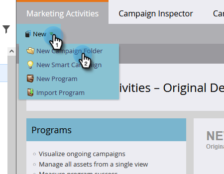
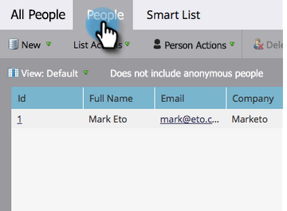

# Préparer sa configuration et ajouter une personne {#get-set-up-and-add-a-person}

Vous devez faire quelques choses avant de commencer les missions.

## Étape 1 : se connecter à Marketo Engage {#step-log-in-to-marketo}

1. [Connectez-vous à Marketo Engage](https://app.marketo.com){target="_blank"} à l’aide des informations d’identification reçues par e-mail.

   

## Étape 2 : créer un dossier d’apprentissage {#step-create-a-learning-folder}

Créons un dossier qui contiendra tout ce que vous ferez lors de vos missions.

1. Accédez à la zone **[!UICONTROL Activités marketing]**.

   

1. Cliquez sur la liste déroulante **[!UICONTROL Nouveau]** et sélectionnez **[!UICONTROL Nouveau dossier de campagne]**.

   

1. Nommez le dossier « Learning », puis cliquez sur **[!UICONTROL Créer]**.

   

1. Le nouveau dossier Learning apparaîtra dans le menu de gauche.

   

## Étape 2 : vous ajouter en tant que personne {#step-add-yourself-as-a-person}

Ajoutez-vous en tant que personne dans Marketo : vous pourrez ensuite vous envoyer des e-mails de test.

1. Accédez à la zone **[!UICONTROL Base de données]**.

   

1. Cliquez sur le menu déroulant **[!UICONTROL Nouveau]** et sélectionnez **[!UICONTROL Nouvelle personne]**.

   

1. Saisissez vos nom et prénom, adresse e-mail et nom de société, puis cliquez sur **[!UICONTROL Créer]** pour vous ajouter en tant que personne.

   

   >[!CAUTION]
   >
   >* Assurez-vous que les adresses e-mail ne contiennent que des caractères ASCII.
   >
   >* Marketo ne prend **pas** en charge les adresses e-mail contenant des émoticônes.

1. Pour afficher vos personnes, ouvrez vos [!UICONTROL Listes intelligentes du système] dans le menu de gauche, puis cliquez sur **[!UICONTROL Toutes les personnes]**.

   

1. Cliquez sur l’onglet **[!UICONTROL Personnes]**. Votre nom devrait apparaître dans la base de données.

   

## Configuration terminée {#set-up-complete}

Vous êtes en mesure de démarrer votre première mission.

  

[Mission 1 : envoyer un e-mail de masse ►](/help/marketo/getting-started/quick-wins/send-an-email.md)
