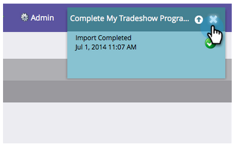

# Importer une Liste de personnes {#import-a-list-of-people}

## Mission : Importer une feuille de calcul liste des participants à un salon commercial dans votre base de données {#mission-import-a-spreadsheet-list-of-trade-show-attendees-into-your-database}

>[!PREREQUISITES]
>
>[Configurer et Ajouter une personne](/help/marketo/getting-started/quick-wins/get-set-up-and-add-a-person.md)

Dans ce didacticiel, vous apprendrez à importer des personnes à partir d’un fichier de feuille de calcul dans Marketing Cloud.

## Étape 1 : Télécharger et modifier une feuille de calcul {#step-download-and-edit-a-spreadsheet}

1. Pour début, téléchargez notre feuille de calcul pratique ([**tradeshow-participants.csv**](https://docs.marketo.com/display/docs/assets/tradeshow-attendees.csv)) sur votre ordinateur.

   

   >[!NOTE]
   >
   >Lors de l’importation d’une date, utilisez le format suivant : **21/9/20** (Mois/Jour/Année).

   >[!NOTE]
   >
   >Tous les champs Date/Heure importés sont traités comme Heure centrale. Si vous avez des champs Date/Heure dans un fuseau horaire différent, vous pouvez utiliser une formule Excel pour le transformer en Heure centrale (Amérique/Chicago).

1. Ajoutez vos propres prénom, nom, adresse électronique et titre de la tâche, puis enregistrez le fichier sur votre ordinateur.

   

>[!NOTE]
>
>Entrez votre véritable adresse de courriel dans le fichier CSV afin de recevoir les messages de soutien que vous enverrez lors de la prochaine mission.

## Étape 2 : Créer un Programme {#step-create-a-program}

1. Accédez à la zone **Activités marketing**.

   

1. Sélectionnez votre dossier **Apprentissage**, puis sous **Nouveau** cliquez sur **Nouveau Programme**.

   

1. **** Nommez le programme &quot;Mon Programme de commerce&quot; et sélectionnez &quot;Événement&quot; pour le type **de** Programme.

   

1. Sélectionnez **Tradeshow** pour le **Canal** et cliquez sur **Créer**.

   

>[!NOTE]
>
>Les programmes de événement se produisent à des dates spécifiques. En savoir plus sur [**Événements**](/help/marketo/product-docs/demand-generation/events/understanding-events/understanding-event-programs.md).

## Étape 3 : Importer votre feuille de calcul dans Marketo {#step-import-your-spreadsheet-into-marketo}

1. Dans **Mon Programme de commerce**, cliquez sur **Nouveau** et sélectionnez **Nouvel actif local**.

   

1. Cliquez sur **Liste**.

   

1. **Attribuez un** nom à la liste &quot;Présents du diaporama&quot; et cliquez sur  **Créer**.

   

1. Dans votre liste **Présents du salon commercial**, cliquez sur **Actions de Liste** et sélectionnez **Importer la Liste**.

   

   >[!CAUTION]
   >
   >Si vous utilisez votre propre fichier CSV, assurez-vous qu’il est codé en UTF-8, UTF-16, Shift-JIS ou EUC-JP.

   >[!NOTE]
   >
   >La taille maximale des fichiers CSV est de 100 Mo.

1. **** Accédez au fichier  **tradeshow-attendees.** csvspreadsheet sur votre ordinateur et cliquez sur  **Suivant**.

   

   >[!NOTE]
   >
   >En mode d’importation de Liste, le fait de sélectionner **Ignorer les nouvelles personnes et les mises à jour** signifie que vous n’aurez aucun impact sur les enregistrements de personne existants ou n’enregistrerez aucune activité. Utilisez ce mode si vous souhaitez une liste statique rapide et préfiltrée de personnes existantes à utiliser dans vos activités marketing. Si vous sélectionnez ce mode, les options suivantes seront disponibles :
   >
   > * Ignorer la création de nouvelles personnes
   > * Ignorer les mises à jour des champs de personne
   > * Ignorer la journalisation des activités

1. Faites correspondre vos champs de colonne de Liste à leur champ Marketo respectif, puis cliquez sur **Suivant**.

   

   >[!TIP]
   >
   >Les en-têtes de colonne doivent toujours correspondre exactement au champ (sensible à la casse) afin d’obtenir les meilleurs résultats de mappage automatique. Si vous utilisez des champs personnalisés et que vous ne les voyez pas dans la liste déroulante, revenez en arrière et [créez-les](/help/marketo/product-docs/administration/field-management/create-a-custom-field-in-marketo.md) afin qu’elles puissent devenir des options.

   >[!NOTE]
   >
   >Si vous ne souhaitez pas importer de champs, sélectionnez **Ignorer** dans le menu déroulant Champ marketing.

1. Sélectionnez **Mon Programme de commerce** pour le **Programme d&#39;acquisition**, puis cliquez sur **Importer**.

   

1. Attendez que vos utilisateurs importeront, puis fermez la fenêtre contextuelle de progression de l’importation.

   

1. De retour dans **Mon Programme de commerce**, cliquez sur l&#39;onglet **Membres**. Vous verrez toutes les personnes que vous venez d&#39;importer.

   

>[!NOTE]
>
>Vous pouvez analyser la réussite de votre programme en suivant l&#39;adhésion au programme. En savoir plus sur [**Programmes**](/help/marketo/product-docs/core-marketo-concepts/programs/creating-programs/understanding-programs.md).

## Fin de la mission {#mission-complete}

Vos participants au salon sont maintenant membres de votre programme Marketo !

  

[Mission 4 : Réponse automatique par courriel](/help/marketo/getting-started/quick-wins/email-auto-response.md)

[Mission 6 : Déchets, gouttes, nourriture ►](/help/marketo/getting-started/quick-wins/drip-drip-nurture.md)
