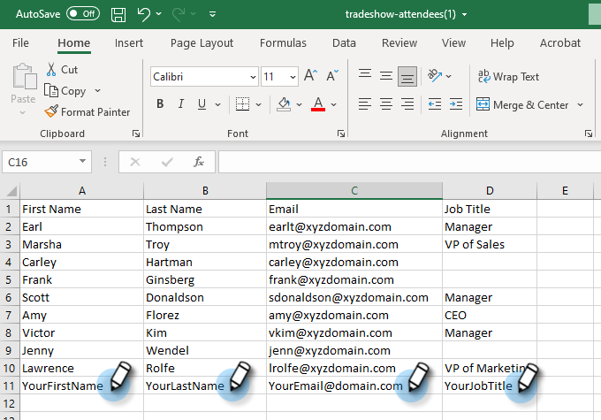

# Importer une liste de personnes {#import-a-list-of-people}

## Mission : importer une liste sous forme de feuille de calcul de participantes et participants à un salon professionnel dans votre base de données {#mission-import-a-spreadsheet-list-of-trade-show-attendees-into-your-database}

>[!PREREQUISITES]
>
>[Préparer sa configuration et ajouter une personne](/help/marketo/getting-started/quick-wins/get-set-up-and-add-a-person.md){target="_blank"}

Dans ce tutoriel, vous allez apprendre à importer des personnes dans Marketo à partir d’une feuille de calcul.

## Étape 1 : télécharger et modifier une feuille de calcul {#step-download-and-edit-a-spreadsheet}

1. Pour commencer, téléchargez notre fichier de feuille de calcul d’exercice pratique ([**tradeshow-attendees.csv**](/help/marketo/getting-started/assets/tradeshow-attendees.csv){target="_blank"}) sur votre ordinateur.

   

   >[!NOTE]
   >
   >Lors de l’import d’une date, utilisez le format suivant : **9/21/20** (Mois/Jour/Année).

   >[!NOTE]
   >
   >Tous les champs de date et d’heure importés sont traités comme des champs d’heure du Centre. Si vous avez des champs de date/heure dans un autre fuseau horaire, vous pouvez utiliser une formule Excel pour les transformer en heure du Centre (Amérique/Chicago).

1. Ajoutez votre prénom, votre nom, votre adresse e-mail actuelle (pour pouvoir recevoir les e-mails d’accompagnement que vous enverrez lors de la mission suivante) et l’intitulé de votre poste. Enregistrez le fichier sur votre ordinateur.

   

   >[!CAUTION]
   >
   >* Assurez-vous que les adresses e-mail ne contiennent que des caractères ASCII.
   >
   >* Marketo ne prend **pas** en charge les adresses e-mail contenant des émoticônes.
   >
   >* L’import de valeurs `NULL` au moyen d’un fichier CSV peut générer une « Valeur des données de modification » pour les champs numériques du [journal d’activité](/help/marketo/product-docs/core-marketo-concepts/smart-lists-and-static-lists/managing-people-in-smart-lists/locate-the-activity-log-for-a-person.md){target="_blank"} d’une personne, _même si les champs sont déjà vides_. Si vous disposez de [campagnes intelligentes](/help/marketo/product-docs/core-marketo-concepts/smart-campaigns/understanding-smart-campaigns.md){target="_blank"} qui utilisent le filtre « Valeur des données modifiée » ou le déclencheur « Modifications de la valeur des données », cela peut entraîner la qualification de certaines personnes pour ces campagnes, même si les données ne changent pas réellement. Vous pouvez utiliser des [contraintes](/help/marketo/product-docs/core-marketo-concepts/smart-lists-and-static-lists/using-smart-lists/add-a-constraint-to-a-smart-list-filter.md){target="_blank"} pour vous assurer que personne n’est qualifié pour ces campagnes lors de l’import.

## Étape 2 : créer un programme {#step-create-a-program}

1. Accédez à la zone **[!UICONTROL Activités marketing]**.

   

1. Sélectionnez votre dossier **Learning**, puis sous **[!UICONTROL Nouveau]**, cliquez sur **[!UICONTROL Nouveau programme]**.

   

1. **Nommez** le programme « Mon programme de salon professionnel », puis sélectionnez « Événement » pour le **[!UICONTROL Type de programme]**.

   

1. Sélectionnez **[!UICONTROL Salon professionnel]** pour le **[!UICONTROL Canal]** et cliquez sur **[!UICONTROL Créer]**.

   

>[!NOTE]
>
>Les programmes d’événement se produisent à des dates spécifiques. En savoir plus sur les [**Événements**](/help/marketo/product-docs/demand-generation/events/understanding-events/understanding-event-programs.md){target="_blank"}.

## Étape 3 : importer votre feuille de calcul dans Marketo {#step-import-your-spreadsheet-into-marketo}

1. Dans **Mon programme de salon professionnel**, cliquez sur **[!UICONTROL Nouveau]** et sélectionnez **[!UICONTROL Nouvelle ressource locale]**.

   

1. Sélectionnez **[!UICONTROL Liste]**.

   

1. **Nommez** la liste « Participantes et participants au salon professionnel » et cliquez sur **[!UICONTROL Créer]**.

   

1. Dans la liste **[!UICONTROL Participantes et participants au salon professionnel]**, cliquez sur **[!UICONTROL Actions de liste]** et sélectionnez **[!UICONTROL Importer la liste]**.

   

   >[!CAUTION]
   >
   >Si vous utilisez votre propre fichier CSV, assurez-vous qu’il est codé au format UTF-8, UTF-16, Shift-JIS ou EUC-JP.

   >[!NOTE]
   >
   >La limite de taille des fichiers CSV est de 100 Mo.

1. **[!UICONTROL Accédez]** au fichier de feuille de calcul **tradeshow-attendees.csv** sur votre ordinateur et cliquez sur **[!UICONTROL Suivant]**.

   

   >[!NOTE]
   >
   >En mode d’import de liste, choisir **[!UICONTROL Ignorer les nouvelles personnes et les mises à jour]** signifie que vous n’affecterez pas les enregistrements de personnes existants et que vous ne consignerez aucune activité. Utilisez ce mode si vous souhaitez obtenir une liste statique rapide et préfiltrée des personnes existantes à utiliser dans vos activités marketing. La sélection de ce mode aura les effets suivants :
   >
   > * Ignorer la création de personnes
   > * Ignorer les mises à jour du champ de personne
   > * Ignorer la journalisation d’activité

1. Mappez vos champs [!UICONTROL Colonne de liste] à leur champ Marketo respectif et cliquez sur **[!UICONTROL Suivant]**.

   

   >[!TIP]
   >
   >Les en-têtes de colonne doivent toujours correspondre exactement au champ (respect de la casse) afin d’obtenir les meilleurs résultats de mappage automatique. Si vous utilisez des champs personnalisés et que vous ne les voyez pas dans la liste déroulante, revenez en arrière et [créez-les](/help/marketo/product-docs/administration/field-management/create-a-custom-field-in-marketo.md){target="_blank"} afin qu’ils puissent devenir des options.

   >[!NOTE]
   >
   >Si vous ne souhaitez pas importer certains champs, sélectionnez **Ignorer** dans le menu déroulant de champ Marketo.

1. Sélectionnez **Mon programme de salon professionnel** pour le **[!UICONTROL Programme d’acquisition]**, puis cliquez sur **[!UICONTROL Importer]**.

   

1. Attendez que les personnes procèdent à l’import, puis fermez la fenêtre pop-up de progression de l’import.

   

1. De retour dans **Mon programme de salon professionnel**, cliquez sur l’onglet **[!UICONTROL Personnes membres]**. Vous y verrez toutes les personnes que vous venez d’importer.

   

>[!NOTE]
>
>Vous pouvez analyser le succès de votre programme en effectuant le suivi de l’abonnement au programme. En savoir plus sur les [**Programmes**](/help/marketo/product-docs/core-marketo-concepts/programs/creating-programs/understanding-programs.md){target="_blank"}.

## Mission accomplie {#mission-complete}

Les participants au salon sont désormais membres de votre programme Marketo !

  

[◄ Mission 4 : e-mail à réponse automatique](/help/marketo/getting-started/quick-wins/email-auto-response.md)

[Mission 6 : marketing goutte à goutte et accompagnement ►](/help/marketo/getting-started/quick-wins/drip-drip-nurture.md)
