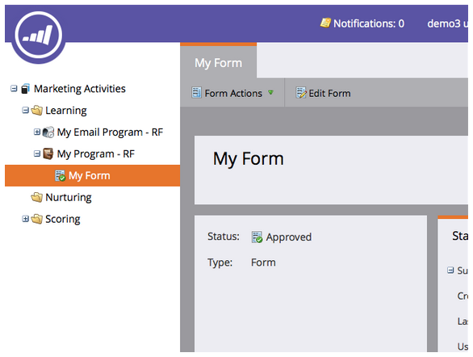
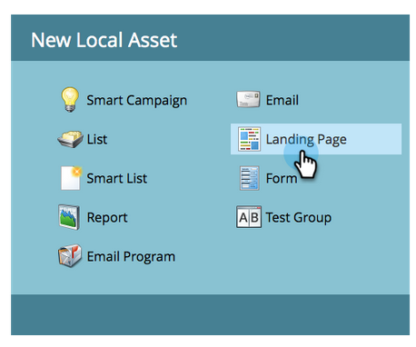

# landing page avec un formulaire {#landing-page-with-a-form}

## Mission : Créez un landing page avec un formulaire pour acquérir de nouvelles personnes. {#mission-create-a-landing-page-with-a-form-to-acquire-new-people}

>[!PREREQUISITES]
>
>[Configurer et Ajouter une personne](/help/marketo/getting-started/quick-wins/get-set-up-and-add-a-person.md)

## ÉTAPE 1 : Création d’un Programme {#step-create-a-program}

1. Accédez à la zone Activités **** marketing.

   

1. Sélectionnez le dossier **Apprentissage** créé dans la liste de succès [rapide](/help/marketo/getting-started/quick-wins/send-an-email.md)précédente.

   

1. Sous **Nouveau**, cliquez sur **Nouveau Programme**.

   

1. Saisissez un **nom** de programme, sélectionnez un **Canal** et cliquez sur **Créer**.

   >[!NOTE]
   >
   >Insérez vos initiales à la fin du nom du programme pour le rendre unique.

   

   >[!NOTE]
   >
   >Un programme est une initiative marketing spécifique. Le **canal** est destiné à être le mécanisme de diffusion, comme le webinaire, le parrainage ou la publicité en ligne. Vous pouvez voir différentes options de canal dans votre liste déroulante, selon ce qui est disponible dans votre propre instance. Vous pouvez également [créer votre propre canal](/help/marketo/product-docs/administration/tags/create-a-program-channel.md).

   

Bien joué ! Maintenant que nous avons créé un programme, passons à autre chose et créons du contenu.

## ÉTAPE 2 : Créer un formulaire {#step-create-a-form}

1. Lorsque votre programme est sélectionné, cliquez sur **Nouveau** puis sur **Nouveau fichier** local.

   

1. Sélectionnez **Formulaire**.

   

1. Saisissez un **nom** de formulaire, puis cliquez sur **Créer**.

   

   >[!NOTE]
   >
   >Assurez-vous que la case **Ouvrir dans l’éditeur** est cochée. Dans le cas contraire, vous devrez cliquer sur l’onglet **Modifier le formulaire** .

   >[!TIP]
   >
   >Vous ne voyez pas l’éditeur de formulaires ? Votre navigateur a probablement bloqué la fenêtre. Activez les fenêtres contextuelles [app.marketo.com](https://app.marketo.com/) dans votre navigateur et cliquez sur Modifier le brouillon dans la barre de menus supérieure.

1. Sélectionnez le champ **Adresse** de courriel et cochez la case **Obligatoire**.

   

1. Cliquez sur **Suivant**.

   

1. Cliquez sur les flèches pour faire défiler les thèmes. Sélectionnez-en un.

   

1. Cliquez sur **Suivant**.

   

1. Sous la section Page de remerciement, sélectionnez URL **** externe pour le **suivi**.

   

1. Saisissez l’URL.

   

   >[!NOTE]
   >
   >La page de suivi est l’endroit où le visiteur est redirigé après avoir rempli le formulaire. L&#39;URL externe est une option, mais il y en a d&#39;autres. Voir [Définition d’une page](/help/marketo/product-docs/demand-generation/forms/creating-a-form/set-a-form-thank-you-page.md)de remerciement de formulaire.

1. Cliquez sur **Terminer**.

   

1. Cliquez sur **Approuver et fermer**.

   

   Super ! Maintenant vous avez un programme avec un formulaire dedans. Passons à autre chose et créons une page.

   

## ÉTAPE 3 : Créer un Landing page et Ajouter votre formulaire {#step-create-a-landing-page-and-add-your-form}

1. Avec votre programme sélectionné, cliquez sur **Nouveau** , puis sur **Nouveau fichier** local.

   

1. Sélectionnez **Landing page**.

   

1. Saisissez un **nom** de page, sélectionnez un modèle et cliquez sur **Créer**.

   >[!NOTE]
   >
   >Vous avez peut-être un modèle différent de celui de notre capture d&#39;écran, c&#39;est bon, il suffit de choisir un modèle et continuer.

   

1. Une fois l’éditeur de landing page ouvert, faites glisser l’élément de formulaire dans le canevas.

   

1. Recherchez et sélectionnez votre formulaire, puis cliquez sur **Insérer**.

   

1. Faites glisser le formulaire vers l’emplacement de votre choix.

   

1. Toutes vos modifications sont enregistrées automatiquement. Fermez l’onglet/la fenêtre de l’éditeur de formulaires.

   

   Super boulot ! Vous avez maintenant un landing page avec un formulaire dessus. Approuvons votre page pour qu&#39;elle soit activée.

## ÉTAPE 4 : Approuver votre Landing page {#step-approve-your-landing-page}

1. Sélectionnez votre landing page, sous Actions **** Landing page, cliquez sur **Approuver**.

   >[!NOTE]
   >
   >Approuver le landing page le rendra accessible en direct et accessible sur Internet.

   

   Parfait ! Vous voyez la coche verte dessus ?

   

## ÉTAPE 5 : Tester votre formulaire {#step-test-your-form}

1. Sélectionnez votre landing page et cliquez sur Page **approuvée** Vue.

   

1. Renseignez le formulaire avec les informations que vous connaissez comme uniques et cliquez sur **Envoyer**.

   

1. Accédez à la zone **Base de données** .

   

1. Recherchez l’adresse électronique unique que vous avez utilisée lors du remplissage du formulaire.

   

   Le voilà ! Vous avez créé un nouveau landing page avec un formulaire dessus et l’avez utilisé pour générer une nouvelle personne.

   

## Mission terminée ! {#mission-complete}

  

[Envoyer un courrier électronique](/help/marketo/getting-started/quick-wins/send-an-email.md)

[Score simple ►](/help/marketo/getting-started/quick-wins/simple-scoring.md)
