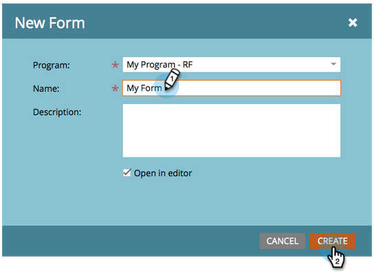
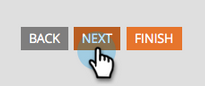

# Page de destination avec un formulaire {#landing-page-with-a-form}

## Mission : créer une landing page avec un formulaire pour acquérir de nouvelles personnes. {#mission-create-a-landing-page-with-a-form-to-acquire-new-people}

>[!PREREQUISITES]
>
>[Préparer sa configuration et ajouter une personne](/help/marketo/getting-started/quick-wins/get-set-up-and-add-a-person.md)

## ÉTAPE 1 : créer un programme {#step-create-a-program}

1. Accédez à la zone **[!UICONTROL Activités marketing]**.

   

1. Sélectionnez le dossier **Apprentissage** créé lors de la [victoire rapide précédente](/help/marketo/getting-started/quick-wins/send-an-email.md){target="_blank"}. Sous **[!UICONTROL Nouveau]**, cliquez sur **[!UICONTROL Nouveau programme]**.

   

1. Saisissez un programme **[!UICONTROL Nom]**, sélectionnez un **[!UICONTROL Canal]**, puis cliquez sur **[!UICONTROL Créer]**.

   

   >[!TIP]
   >
   >Insérez vos initiales à la fin du nom du programme pour le rendre unique.

   >[!NOTE]
   >
   >Un programme est une initiative marketing spécifique. Le **canal** est conçu pour être le mécanisme de diffusion, comme un webinaire, un parrainage ou une publicité en ligne. Il se peut que différentes options de canal s’affichent dans la liste déroulante, selon les options disponibles dans votre propre instance. Vous pouvez également [créer votre propre canal](/help/marketo/product-docs/administration/tags/create-a-program-channel.md){target="_blank"}.

Bien joué ! Maintenant que nous avons créé un programme, passons à autre chose et créons du contenu.

## ÉTAPE 2 : créer un formulaire {#step-create-a-form}

1. Une fois votre programme sélectionné, cliquez sur le menu déroulant **[!UICONTROL Nouveau]** et sélectionnez **[!UICONTROL Nouvelle ressource locale]**.

   

1. Sélectionnez **[!UICONTROL Formulaire]**.

   

1. Saisissez un formulaire **[!UICONTROL Nom]** et cliquez sur **[!UICONTROL Créer]**.

   

   >[!NOTE]
   >
   >Veillez à cocher la case **[!UICONTROL Ouvrir dans l’éditeur]**. Dans le cas contraire, vous devez cliquer sur l’onglet **[!UICONTROL Modifier le formulaire]**.

   >[!TIP]
   >
   >Vous ne voyez pas l’éditeur de formulaires ? Votre navigateur a probablement bloqué la fenêtre. Activez les pop-ups d’`app.marketo.com` dans votre navigateur et cliquez sur Modifier le brouillon dans la barre de menus supérieure.

1. Sélectionnez le champ **[!UICONTROL Adresse e-mail]** et cochez la case **[!UICONTROL Est obligatoire]**.

   

1. Cliquez sur **[!UICONTROL Suivant]**.

   

1. Cliquez sur les flèches pour faire défiler les thèmes. Sélectionnez-en un.

   

1. Cliquez sur **[!UICONTROL Suivant]**.

   

1. Dans la section Page de remerciement, sélectionnez **[!UICONTROL URL externe]** pour **[!UICONTROL Suivre avec]**.

   

1. Saisissez l’URL.

   

   >[!NOTE]
   >
   >La page de suivi est l’endroit où le visiteur est redirigé après avoir rempli le formulaire. L’URL externe est une option, mais il en existe d’autres. Voir [Définir une page de remerciement de formulaire](/help/marketo/product-docs/demand-generation/forms/creating-a-form/set-a-form-thank-you-page.md){target="_blank"}.

1. Cliquez sur **[!UICONTROL Terminer]**.

   

1. Cliquez sur **[!UICONTROL Approuver et fermer]**.

   

   Fantastique ! Vous disposez désormais d’un programme contenant un formulaire. Passons à autre chose et créons une page.

## ÉTAPE 3 : créer une page de destination et ajouter votre formulaire {#step-create-a-landing-page-and-add-your-form}

1. Une fois votre programme sélectionné, cliquez sur le menu déroulant **[!UICONTROL Nouveau]** et sélectionnez **[!UICONTROL Nouvelle ressource locale]**.

   

1. Sélectionnez **[!UICONTROL Page de destination]**.

   

1. Saisissez une page **[!UICONTROL Nom]**, sélectionnez un modèle et cliquez sur **[!UICONTROL Créer]**.

   >[!NOTE]
   >
   >Vous avez peut-être un modèle différent de celui de notre capture d&#39;écran, c&#39;est bon, choisissez-en un et continuez.

   

1. Une fois l&#39;éditeur de landing page ouvert, faites glisser l&#39;élément [!UICONTROL Form] sur la zone de travail.

   

1. Recherchez et sélectionnez votre formulaire, puis cliquez sur **[!UICONTROL Insérer]**.

   

1. Faites glisser le formulaire jusqu’à l’emplacement souhaité.

   

1. Toutes vos modifications sont enregistrées automatiquement. Fermez l’onglet/la fenêtre de l’éditeur de formulaire.

   

   Très bon travail ! Vous disposez désormais d’une page de destination comportant un formulaire. Approuvons votre page pour la rendre active.

## ÉTAPE 4 : Approuver votre page de destination {#step-approve-your-landing-page}

1. Sélectionnez votre page de destination et cliquez sur **[!UICONTROL Approuver le brouillon]**.

   

   >[!NOTE]
   >
   >L’approbation de la page de destination la rendra active et accessible sur Internet.

   Parfait ! Vous voyez la coche verte ?

   

## ÉTAPE 5 : Tester votre formulaire {#step-test-your-form}

1. Sélectionnez votre page de destination et cliquez sur **[!UICONTROL Afficher la page approuvée]**.

   

1. Remplissez le formulaire avec des informations que vous savez uniques et cliquez sur **[!UICONTROL Envoyer]**.

   

1. Accédez à la zone **[!UICONTROL Base de données]**.

   

1. Recherchez l’adresse e-mail unique que vous avez utilisée lors du remplissage du formulaire.

   

   Voilà ! Vous avez créé une page de destination comportant un formulaire et l’avez utilisée pour générer une nouvelle personne.

   

## Mission accomplie. {#mission-complete}

  

[◄ Mission 1 : Envoyer un e-mail](/help/marketo/getting-started/quick-wins/send-an-email.md)

[Mission 3 : ► de notation simple](/help/marketo/getting-started/quick-wins/simple-scoring.md)
