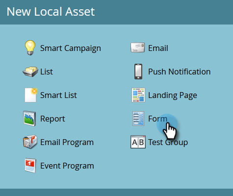
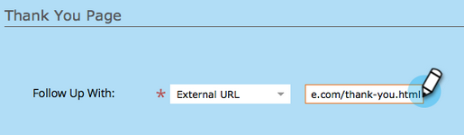
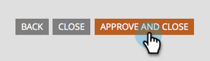

# Page de destination avec un formulaire {#landing-page-with-a-form}

## Mission : Créez une landing page avec un formulaire pour acquérir de nouvelles personnes. {#mission-create-a-landing-page-with-a-form-to-acquire-new-people}

>[!PREREQUISITES]
>
>[Configuration et ajout d’une personne](/help/marketo/getting-started/quick-wins/get-set-up-and-add-a-person.md)

## ÉTAPE 1 : Création d’un programme {#step-create-a-program}

1. Accédez au **Activités marketing** zone.

   

1. Sélectionnez la **Formation** dossier créé dans [aperçu rapide précédent](/help/marketo/getting-started/quick-wins/send-an-email.md){target=&quot;_blank&quot;}. Sous **Nouveau**, cliquez sur **Nouveau programme**.

   

1. Saisie d’un programme **Nom**, sélectionnez une **Canal**, puis cliquez sur **Créer**.

   

   >[!TIP]
   >
   >Incluez vos initiales à la fin du nom du programme pour le rendre unique.

   >[!NOTE]
   >
   >Un programme est une initiative marketing spécifique. Le **channel** est conçu pour être le mécanisme de diffusion, comme le webinaire, le parrainage ou la publicité en ligne. Vous pouvez voir différentes options de canal dans votre liste déroulante, selon ce qui est disponible dans votre propre instance. Vous pouvez également [créer votre propre canal](/help/marketo/product-docs/administration/tags/create-a-program-channel.md){target=&quot;_blank&quot;}.

C&#39;est joli ! Maintenant que nous avons créé un programme, passons à autre chose et créons du contenu.

## ÉTAPE 2 : Créer un formulaire {#step-create-a-form}

1. Lorsque votre programme est sélectionné, cliquez sur le bouton **Nouveau** et sélectionnez **Nouvelle ressource locale**.

   

1. Sélectionner **Formulaire**.

   

1. Saisie d’un formulaire **Nom** et cliquez sur **Créer**.

   

   >[!NOTE]
   >
   >Assurez-vous que la variable **Ouvrir dans l’éditeur** est cochée. Si ce n’est pas le cas, vous devrez cliquer sur le bouton **Modifier le formulaire** .

   >[!TIP]
   >
   >L’éditeur de formulaire ne s’affiche-t-il pas ? Votre navigateur a probablement bloqué la fenêtre. Activation des fenêtres contextuelles à partir de `app.marketo.com` dans votre navigateur, puis cliquez sur Modifier le brouillon dans la barre de menu supérieure.

1. Sélectionnez la **Adresse électronique** champ et vérification **Est obligatoire**.

   

1. Cliquez sur **Suivant**.

   

1. Cliquez sur les flèches pour faire défiler les thèmes. Sélectionnez-en un.

   

1. Cliquez sur **Suivant**.

   

1. Sous la section Page de remerciement , sélectionnez **URL externe** pour **Effectuez Le Suivi Avec**.

   

1. Saisissez l’URL.

   

   >[!NOTE]
   >
   >La page de suivi est l’endroit où le visiteur est redirigé après avoir rempli le formulaire. L’URL externe est une option, mais il existe d’autres options. Voir [Définition d’une page de remerciement de formulaire](/help/marketo/product-docs/demand-generation/forms/creating-a-form/set-a-form-thank-you-page.md){target=&quot;_blank&quot;}.

1. Cliquez sur **Terminer**.

   

1. Cliquez sur **Approuver et fermer**.

   

   Fantastique ! Maintenant vous avez un programme avec un formulaire dedans. Passons à la page et créons une page.

## ÉTAPE 3 : Création d’une page d’entrée et ajout d’un formulaire {#step-create-a-landing-page-and-add-your-form}

1. Lorsque votre programme est sélectionné, cliquez sur **Nouveau** puis **Nouvelle ressource locale**.

   

1. Sélectionner **Page d’entrée**.

   

1. Saisie d’une page **Nom**, sélectionnez un modèle et cliquez sur **Créer**.

   >[!NOTE]
   >
   >Vous avez peut-être un modèle différent de celui de notre capture d&#39;écran, c&#39;est bien, il suffit d&#39;en choisir un et continuez.

   

1. Une fois l’éditeur de page d’entrée ouvert, faites glisser l’élément Formulaire sur la zone de travail.

   

1. Recherchez et sélectionnez votre formulaire, puis cliquez sur **Insérer**.

   

1. Faites glisser le formulaire vers l’emplacement souhaité.

   

1. Toutes vos modifications sont automatiquement enregistrées. Fermez l’onglet/la fenêtre de l’éditeur de formulaire.

   

   Bon boulot ! Vous disposez désormais d’une landing page comportant un formulaire. Approuvons votre page pour la rendre active.

## ÉTAPE 4 : Approuver votre page d’entrée {#step-approve-your-landing-page}

1. Sélectionnez votre landing page et cliquez sur **Approuver le brouillon**.

   

   >[!NOTE]
   >
   >La validation de la landing page la mettra en ligne et sera accessible sur Internet.

   Mot clé! Vous voyez la coche verte dessus ?

   

## ÉTAPE 5 : Tester votre formulaire {#step-test-your-form}

1. Sélectionnez votre landing page et cliquez sur **Afficher la page approuvée**.

   

1. Remplissez le formulaire avec les informations que vous savez uniques, puis cliquez sur **Envoyer**.

   

1. Accédez au **Base** zone.

   

1. Recherchez l’adresse électronique unique que vous avez utilisée lors du remplissage du formulaire.

   

   Le voilà ! Vous avez créé une landing page avec un formulaire dessus et vous l’avez utilisée pour générer une nouvelle personne.

   

## Mission accomplie! {#mission-complete}

  

[◄ Mission 1 : Envoyer un E-mail de masse](/help/marketo/getting-started/quick-wins/send-an-email.md)

[Mission 3 : Évaluation simple ►](/help/marketo/getting-started/quick-wins/simple-scoring.md)
