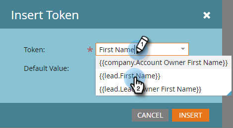
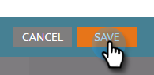

# Personnaliser un e-mail {#personalize-an-email}

## Mission : rendre vos e-mails personnels en ajoutant des jetons de données {#mission-make-your-emails-personal-by-adding-data-tokens}

>[!PREREQUISITES]
>
>* [Préparer sa configuration et ajouter une personne](/help/marketo/getting-started/quick-wins/get-set-up-and-add-a-person.md){target="_blank"}
>* [Envoyer un e-mail de masse](/help/marketo/getting-started/quick-wins/send-an-email.md){target="_blank"}
>* [Marketing goutte à goutte et accompagnement](/help/marketo/getting-started/quick-wins/drip-drip-nurture.md){target="_blank"}

## Étape 1 : sélectionner un e-mail à personnaliser {#step-select-an-email-to-personalize}

1. Sélectionnez l’un des e-mails d’accompagnement créés dans la [solution rapide précédente](/help/marketo/getting-started/quick-wins/drip-drip-nurture.md){target="_blank"} et cliquez sur **[!UICONTROL Créer un brouillon]**.

   

   >[!NOTE]
   >
   >Une copie de cet e-mail sera créée en tant que brouillon. N’oubliez pas d’approuver le brouillon pour que les changements prennent effet.

Si vous n’avez pas activé de bloqueur de fenêtres contextuelles, l’éditeur d’e-mail s’ouvre dans un nouvel onglet/une nouvelle fenêtre. Sinon, cliquez deux fois sur **[!UICONTROL Créer un brouillon]**.

## Étape 2 : définir le vendeur ou la vendeuse comme personne expéditrice {#step-make-the-salesperson-the-sender}

1. Sélectionnez le champ **[!UICONTROL De]**, mettez en surbrillance et **supprimez** le nom actuel.

   

1. Cliquez sur l’icône **Jeton** située à droite du champ **[!UICONTROL De]**.

   

1. Recherchez et sélectionnez le jeton **`{{lead.Lead Owner First Name}}`**.

   

1. Saisissez le nom de votre société et un tiret pour la **Valeur par défaut** afin de vous assurer que quelque chose s’affiche au cas où le prénom du représentant commercial ou de la représentante commerciale n’est pas disponible. Cliquez sur **Insérer**.

   

1. Appuyez sur la barre d’espace dans le champ **[!UICONTROL De]**, en vous assurant que le curseur clignote un espace après le jeton que vous venez d’insérer. Cliquez ensuite à nouveau sur l’icône **Jeton**.

   

1. Recherchez et sélectionnez le jeton **`{{lead.Lead Owner Last Name}}`**.

   

1. Saisissez « Ventes » pour la **Valeur par défaut**, puis cliquez sur **Insérer**.

   

## Étape 3 : ajouter le nom du lead à l’e-mail {#step-add-the-leads-name-to-the-email}

1. Sélectionnez la section modifiable supérieure, cliquez sur l’icône de roue dentée et sélectionnez **[!UICONTROL Modifier]**.

   

1. Ajoutez un espace après « Bonjour » et placez le curseur devant la virgule, puis cliquez sur l’icône **Insérer un jeton**.

   

1. Recherchez et sélectionnez le jeton **`{{lead.First Name}}`**.

   

1. Saisissez « Ami ou amie » (ou tout libellé de votre choix) dans le champ **[!UICONTROL Valeur par défaut]**, puis cliquez sur **[!UICONTROL Insérer]**.

   

   >[!TIP]
   >
   >Incluez toujours une valeur par défaut pour les jetons. Cela garantit que la valeur par défaut sera affichée dans l’e-mail si une partie des informations personnelles est manquante.

1. Cliquez sur **[!UICONTROL Enregistrer]**

   

1. sous **[!UICONTROL Actions d’e-mail]** et sélectionnez **[!UICONTROL Approuver et fermer]**.

   

>[!TIP]
>
>Besoin d’un petit rappel sur la manière de vous envoyer l’e-mail ? Consultez [Envoyer un e-mail de masse](/help/marketo/getting-started/quick-wins/send-an-email.md){target="_blank"}.

### Mission accomplie {#mission-complete}

Félicitations, vous avez personnalisé votre e-mail.

  

[◄ Mission 6 : marketing goutte à goutte et accompagnement](/help/marketo/getting-started/quick-wins/drip-drip-nurture.md)

[Mission 8 : prévenir le représentant commercial ou la représentante commerciale ►](/help/marketo/getting-started/quick-wins/alert-the-sales-rep.md)
