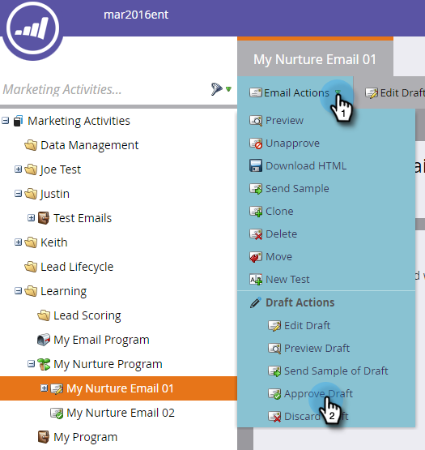

# Personnaliser un courriel {#personalize-an-email}

## Mission : Personnaliser vos courriers électroniques en ajoutant des jetons de données {#mission-make-your-emails-personal-by-adding-data-tokens}

>[!PREREQUISITES]
>
>* [Configurer et Ajouter une personne](/help/marketo/getting-started/quick-wins/get-set-up-and-add-a-person.md)
>* [Envoyer un courrier électronique](/help/marketo/getting-started/quick-wins/send-an-email.md)
>* [Déchets, gouttes, culture](/help/marketo/getting-started/quick-wins/drip-drip-nurture.md)

## Étape 1 : Sélectionner un courriel à personnaliser {#step-select-an-email-to-personalize}

1. Sélectionnez l&#39;un des messages électroniques d&#39;accueil créés lors de la [précédente victoire](/help/marketo/getting-started/quick-wins/drip-drip-nurture.md) rapide et cliquez sur **Modifier le brouillon**.

   

   >[!NOTE]
   >
   >Cette opération crée une copie du courrier électronique en tant que brouillon. Vous devez approuver le brouillon pour que les modifications soient mises en oeuvre.

Si vous n&#39;avez pas activé de blocage des fenêtres contextuelles, l&#39;éditeur de messages électroniques s&#39;ouvre dans un nouvel onglet/une nouvelle fenêtre. Sinon, cliquez deux fois sur **Modifier le brouillon** .

## Étape 2 : Faire du vendeur l&#39;expéditeur {#step-make-the-salesperson-the-sender}

1. Sélectionnez le champ **De** , mettez en surbrillance et **supprimez** le nom actuel.

   

1. Cliquez sur l’icône **Jeton** à droite du champ **De** .

   

1. Recherchez et sélectionnez le **`{{lead.Lead Owner First Name}}`** jeton.

   

1. Tapez le nom de votre société et un tiret pour la valeur **** par défaut afin de vous assurer que quelque chose s’affiche au cas où le prénom du représentant de la vente ne serait pas disponible. Cliquez sur **Insérer**.

   

1. Cliquez sur la barre d’espace dans le champ **De** , en vous assurant que le curseur clignote un espace après le jeton que vous venez d’insérer. Cliquez de nouveau sur l’icône **Jeton** .

   

1. Recherchez et sélectionnez le **`{{lead.Lead Owner Last Name}}`** jeton.

   

1. Saisissez &quot;Sales&quot; pour la valeur **** par défaut et cliquez sur **Insérer**.

   

## Étape 3 : Ajouter le nom du prospect au courriel {#step-add-the-leads-name-to-the-email}

1. Sélectionnez la section modifiable supérieure, cliquez sur l’icône d’engrenage et sélectionnez **Modifier**.

   

1. Ajoutez un espace après &quot;Hello&quot; et placez votre curseur devant la virgule, puis cliquez sur l&#39;icône **Insérer un jeton** .

   

1. Recherchez et sélectionnez le **`{{lead.First Name}}`** jeton.

   

1. Saisissez &quot;Friend&quot; (ou toute étiquette de votre choix) dans le champ Valeur **** par défaut et cliquez sur **Insérer**.

   

   >[!TIP]
   >
   >toujours inclure une valeur par défaut pour les jetons ; ainsi, la valeur par défaut sera affichée dans le courrier électronique si une partie des informations personnelles est manquante.

1. Cliquez sur **Enregistrer**.

   

1. Fermez l’onglet/la fenêtre de l’éditeur de courrier électronique.

   

1. Sous Actions **** par courrier électronique, sélectionnez **Approuver le brouillon**.

   

>[!TIP]
>
>Vous avez besoin d&#39;une actualisation rapide de la façon de vous envoyer le courriel ? Voir [Envoyer un message électronique](/help/marketo/getting-started/quick-wins/send-an-email.md).

### Fin de la mission {#mission-complete}

Félicitations, vous avez personnalisé votre e-mail !

  

[Mission 6 : Déchets, gouttes, culture](/help/marketo/getting-started/quick-wins/drip-drip-nurture.md)

[Mission 8 : Alerter le représentant légal ►](/help/marketo/getting-started/quick-wins/alert-the-sales-rep.md)
