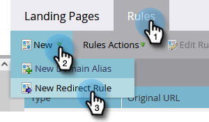

# Rediriger une page de destination {#redirect-a-landing-page}

## Mission : Rediriger une landing page vers une autre page web {#mission-redirect-a-landing-page-to-a-different-web-page}

>[!NOTE]
>
>**Autorisations d’administrateur requises**

>[!PREREQUISITES]
>
>* [Page d’entrée avec un formulaire](/help/marketo/getting-started/quick-wins/landing-page-with-a-form.md){target=&quot;_blank&quot;}
>* [Personnalisation de l’URL de votre page d’entrée avec un CNAME](/help/marketo/product-docs/demand-generation/landing-pages/landing-page-actions/customize-your-landing-page-urls-with-a-cname.md){target=&quot;_blank&quot;}

## Étape 1 : Démarrage d’une nouvelle règle de redirection {#step-start-a-new-redirect-rule}

1. Cliquez sur l&#39;icône **Admin**.

   

1. Accédez à **Pages d’entrée**.

   

1. Cliquez sur le bouton **Règles** , puis cliquez sur **Nouveau** et **Nouvelle règle de redirection**.

   

## Étape 2 : Définition de la règle de redirection {#step-define-the-redirect-rule}

1. Cliquez sur le premier **URL d’origine** et sélectionnez votre CNAME Marketo.

   

   >[!NOTE]
   >
   >Souvenez-vous que vous ne pouvez rediriger que les landing pages qui commencent avec votre Marketo. [CNAME](/help/marketo/product-docs/demand-generation/landing-pages/landing-page-actions/customize-your-landing-page-urls-with-a-cname.md){target=&quot;_blank&quot;}.

1. Cliquez sur la seconde **URL d’origine** et sélectionnez la landing page à rediriger.

   

1. Pour **URL de redirection** sélectionnez la page vers laquelle vous souhaitez rediriger et cliquez sur **Créer**.

   

## Mission accomplie {#mission-complete}

Félicitations ! Vous avez redirigé correctement une landing page.

  

[◄ Mission 9 : Mettre à jour les données des leads](/help/marketo/getting-started/quick-wins/update-person-data.md)
