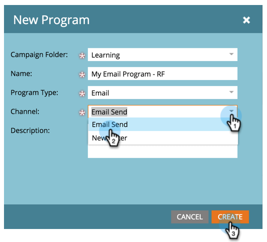

# Envoyer un e-mail {#send-an-email}

Il s’agit de la première chose que tout le monde veut faire. Envoyons un e-mail depuis Marketo.

>[!PREREQUISITES]
>
>[Préparer sa configuration et ajouter une personne](/help/marketo/getting-started/quick-wins/get-set-up-and-add-a-person.md){target="_blank"}

## Créer un programme d’e-mail {#create-an-email-program}

1. Accédez à la zone **[!UICONTROL Activités marketing]**.

   

1. Sélectionnez votre dossier **[!UICONTROL Learning]**. Cliquez sur le menu déroulant **[!UICONTROL Nouveau]** et sélectionnez **[!UICONTROL Nouveau programme]**.

   

1. Saisissez un **[!UICONTROL Nom]** et sélectionnez **[!UICONTROL E-mail]** pour **[!UICONTROL Type de programme]**.

   >[!TIP]
   >
   >Ajoutez vos initiales à la fin du nom du programme pour le rendre unique.

   

1. Sous **[!UICONTROL Canal]**, sélectionnez **[!UICONTROL Envoi d’e-mail]** et cliquez sur **[!UICONTROL Créer]**.

   

## Définir votre audience {#define-your-audience}

1. Cliquez sur **[!UICONTROL Modifier la liste intelligente]** sous la vignette [!UICONTROL Audience].

   

1. Recherchez et faites glisser le filtre [!UICONTROL Adresse e-mail] sur la zone de travail.

   

   >[!TIP]
   >
   >Utilisez la fonction **[!UICONTROL Recherche]** pour rechercher plus facilement des filtres.

1. Recherchez et sélectionnez votre adresse e-mail.

   

   >[!NOTE]
   >
   >Si votre adresse e-mail n’est pas renseignée automatiquement, vous avez peut-être oublié de [Configurer et ajouter un lead](/help/marketo/getting-started/quick-wins/get-set-up-and-add-a-person.md){target="_blank"}.

   >[!NOTE]
   >
   >Dans cet exemple, nous vous demandons d’envoyer l’e-mail à vous-même uniquement, mais vous pouvez personnaliser l’audience comme bon vous semble.

1. Revenez à l’onglet principal du programme et cliquez sur l’icône d’actualisation de **[!UICONTROL Personne]**.

   

   Vous devriez voir le nombre de personnes augmenter à 1. Il s’agit de vous.

## Créer un e-mail {#create-an-email}

1. Sous la vignette E-mail, cliquez sur **[!UICONTROL Nouvel e-mail]**.

   

1. Saisissez un **[!UICONTROL Nom]**, sélectionnez un **Modèle**, puis cliquez sur **[!UICONTROL Créer]**.

   

1. La fenêtre de l’éditeur d’e-mail s’ouvre. Saisissez un objet de 50 caractères maximum (recommandé).

   

   >[!NOTE]
   >
   >Si vous disposez d’un bloqueur de fenêtres contextuelles, cliquez sur **[!UICONTROL Modifier le brouillon]** pour accéder à l’éditeur d’e-mail.

1. Sélectionnez la zone à modifier, cliquez sur l’icône de roue dentée à droite, puis sélectionnez **[!UICONTROL Modifier]** (vous pouvez également double-cliquer sur la section modifiable à modifier).

   

1. Saisissez le contenu souhaité, puis cliquez sur **[!UICONTROL Enregistrer]**.

   

1. Cliquez sur la liste déroulante **[!UICONTROL Actions d’e-mail]** et sélectionnez **[!UICONTROL Approuver et fermer]**.

   

   >[!TIP]
   >
   >Vous voulez vous envoyer un exemple rapide pour voir à quoi ressemble votre e-mail avant le lancement ? Sélectionnez **[!UICONTROL Envoyer un exemple]** dans le menu ci-dessus, ou cliquez sur **[!UICONTROL Actions d’e-mail]** puis sur [**[!UICONTROL Envoyer un exemple]**](/help/marketo/product-docs/email-marketing/general/creating-an-email/send-a-sample-email.md){target="_blank"}.

1. Sélectionnez le programme d’e-mail dans l’arborescence de gauche.

   

1. Sous la vignette [!UICONTROL Planning], définissez le jour de lancement de l’e-mail sur **[!UICONTROL Aujourd’hui]**.

   

   >[!NOTE]
   >
   >En savoir plus sur le [Fuseau horaire de la personne destinataire](/help/marketo/product-docs/email-marketing/email-programs/email-program-actions/scheduling-with-recipient-time-zone/schedule-email-programs-with-recipient-time-zone.md){target="_blank"} et le [Démarrage rapide](/help/marketo/product-docs/email-marketing/email-programs/email-program-actions/head-start-for-email-programs.md){target="_blank"}.

1. Sélectionnez une heure située au moins 15 minutes dans le futur.

   

   >[!TIP]
   >
   >Le fuseau horaire par défaut n’est pas le vôtre ? Découvrez comment le [mettre à jour ici](/help/marketo/product-docs/administration/settings/select-your-language-locale-and-time-zone.md){target="_blank"}.

1. Cliquez sur **[!UICONTROL Approuver le programme]** sous la vignette [!UICONTROL Approbation] et vous avez terminé.

   

Vous devriez recevoir l’e-mail peu de temps après le jour et l’heure planifiés.

## Mission accomplie. {#mission-complete}

  

[◄ Configurer et ajouter une personne](/help/marketo/getting-started/quick-wins/get-set-up-and-add-a-person.md)

[Mission 2 : page de destination avec un formulaire ►](/help/marketo/getting-started/quick-wins/landing-page-with-a-form.md)
