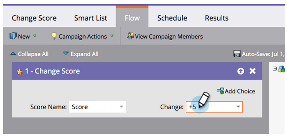
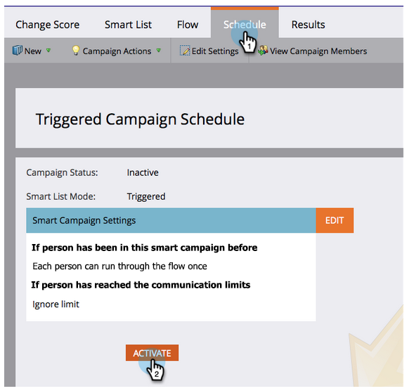
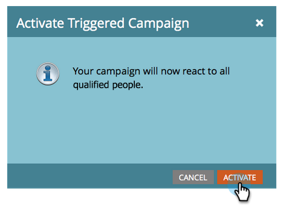

# Score simple {#simple-scoring}

>[!NOTE]
>
>**FYI**
>
>Marketo est maintenant en train de normaliser la langue dans tous les abonnements. Vous pouvez donc voir des pistes dans votre abonnement et des personnes/personnes dans docs.marketo.com. Ces termes signifient la même chose ; cela n&#39;a aucune incidence sur les instructions relatives aux articles. Il y a aussi d&#39;autres changements. [En savoir plus](http://docs.marketo.com/display/DOCS/Updates+to+Marketo+Terminology).

>[!NOTE]
>
>**Conditions préalables**
>
>* [Configurer et Ajouter une personne](get-set-up-and-add-a-person.md)
>* [landing page avec un formulaire](landing-page-with-a-form.md)

>

## Étape 1 : Création d’une Campaign de score {#step-create-a-scoring-campaign}

1. Accédez à la zone Activités **** marketing.

   

1. Cliquez avec le bouton droit sur votre dossier **Apprentissage** et cliquez sur **Nouveau dossier** de campagne.

   

1. Nommez le dossier de campagne &quot;Score&quot;.

   

   >[!NOTE]
   >
   >Si vous disposez déjà d’un dossier Scoring, nommez celui-ci quelque chose de différent, tel que Scoring 1. Les noms de dossiers doivent être uniques.

1. Cliquez ensuite avec le bouton droit de la souris sur votre nouveau dossier **Scoring** et sélectionnez **Nouvelle Campaign** dynamique.

   

1. **Nommez** la campagne &quot;Changer de note&quot; et cliquez sur **Créer**.

   

1. Cliquez sur l’onglet Liste **** intelligente.

   

   Nous voulons que cette campagne s’exécute chaque fois qu’une personne remplit votre formulaire **de demande d’**&#x200B;évaluation.

1. Recherchez et faites glisser le déclencheur **Remplir le formulaire** sur le canevas de gauche.

   

1. Sélectionnez **Mon formulaire**.

   >[!NOTE]
   >
   >Si vous avez rempli le [Landing page avec un formulaire](landing-page-with-a-form.md) de victoire rapide, vous devriez avoir le formulaire. Si vous avez utilisé un autre nom pour votre formulaire, sélectionnez-le.

   

1. Cliquez sur l&#39;onglet **Flux **.

   

1. Faites glisser l’action d’enchaînement **Modifier la note** sur le canevas de gauche.

   

1. Vous pouvez entrer n’importe quelle valeur à ajouter à la note de la personne. Saisissez &quot;+5&quot; dans le champ **Modifier** .

   

   >[!TIP]
   >
   >Les campagnes de notation de qualité sont essentielles pour fournir des personnes de qualité aux ventes. Consultez [**le Guide de définition du score**](http://www.marketo.com/definitive-guides/lead-scoring/)de piste.

1. Cliquez sur l’onglet **Planification** et sur le bouton **Activer** .

   

1. Cliquez sur **Activer** dans l’écran de confirmation.

   

>[!NOTE]
>
>Une fois principale, cette campagne s’exécute chaque fois qu’une personne remplit le formulaire. La campagne continue à s’exécuter jusqu’à ce qu’elle soit désactivée.

## Étape 2 : Remplir le formulaire {#step-fill-out-the-form}

1. Sélectionnez le landing page que vous avez créé dans le [Landing page avec un formulaire](landing-page-with-a-form.md) obtenu rapidement.

   

1. Cliquez sur Page **Approuvée** Vue. Le landing page s’ouvre dans un nouvel onglet.

   

1. Remplissez le formulaire avec votre prénom, votre nom et votre adresse électronique, puis cliquez sur **Envoyer** .

   

   >[!NOTE]
   >
   >Utilisez le même nom et la même adresse électronique que ceux que vous avez utilisés lors de votre première inscription en tant que personne afin d’appliquer l’augmentation de score &quot;+5&quot;.

## Étape 3 : Vue des informations sur la personne {#step-view-the-person-info}

1. Accédez à la zone Base de données.

   

1. Recherchez l’adresse électronique que vous avez utilisée lors du remplissage du formulaire.

   

1. Doublon-cliquez sur votre personne.

   

Les détails de votre personne s&#39;ouvriront dans un nouvel onglet ou une nouvelle fenêtre. Voyez comment votre score a augmenté de 5 points pour remplir le formulaire ? !

**Félicitations !** Vous avez créé une campagne de score.
[Mission 2 : landing page avec un formulaire](landing-page-with-a-form.md) [Mission 4 : ► Réponse automatique par courriel](email-auto-response.md)