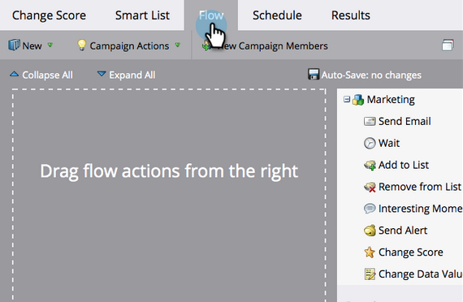

# Évaluation simple {#simple-scoring}

>[!PREREQUISITES]
>
>* [Configuration et ajout d’une personne](/help/marketo/getting-started/quick-wins/get-set-up-and-add-a-person.md){target=&quot;_blank&quot;}
>* [Page d’entrée avec un formulaire](/help/marketo/getting-started/quick-wins/landing-page-with-a-form.md){target=&quot;_blank&quot;}

## Étape 1 : Créer une campagne d&#39;évaluation {#step-create-a-scoring-campaign}

1. Accédez au **Activités marketing** zone.

   

1. Cliquez avec le bouton droit de la souris sur votre **Formation** et cliquez sur **Nouveau dossier Campaign**.

   

1. Nommez le dossier de campagne &quot;Notation&quot; et cliquez sur **Créer**.

   

   >[!NOTE]
   >
   >Si vous disposez déjà d’un dossier de notation, nommez celui-ci quelque chose de différent, tel que Scoring 1. Les noms de dossier doivent être uniques.

1. Cliquez avec le bouton droit de la souris sur votre **Notation** et sélectionnez **Nouvelle campagne dynamique**.

   

1. Nommez la campagne &quot;Changer de score&quot; et cliquez sur **Créer**.

   

1. Cliquez sur l&#39;onglet **Liste intelligente**.

   

   Nous voulons que cette campagne s’exécute chaque fois qu’une personne remplit votre **Formulaire de demande d’évaluation**.

1. Recherchez et faites glisser le **Remplir le formulaire** se déclenche sur la zone de travail de gauche.

   

1. Sélectionner **Mon formulaire**.

   

   >[!NOTE]
   >
   >Si vous avez terminé la [Page d’entrée avec un formulaire](/help/marketo/getting-started/quick-wins/landing-page-with-a-form.md){target=&quot;_blank&quot;} gain rapide, vous devez avoir le formulaire. Si vous avez utilisé un autre nom pour votre formulaire, sélectionnez-le.

1. Cliquez sur l&#39;onglet **Flux**.

   

1. Faites glisser le **Modifier le score** action de flux sur la zone de travail de gauche.

   

1. Vous pouvez saisir n’importe quelle valeur à ajouter au score de la personne. Entrons &quot;+5&quot; dans le **Modifier** champ .

   

   >[!TIP]
   >
   >De bonnes campagnes de notation sont essentielles pour fournir des personnes de haute qualité aux ventes. Lecture [**Guide définitif pour la notation des pistes**](https://www.marketo.com/definitive-guides/lead-scoring/){target=&quot;_blank&quot;}.

1. Cliquez sur le bouton **Planification** et le **Activer** bouton .

   

1. Cliquez sur **Activer** sur l’écran de confirmation.

   

>[!NOTE]
>
>Une fois principale, cette campagne s’exécute chaque fois qu’une personne remplit le formulaire. La campagne continue à s’exécuter jusqu’à ce qu’elle soit désactivée.

## Étape 2 : Remplir le formulaire {#step-fill-out-the-form}

1. Sélectionnez la landing page que vous avez créée dans le [Page d’entrée avec un formulaire](/help/marketo/getting-started/quick-wins/landing-page-with-a-form.md){target=&quot;_blank&quot;} gain rapide.

   

1. Cliquez sur **Aperçu**. La landing page s’ouvre dans un nouvel onglet.

   

1. Remplissez le formulaire avec votre prénom, votre nom et votre adresse électronique, puis cliquez sur **Envoyer**.

   

   >[!NOTE]
   >
   >Utilisez le même nom et la même adresse email que ceux que vous avez utilisés lors de votre première inscription en tant que personne afin d&#39;appliquer l&#39;augmentation de score &quot;+5&quot;.

## Étape 3 : Affichage des informations sur la personne {#step-view-the-person-info}

1. Accédez à la zone Base de données .

   

1. Recherchez l’adresse électronique utilisée lors du remplissage du formulaire.

   

1. Double-cliquez sur votre personne.

   

Les détails de votre personne s’ouvrent dans un nouvel onglet ou une nouvelle fenêtre. Voyez comment votre score a augmenté de 5 points pour remplir le formulaire ?

## Mission accomplie! {#mission-complete}

  

[◄ Mission 2 : Page de destination avec un formulaire](/help/marketo/getting-started/quick-wins/landing-page-with-a-form.md)

[Mission 4 : Réponse e-mail automatique ►](/help/marketo/getting-started/quick-wins/email-auto-response.md)
