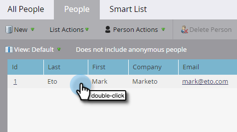

# Évaluation simple {#simple-scoring}

>[!PREREQUISITES]
>
>* [Configurer et ajouter une personne](/help/marketo/getting-started/quick-wins/get-set-up-and-add-a-person.md){target="_blank"}
>* [Page d’entrée avec un formulaire](/help/marketo/getting-started/quick-wins/landing-page-with-a-form.md){target="_blank"}

## Étape 1 : Créer une campagne d&#39;évaluation {#step-create-a-scoring-campaign}

1. Accédez à la zone **[!UICONTROL Activités marketing]**.

   

1. Cliquez avec le bouton droit de la souris sur votre dossier **Learning** et cliquez sur **[!UICONTROL New Campaign Folder]**.

   

1. Nommez le dossier de campagne &quot;Score&quot; et cliquez sur **[!UICONTROL Créer]**.

   

   >[!NOTE]
   >
   >Si vous disposez déjà d’un dossier de notation, nommez celui-ci quelque chose de différent, tel que Scoring 1. Les noms de dossier doivent être uniques.

1. Cliquez avec le bouton droit sur votre dossier **Scoring** et sélectionnez **[!UICONTROL New Smart Campaign]**.

   

1. Nommez la campagne &quot;Change Score&quot; et cliquez sur **[!UICONTROL Create]**.

   

1. Cliquez sur l’onglet **[!UICONTROL Liste dynamique]** .

   

   Nous voulons que cette campagne s’exécute chaque fois qu’une personne remplit votre **Formulaire de demande d’évaluation**.

1. Recherchez et faites glisser le déclencheur **[!UICONTROL Remplit le formulaire]** sur le canevas de gauche.

   

1. Sélectionnez **Mon formulaire**.

   

   >[!NOTE]
   >
   >Si vous avez terminé l’obtention rapide [Landing Page avec un formulaire](/help/marketo/getting-started/quick-wins/landing-page-with-a-form.md){target="_blank"}, vous devez disposer du formulaire. Si vous avez utilisé un autre nom pour votre formulaire, sélectionnez-le.

1. Cliquez sur l’onglet **[!UICONTROL Flux]** .

   

1. Faites glisser l’action de flux **Changer le score** sur le canevas de gauche.

   

1. Vous pouvez saisir n’importe quelle valeur à ajouter au score de la personne. Saisissez &quot;+5&quot; dans le champ **[!UICONTROL Changer]**.

   

   >[!TIP]
   >
   >De bonnes campagnes de notation sont essentielles pour fournir des personnes de haute qualité aux ventes. Lisez [**Le Guide Définitif pour la notation des pistes**](https://www.marketo.com/definitive-guides/lead-scoring/){target="_blank"}.

1. Cliquez sur l&#39;onglet **[!UICONTROL Schedule]** et sur le bouton **[!UICONTROL Activer]** .

   

1. Cliquez sur **[!UICONTROL Activer]** dans l’écran de confirmation.

   

>[!NOTE]
>
>Une fois active, cette campagne s’exécute chaque fois qu’une personne remplit le formulaire. La campagne continue à s’exécuter jusqu’à ce qu’elle soit désactivée.

## Étape 2 : Remplir le formulaire {#step-fill-out-the-form}

1. Sélectionnez la landing page que vous avez créée dans la [Landing Page with a Form](/help/marketo/getting-started/quick-wins/landing-page-with-a-form.md){target="_blank"} gain rapide.

   

1. Cliquez sur **[!UICONTROL Aperçu]**. La landing page s’ouvre dans un nouvel onglet.

   

1. Remplissez le formulaire avec votre prénom, votre nom et votre adresse électronique, puis cliquez sur **[!UICONTROL Submit]**.

   

   >[!NOTE]
   >
   >Utilisez le même nom et la même adresse email que ceux que vous avez utilisés lors de votre première inscription en tant que personne afin d&#39;appliquer l&#39;augmentation de score &quot;+5&quot;.

## Étape 3 : affichage des informations sur la personne {#step-view-the-person-info}

1. Accédez à la zone **[!UICONTROL Base de données]**.

   

1. Recherchez l’adresse électronique que vous avez utilisée lors du remplissage du formulaire.

   

1. Double-cliquez sur votre personne.

   

Les détails de votre personne s’ouvrent dans un nouvel onglet ou une nouvelle fenêtre. Voyez comment votre score a augmenté de 5 points pour remplir le formulaire ?

## Mission terminée ! {#mission-complete}

  

[◄ Mission 2 : page d’entrée avec un formulaire](/help/marketo/getting-started/quick-wins/landing-page-with-a-form.md)

[Mission 4 : ► de réponse automatique aux e-mails](/help/marketo/getting-started/quick-wins/email-auto-response.md)
