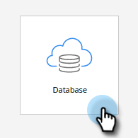

# Évaluation simple {#simple-scoring}

>[!PREREQUISITES]
>
>* [Préparer sa configuration et ajouter une personne](/help/marketo/getting-started/quick-wins/get-set-up-and-add-a-person.md){target="_blank"}
>* [Page de destination avec un formulaire](/help/marketo/getting-started/quick-wins/landing-page-with-a-form.md){target="_blank"}

## Étape 1 : Créer une campagne d&#39;évaluation {#step-create-a-scoring-campaign}

1. Accédez à la zone **[!UICONTROL Activités marketing]**.

   

1. Cliquez avec le bouton droit sur votre dossier **Learning** et cliquez sur **[!UICONTROL Nouveau dossier de campagne]**.

   

1. Nommez le dossier de campagne « Score » et cliquez sur **[!UICONTROL Créer]**.

   

   >[!NOTE]
   >
   >Si vous disposez déjà d’un dossier de notation, donnez-lui un nom différent, tel que Notation 1. Les noms de dossier doivent être uniques.

1. Cliquez avec le bouton droit sur votre dossier **Score** et sélectionnez **[!UICONTROL Nouvelle campagne intelligente]**.

   

1. Nommez la campagne « Modifier le score » et cliquez sur **[!UICONTROL Créer]**.

   

1. Cliquez sur l’onglet **[!UICONTROL Liste dynamique]**.

   

   Nous voulons que cette campagne s&#39;exécute chaque fois qu&#39;une personne remplit votre **Formulaire de demande d&#39;essai**.

1. Recherchez et faites glisser le déclencheur **[!UICONTROL Remplit le formulaire]** sur la zone de travail de gauche.

   

1. Sélectionnez **Mon formulaire**.

   

   >[!NOTE]
   >
   >Si vous avez terminé la [Page de destination avec un formulaire](/help/marketo/getting-started/quick-wins/landing-page-with-a-form.md){target="_blank"} gain rapide, vous devriez avoir le formulaire. Si vous avez utilisé un autre nom pour votre formulaire, sélectionnez-le.

1. Cliquez sur l’onglet **[!UICONTROL Flux]**.

   

1. Faites glisser l’action de flux **[!UICONTROL Modifier le score]** sur la zone de travail de gauche.

   

1. Vous pouvez saisir n’importe quelle valeur à ajouter au score de la personne. Saisissons « +5 » dans le champ **[!UICONTROL Modifier]**.

   

   >[!TIP]
   >
   >De bonnes campagnes de notation sont essentielles pour proposer des personnes de qualité aux équipes commerciales. Lisez [**Guide définitif de la notation des prospects**](https://www.marketo.com/definitive-guides/lead-scoring/){target="_blank"}.

1. Cliquez sur l’onglet **[!UICONTROL Planifier]** et sur le bouton **[!UICONTROL Activer]**.

   

1. Cliquez sur **[!UICONTROL Activer]** sur l’écran de confirmation.

   

>[!NOTE]
>
>Une fois active, cette campagne s’exécute chaque fois qu’une personne remplit le formulaire. La campagne sera opérationnelle jusqu’à ce qu’elle soit désactivée.

## Étape 2 : remplir le formulaire {#step-fill-out-the-form}

1. Sélectionnez la page de destination que vous avez créée dans la [Page de destination avec un formulaire](/help/marketo/getting-started/quick-wins/landing-page-with-a-form.md){target="_blank"} rapide.

   

1. Cliquez sur **[!UICONTROL Aperçu]**. La page de destination s’ouvre dans un nouvel onglet.

   

1. Remplissez le formulaire avec votre prénom, votre nom et votre adresse e-mail, puis cliquez sur **[!UICONTROL Envoyer]**.

   

   >[!NOTE]
   >
   >Utilisez le même nom et la même adresse e-mail que ceux que vous avez utilisés lors de votre première saisie en tant que personne afin d’appliquer l’augmentation de score « +5 ».

## Étape 3 : afficher les informations sur la personne {#step-view-the-person-info}

1. Accédez à la zone **[!UICONTROL Base de données]**.

   

1. Recherchez l’adresse e-mail utilisée lors du remplissage du formulaire.

   

1. Double-cliquez sur votre personne.

   

Les détails de votre personne s’ouvrent dans un nouvel onglet ou une nouvelle fenêtre. Voyez comment votre score a augmenté de 5 points pour remplir le formulaire ?

## Mission accomplie. {#mission-complete}

  

[◄ Mission 2 : Page de destination avec un formulaire](/help/marketo/getting-started/quick-wins/landing-page-with-a-form.md)

[Mission 4 : ► de réponse automatique aux courriers électroniques](/help/marketo/getting-started/quick-wins/email-auto-response.md)
