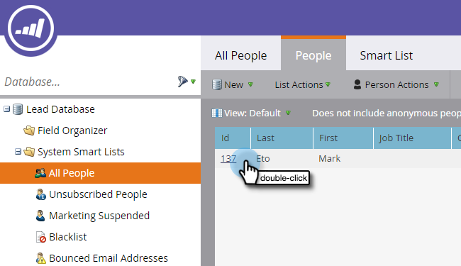

# Mettre à jour les données personnelles {#update-person-data}

## Mission : Mettre à jour les coordonnées d’une personne ou d’autres données {#mission-update-a-persons-contact-info-or-other-data}

>[!NOTE]
>
>**FYI**
>
>Marketo est maintenant en train de normaliser la langue dans tous les abonnements. Vous pouvez donc voir des pistes dans votre abonnement et des personnes/personnes dans docs.marketo.com. Ces termes signifient la même chose ; cela n&#39;a aucune incidence sur les instructions relatives aux articles. Il y a aussi d&#39;autres changements. [En savoir plus](http://docs.marketo.com/display/DOCS/Updates+to+Marketo+Terminology).

>[!NOTE]
>
>**Conditions préalables**
>
>* [Configurer et Ajouter une personne](get-set-up-and-add-a-person.md)
>* [Importer une Liste de personnes](import-a-list-of-people.md)

>

Imaginons que dans votre salon, une personne vous ait donné des coordonnées supplémentaires. Voici comment mettre à jour les données personnelles.

## Rechercher la personne à mettre à jour {#find-the-person-you-need-to-update}

1. Accédez à votre base de données.

   

1. Recherchez le nom ou l’adresse électronique de la personne.

   >[!TIP]
   >
   >L&#39;utilisation de l&#39;adresse électronique pour effectuer la recherche accélère la recherche.

   

1. Cliquez sur le doublon pour ouvrir le détail de la personne.

   

   >[!TIP]
   >
   >Il existe de nombreuses façons de mettre à jour les données des personnes dans Marketo. Voir [Importation d’une Liste de personnes](import-a-list-of-people.md) et [modification de la valeur](../../product-docs/core-marketo-concepts/smart-campaigns/flow-actions/change-data-value.md)des données.

## Mise à jour des données personnelles {#update-the-person-data}

1. Saisissez les nouvelles informations que vous avez reçues, puis fermez l’onglet.

>[!NOTE]
>
>Une fois les données modifiées, les Listes dynamiques et les campagnes dynamiques reconnaîtront immédiatement les nouvelles informations.

## Fin de la mission {#mission-complete}

Beau boulot ! Vous avez mis à jour vos données personnelles.

  

[Mission 8 : Alerter la](alert-the-sales-rep.md) mission du représentant [commercial 10 : Rediriger un Landing page ►](redirect-a-landing-page.md)