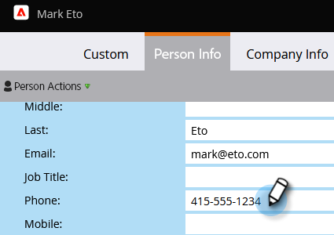

# Mettre à jour les données de personne {#update-person-data}

## Mission : mise à jour des coordonnées d’une personne ou d’autres données {#mission-update-a-persons-contact-info-or-other-data}

>[!PREREQUISITES]
>
>* [Configurer et ajouter une personne](/help/marketo/getting-started/quick-wins/get-set-up-and-add-a-person.md){target="_blank"}
>* [Importer une liste de personnes](/help/marketo/getting-started/quick-wins/import-a-list-of-people.md){target="_blank"}

Imaginons que dans votre salon récent, une personne vous ait donné des coordonnées supplémentaires. Voici comment mettre à jour les données de personne.

## Rechercher la personne que vous devez mettre à jour {#find-the-person-you-need-to-update}

1. Accédez à votre **[!UICONTROL base de données]**.

   

1. Recherchez le nom ou l’adresse électronique de la personne.

   >[!TIP]
   >
   >L’utilisation de l’adresse électronique pour effectuer des recherches plus rapidement.

   

1. Double-cliquez pour ouvrir le détail de la personne.

   

   >[!TIP]
   >
   >Il existe de nombreuses façons de mettre à jour les données de personne dans Marketo. Voir [Importer une liste de personnes](/help/marketo/getting-started/quick-wins/import-a-list-of-people.md){target="_blank"} et [Modifier la valeur des données](/help/marketo/product-docs/core-marketo-concepts/smart-campaigns/flow-actions/change-data-value.md){target="_blank"}.

## Mise à jour des données personnelles {#update-the-person-data}

1. Saisissez les nouvelles informations que vous avez reçues, puis fermez l’onglet.

>[!NOTE]
>
>Une fois les données modifiées, les listes intelligentes et les campagnes intelligentes reconnaissent immédiatement les nouvelles informations.

## Mission accomplie {#mission-complete}

Beau boulot ! Vous avez mis à jour vos données personnelles.

  

[◄ Mission 8 : Alerter le représentant commercial](/help/marketo/getting-started/quick-wins/alert-the-sales-rep.md)

[Mission 10 : redirection d’une page d’entrée ►](/help/marketo/getting-started/quick-wins/redirect-a-landing-page.md)
