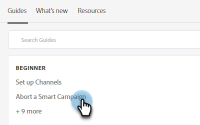
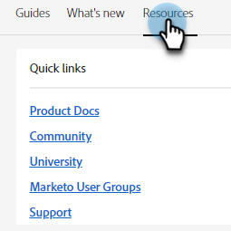

# Centre d’aide {#help-center}

Le centre d’aide d’Adobe Marketo Engage sert d’emplacement centralisé pour obtenir de l’aide. Outre les liens vers diverses ressources (par exemple, [documentation du produit](/help/marketo/home.md){target="_blank"}, [informations sur la version](/help/marketo/release-notes/current.md){target="_blank"}, [Communauté Marketing Nation](https://nation.marketo.com/){target="_blank"}), vous pouvez accéder à des présentations très utiles, intégrées au produit et organisées par niveau d’expérience.

## Comment y accéder {#how-to-access}

Après vous être connecté à Marketo Engage, cliquez sur l’icône d’aide.

### Guides {#guides}

Les guides servent de présentations rapides des fonctionnalités populaires.

1. Cliquez sur le guide souhaité pour l’afficher.

   

1. Cliquez sur **Commencer**.

   

1. Cliquez sur **Suivant** pour continuer.

   

1. Cliquez sur **Terminé** pour quitter la présentation.

   

   >[!TIP]
   >
   >Quittez le guide à tout moment en cliquant sur **Ignorer**.

### Nouveautés {#whats-new}

L’onglet Nouveautés contient tous les détails sur la dernière version de Marketo Engage.

>[!TIP]
>
>Cliquez sur l’icône de flèche située en bas pour afficher la page dans Experience League.

### Ressources {#resources}

L’onglet Ressources vous donne un accès rapide et direct aux différentes manières d’obtenir de l’aide supplémentaire pour votre instance Marketo Engage.

