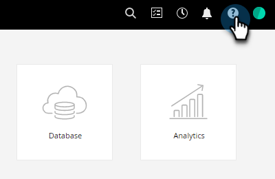

# Centre d’aide {#help-center}

Le centre d’aide d’Adobe Marketo Engage sert d’emplacement centralisé pour obtenir de l’aide. Outre les liens vers diverses ressources (par exemple, [documentation du produit](/help/marketo/home.md){target="_blank"}, [informations sur la version](/help/marketo/release-notes/current.md){target="_blank"}, [Communauté Marketing Nation](https://nation.marketo.com/){target="_blank"}), vous pouvez accéder à des présentations très utiles, intégrées au produit et organisées par niveau d’expérience.

## Comment y accéder {#how-to-access}

Il existe deux expériences différentes, selon que votre abonnement a déjà été migré ou non vers le système de gestion des identités (IMS) Adobe.

### Avant la migration vers Adobe IMS {#pre-adobe-ims-integration}

Ces étapes sont destinées aux utilisateurs et utilisatrices de Marketo Engage qui n’ont _pas_ encore été migrés vers [Adobe IMS](/help/marketo/product-docs/administration/marketo-with-adobe-identity/adobe-identity-management-overview.md){target="_blank"}.

[Connectez-vous](https://login.marketo.com/){target="_blank"} à Marketo Engage et cliquez sur l’icône Aide.

#### Guides {#guides}

Les guides servent de présentations rapides des fonctionnalités populaires.

1. Cliquez sur le guide souhaité pour l’afficher.

   

1. Cliquez sur **Commencer**.

   

1. Cliquez sur **Suivant** pour continuer.

   

1. Cliquez sur **Terminé** pour quitter la présentation.

   

   >[!TIP]
   >
   >Quittez le guide à tout moment en cliquant sur **Ignorer**.

#### Nouveautés {#whats-new}

L’onglet Nouveautés contient les détails de la dernière version de Marketo Engage.

>[!TIP]
>
>Cliquez sur l’icône de flèche située en bas pour afficher la page dans Experience League.

#### Ressources {#resources}

L’onglet Ressources vous donne un accès rapide et direct aux différentes manières d’obtenir de l’aide supplémentaire pour votre instance Marketo Engage.

### Après la migration vers Adobe IMS {#post-adobe-ims-integration}

Ces étapes sont destinées aux utilisateurs et utilisatrices de Marketo Engage qui ont déjà été migrés vers [Adobe IMS](/help/marketo/product-docs/administration/marketo-with-adobe-identity/adobe-identity-management-overview.md){target="_blank"}.

[Connectez-vous](https://experience.adobe.com/){target="_blank"} à Marketo Engage et cliquez sur l’icône Aide.

Le centre d’aide s’affiche. Cliquez sur l’une des ressources d’aide répertoriées pour accéder à sa zone respective. Vous pouvez également rechercher des termes spécifiques.

Les guides (qui faisaient auparavant partie du Centre d’aide avant la migration vers Adobe IMS) se trouvent désormais dans la zone de navigation de gauche.

Le centre de guides comporte deux onglets : Guides et Nouveautés. Les guides servent de présentations rapides des fonctionnalités populaires dans Marketo Engage. Cliquez sur un guide souhaité ou recherchez-en un en particulier.

L’onglet Nouveautés contient les détails de la dernière version de Marketo Engage.

