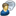

# Glossaire des icônes Marketo Engage {#icon-glossary}

Vous trouverez ci-dessous les icônes de l’interface actuelle de Adobe Marketo Engage. Si vous devez référencer les icônes Marketo Classic, elles se trouvent [ici](/help/marketo/getting-started/things-to-know/classic-icon-glossary.md).

## Icônes générales {#general-icons}

<table>
 <tbody>
  <tr>
   <th style="width:25%">Ancienne Icône</th>
   <th style="width:25%">Icône Nouveau</th>
   <th style="width:50%">Description</th>
  </tr>
  <tr>
   <td><strong>S.O.</strong></td>
   <td></td>
   <td>Liste intelligente des comptes</td>
  </tr>
  <tr>
   <td></td>
   <td></td>
   <td>Campagne par lots - active</td>
  </tr>
  <tr>
   <td></td>
   <td></td>
   <td>Campagne par lots - inactive</td>
  </tr>
  <tr>
   <td></td>
   <td></td>
   <td>Programme par défaut</td>
  </tr>
  <tr>
   <td></td>
   <td></td>
   <td>E-mail</td>
  </tr>
  <tr>
   <td></td>
   <td></td>
   <td>Programme d’e-mail</td>
  </tr>
  <tr>
   <td></td>
   <td></td>
   <td>Modèle d'e-mail</td>
  </tr>
  <tr>
   <td></td>
   <td></td>
   <td>Programme d’engagement</td>
  </tr>
  <tr>
   <td></td>
   <td></td>
   <td>Programme d’événement</td>
  </tr>
  <tr>
   <td></td>
   <td></td>
   <td>Campagne exécutable</td>
  </tr>
  <tr>
   <td></td>
   <td></td>
   <td>Organisateur de champ</td>
  </tr>
  <tr>
   <td></td>
   <td></td>
   <td>Filtre</td>
  </tr>
  <tr>
   <td><strong>S.O.</strong></td>
   <td></td>
   <td>Filtre - actif</td>
  </tr>
  <tr>
   <td></td>
   <td></td>
   <td>Dossier</td>
  </tr>
  <tr>
   <td></td>
   <td></td>
   <td>Dossier - archivé</td>
  </tr>
  <tr>
   <td></td>
   <td></td>
   <td>Dossier - partagé</td>
  </tr>
  <tr>
   <td></td>
   <td></td>
   <td>Dossier - verrouillé</td>
  </tr>
  <tr>
   <td></td>
   <td></td>
   <td>Form</td>
  </tr>
  <tr>
   <td></td>
   <td></td>
   <td>Images (et fichiers)</td>
  </tr>
  <tr>
   <td></td>
   <td></td>
   <td>Messages internes à l’application</td>
  </tr>
  <tr>
   <td></td>
   <td></td>
   <td>Programme in-app</td>
  </tr>
  <tr>
   <td></td>
   <td></td>
   <td>Page de destination</td>
  </tr>
  <tr>
   <td></td>
   <td></td>
   <td>Modèle de page de destination</td>
  </tr>
  <tr>
   <td></td>
   <td></td>
   <td>Modèle</td>
  </tr>
  <tr>
   <td></td>
   <td></td>
   <td>Sondage</td>
  </tr>
  <tr>
   <td></td>
   <td></td>
   <td>Notification Push</td>
  </tr>
  <tr>
   <td></td>
   <td></td>
   <td>Offre de parrainage</td>
  </tr>
  <tr>
   <td></td>
   <td></td>
   <td>Rapport</td>
  </tr>
  <tr>
   <td><strong>S.O.</strong></td>
   <td></td>
   <td>Recherche</td>
  </tr>
  <tr>
   <td></td>
   <td></td>
   <td>Segments</td>
  </tr>
  <tr>
   <td></td>
   <td></td>
   <td>Liste intelligente</td>
  </tr>
  <tr>
   <td></td>
   <td></td>
   <td>Liste dynamique - mise en cache</td>
  </tr>
  <tr>
   <td></td>
   <td></td>
   <td>Message SMS</td>
  </tr>
  <tr>
   <td></td>
   <td></td>
   <td>Extraits</td>
  </tr>
  <tr>
   <td></td>
   <td></td>
   <td>Réseaux sociaux</td>
  </tr>
  <tr>
   <td></td>
   <td></td>
   <td>Liste statique</td>
  </tr>
  <tr>
   <td></td>
   <td></td>
   <td>Loteries</td>
  </tr>
  <tr>
   <td></td>
   <td></td>
   <td>Groupe de test</td>
  </tr>
  <tr>
   <td></td>
   <td></td>
   <td>Déclencheur - actif</td>
  </tr>
  <tr>
   <td><strong>S.O.</strong></td>
   <td></td>
   <td>Déclencheur - inactif</td>
  </tr>
  <tr>
   <td></td>
   <td></td>
   <td>Espace de travail</td>
  </tr>
  <tr>
   <td></td>
   <td></td>
   <td>Vidéo YouTube</td>
  </tr>
 </tbody>
</table>

## Campagnes par lot {#batch-campaigns}

<table>
 <tbody>
  <tr>
   <th style="width:25%">Ancienne Icône</th>
   <th style="width:25%"> Icône Nouveau</th>
   <th style="width:50%">Description</th>
  </tr>
  <tr>
   <td></td>
   <td></td>
   <td>S’est exécuté, rien à venir</td>
  </tr>
  <tr>
   <td></td>
   <td></td>
   <td>Non valide</td>
  </tr>
  <tr>
   <td></td>
   <td></td>
   <td>Ne jamais exécuter</td>
  </tr>
  <tr>
   <td></td>
   <td></td>
   <td>En exécution, en phase d’attente</td>
  </tr>
  <tr>
   <td></td>
   <td></td>
   <td>Planifié pour l'exécution</td>
  </tr>
  <tr>
   <td></td>
   <td></td>
   <td>Nouvelle exécution planifiée</td>
  </tr>
  <tr>
   <td></td>
   <td></td>
   <td>Utilisé par Nurture</td>
  </tr>
 </tbody>
</table>

## Déclencher les campagnes {#trigger-campaigns}

<table>
 <tbody>
  <tr>
   <th style="width:25%">Ancienne Icône</th>
   <th style="width:25%"> Icône Nouveau</th>
   <th style="width:50%">Description</th>
  </tr>
  <tr>
   <td></td>
   <td></td>
   <td>Actif</td>
  </tr>
  <tr>
   <td></td>
   <td></td>
   <td>Est demandé</td>
  </tr>
  <tr>
   <td><strong>S.O.</strong></td>
   <td></td>
   <td>Inactif</td>
  </tr>
  <tr>
   <td></td>
   <td></td>
   <td>Non valide</td>
  </tr>
 </tbody>
</table>

## Programmes d’e-mail {#email-programs}

<table>
 <tbody>
  <tr>
   <th style="width:25%">Ancienne Icône</th>
   <th style="width:25%"> Icône Nouveau</th>
   <th style="width:50%">Description</th>
  </tr>
  <tr>
   <td></td>
   <td></td>
   <td>Interrompu</td>
  </tr>
  <tr>
   <td></td>
   <td></td>
   <td>Terminé</td>
  </tr>
  <tr>
   <td></td>
   <td></td>
   <td>Non approuvé</td>
  </tr>
  <tr>
   <td></td>
   <td></td>
   <td>Planifiés</td>
  </tr>
 </tbody>
</table>

## Programmes d’engagement {#engagement-programs}

<table>
 <tbody>
  <tr>
   <th style="width:25%">Ancienne Icône</th>
   <th style="width:25%"> Icône Nouveau</th>
   <th style="width:50%">Description</th>
  </tr>
  <tr>
   <td></td>
   <td></td>
   <td>Désactivé</td>
  </tr>
  <tr>
   <td></td>
   <td></td>
   <td>Activé</td>
  </tr>
 </tbody>
</table>

## Programmes in-app {#in-app-programs}

<table>
 <tbody>
  <tr>
   <th style="width:25%">Ancienne Icône</th>
   <th style="width:25%"> Icône Nouveau</th>
   <th style="width:50%">Description</th>
  </tr>
  <tr>
   <td></td>
   <td></td>
   <td>Approuvé</td>
  </tr>
  <tr>
   <td></td>
   <td></td>
   <td>Not Configured Yet</td>
  </tr>
  <tr>
   <td></td>
   <td></td>
   <td>En pause</td>
  </tr>
  <tr>
   <td><strong>S.O.</strong></td>
   <td></td>
   <td>Planifiés</td>
  </tr>
  <tr>
   <td></td>
   <td></td>
   <td>Arrêté</td>
  </tr>
 </tbody>
</table>

## Ressources {#assets}

<table>
 <tbody>
  <tr>
   <th style="width:25%">Ancienne Icône</th>
   <th style="width:25%"> Icône Nouveau</th>
   <th style="width:50%">Description</th>
  </tr>
  <tr>
   <td></td>
   <td></td>
   <td>Approuvé</td>
  </tr>
  <tr>
   <td></td>
   <td></td>
   <td>Brouillon</td>
  </tr>
  <tr>
   <td></td>
   <td></td>
   <td>Approuvé avec brouillon</td>
  </tr>
 </tbody>
</table>

## Segments {#segments}

<table>
 <tbody>
  <tr>
   <th style="width:25%">Ancienne Icône</th>
   <th style="width:25%"> Icône Nouveau</th>
   <th style="width:50%">Description</th>
  </tr>
  <tr>
   <td><strong>S.O.</strong></td>
   <td></td>
   <td>Approuvé - en cours de calcul</td>
  </tr>
  <tr>
   <td><strong>S.O.</strong></td>
   <td></td>
   <td>Approuvé - en cours de recalcul</td>
  </tr>
  <tr>
   <td><strong>S.O.</strong></td>
   <td></td>
   <td>Brouillon - en cours de calcul</td>
  </tr>
 </tbody>
</table>
