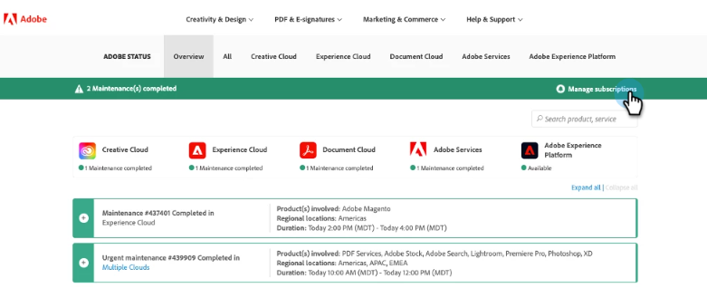
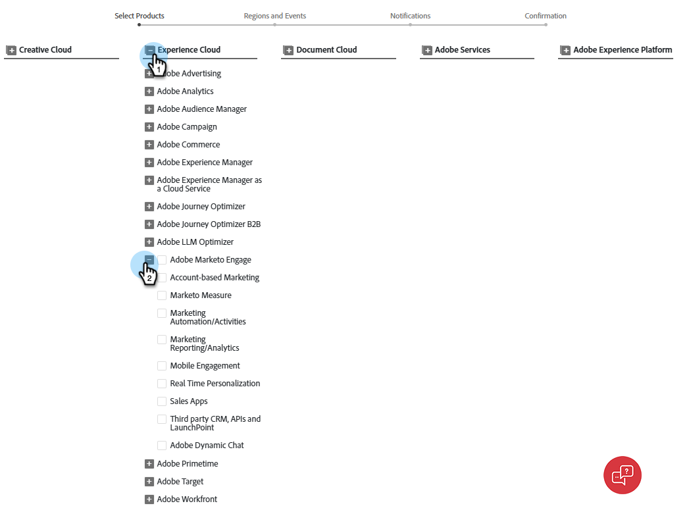

# Abonnement aux notifications d’état du système {#subscribe-to-system-status-notifications}

Découvrez comment vous abonner à différentes notifications de statut pour rester informé des problèmes actuels.

>[!PREREQUISITES]
>
>Avant de pouvoir créer un abonnement, vous devez d’abord identifier le centre de données et le pod/serveur dans lesquels se trouve votre abonnement.

## Identification de votre datacenter {#identify}

1. Dans la section **Admin** de Marketo Engage, cliquez sur **Mon compte**.

   

1. Faites défiler jusqu’à _Informations d’assistance_.

   

Dans le champ _Centre de données_, les lettres correspondent au centre de données et les chiffres au pod. Dans l’exemple ci-dessus, l’utilisateur se trouve dans notre centre de données Ashburn sur la capsule 49.

À l’étape 7 de [section ci-dessous](#create-a-subscription), cet utilisateur sélectionnerait l’emplacement régional **Marketo Ashburn** et le pod **ab49**.

**Abréviations des centres de données**

ab : Ashburn
sj : San Jose
sn : Sydney
lon : Londres
nld : Amsterdam

>[!TIP]
>
>Cette méthode peut également être utilisée pour identifier le pod/serveur Real Time Personalization (RTP) dans lequel se trouve votre abonnement.

## Créer un abonnement {#create-a-subscription}

Après [identification de votre centre de données et de votre pod/serveur](#identify), suivez les étapes ci-dessous pour créer un abonnement.

1. Sur [status.adobe.com](https://status.adobe.com/fr), cliquez sur **Gérer les abonnements**.

   

1. Connectez-vous (si ce n’est pas déjà fait) à l’aide de vos identifiants Adobe ou cliquez sur **Créer un compte** si vous n’en avez pas.

   

1. Restez dans l’onglet _Description des produits_ et cliquez sur **Créer des abonnements**.

   

1. Cliquez sur l’icône  située en regard de _Experience Cloud_ pour développer le menu. Faites de même pour _Adobe Marketo Engage_.

   {width="800"}

1. Sélectionnez les produits/services pour lesquels vous souhaitez recevoir des notifications et cliquez sur **Continuer**.

   >[!TIP]
   >
   >Cochez _Adobe Marketo Engage_ pour tout sélectionner.

   {width="800"}

1. Sélectionnez les types d’événements souhaités.

   

   <table style="width:500px;">
   <tr>
   <td style="width:35%;"><b>Problème de service majeur</b></td>
   <td>Indisponibilité du service ou dégradation sévère des performances pour plusieurs utilisateurs sur les systèmes d’exploitation.</td>
   </tr>
   <tr>
   <td style="width:35%;"><b>Problème mineur de service</b></td>
   <td>Indisponibilité partielle du service ou dégradation modérée des performances pour plusieurs utilisateurs sur les systèmes d’exploitation.</td>
   </tr>
   <tr>
   <td style="width:35%;"><b>Maintenance des services</b></td>
   <td>Des fenêtres planifiées pour effectuer la maintenance du produit, ce qui peut avoir un impact sur sa disponibilité ou ses performances.</td>
   </tr>
   <tr>
   <td style="width:35%;"><b>Annonces</b></td>
   <td>Messages globaux, de famille de produits ou liés à des produits qui ont un large impact.</td>
   </tr>
   </table>

1. Sélectionnez l’emplacement régional et l’environnement. Cliquez sur **Continuer**.

   {width="900"}

   >[!NOTE]
   >
   >Si vous n’avez pas trouvé l’emplacement correspondant, reportez-vous à la section [&#x200B; Identifier votre centre de données &#x200B;](#identify).

1. Choisissez votre préférence d’abonnement, **E-mail** ou **Slack**, puis cliquez sur **Continuer**.

   

1. Vérifiez vos sélections et cliquez sur **Confirmer les préférences**.

   
