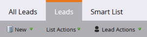

# Mises à jour de la terminologie Marketo {#updates-to-marketo-terminology}

Nous apportons des modifications à notre plateforme, ce qui va affecter ce que certains éléments sont appelés. Si vous disposez d’une nouvelle instance Marketo à compter de mars 2016 ou si votre société a renouvelée après juillet 2016, la nouvelle terminologie s’affiche peut-être maintenant.

Bien que la terminologie de la documentation Marketo puisse varier, assurez-vous que chaque article sera bientôt mis à jour pour prendre en compte ces modifications. Toutes les instructions sont les mêmes.

Alors, qu&#39;est-ce qui a changé ?

## Le prospect est maintenant une personne {#lead-is-now-person}

Le changement le plus important est le changement de nom de piste/pistes en personne/personnes.

<table> 
 <colgroup> 
  <col> 
  <col> 
 </colgroup> 
 <tbody> 
  <tr> 
   <td><strong>Ancien</strong></td> 
   <td><strong>Nouveau</strong></td> 
  </tr> 
  <tr> 
   <td> 
    
 
      
    
</td> 
   <td> 
    
 
      
    
</td> 
  </tr> 
 </tbody> 
</table>

Dans certains cas, le mot &quot;plomb&quot; est simplement supprimé.

<table> 
 <colgroup> 
  <col> 
  <col> 
 </colgroup> 
 <tbody> 
  <tr> 
   <td><strong>Ancien</strong></td> 
   <td><strong>Nouveau</strong></td> 
  </tr> 
  <tr> 
   <td> 
    
 
      
    
</td> 
   <td> 
    
 
     

 
    
</td> 
  </tr> 
 </tbody> 
</table>

&quot;Lead&quot; et &quot;personne&quot; **sont la même chose**.

## Jetons {#tokens}

Les jetons contenant le mot &quot;lead&quot; **ne changent pas**. Nous vous excusons pour toute confusion ; toutefois, modifier tous les jetons pour qu’ils correspondent à la nouvelle terminologie romprait un grand nombre de jetons actuellement utilisés. Vous verrez donc toujours des jetons tels que &quot;`{{lead.First Name}}`&quot;. Il n’existe aucun jeton spécifique à une personne.

>[!NOTE]
>
>*contient un jeton appelé &quot;Person Notes&quot;, mais ce jeton était toujours présent.* Il est généralement utilisé pour un champ de description dans votre gestion de la relation client (CRM), le cas échéant.

## Gestion des champs {#field-management}

Les champs qui contenaient le terme &quot;piste&quot; ont été remplacés par &quot;personne&quot; ou le mot &quot;piste&quot; a été supprimé. Une exception notable est toutefois le champ &quot;Propriétaire du prospect&quot;. Il est désormais appelé &quot;Propriétaire des ventes&quot;.

<table> 
 <colgroup> 
  <col> 
  <col> 
 </colgroup> 
 <tbody> 
  <tr> 
   <td><strong>Ancien</strong></td> 
   <td><strong>Nouveau</strong></td> 
  </tr> 
  <tr> 
   <td> 
    
 
      
    
</td> 
   <td> 
    
 
      
    
</td> 
  </tr> 
 </tbody> 
</table>

>[!NOTE]
>
>Pour obtenir la liste complète des noms de champ concernés, consultez cet [article de support](https://nation.marketo.com/docs/DOC-4218#jive_content_id_Field_Names_and_Tokens){target="_blank"}.

## La Personalization en temps réel (RTP) est désormais Personalization web {#real-time-personalization-rtp-is-now-web-personalization}

<table> 
 <colgroup> 
  <col> 
  <col> 
 </colgroup> 
 <tbody> 
  <tr> 
   <td><strong>Ancien</strong></td> 
   <td><strong>Nouveau</strong></td> 
  </tr> 
  <tr> 
   <td> 
    
 
      
    
</td> 
   <td> 
    
 
      
    
</td> 
  </tr> 
 </tbody> 
</table>

Outre le changement de nom, il se compose désormais de quatre applications distinctes :

| **[Personalization Web](https://docs.marketo.com/display/DOCS/Web+Personalization+-+RTP){target="_blank"}** | Comporte une mosaïque sur l’écran d’accueil |
|---|---|
| **[Marketing Web basé sur un compte](https://docs.marketo.com/display/DOCS/Account-Based+Web+Marketing){target="_blank"}** | Accessible via la mosaïque Personalization web |
| **[Reciblage personnalisé](https://docs.marketo.com/display/DOCS/Website+Retargeting){target="_blank"}** | Accessible via la mosaïque Personalization web |
| **[Contenu prédictif](https://docs.marketo.com/display/DOCS/Predictive+Content){target="_blank"}** | Comporte une mosaïque sur l’écran d’accueil |

>[!NOTE]
>
>Les mosaïques visibles sur votre écran d’accueil reflètent les modules achetés.

Merci pour votre patience lors de cette mise à jour.
