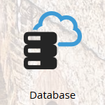

# Mises à jour de la terminologie Marketo {#updates-to-marketo-terminology}

Nous apportons des modifications à notre plateforme, ce qui aura une incidence sur la dénomination de certains éléments. Si vous disposez d’une nouvelle instance Marketo à compter de mars 2016, ou si votre société a renouvelé son contrat après juillet 2016, il est possible que vous voyiez la nouvelle terminologie.

Bien que la terminologie puisse varier dans la documentation de Marketo, nous vous assurons que chaque article sera bientôt mis à jour pour refléter ces modifications. Toutes les instructions sont identiques.

Qu’est-ce qui a donc changé ?

## Le lead devient une personne. {#lead-is-now-person}

La modification la plus importante est le changement de nom de lead/leads en personne/personnes.

<table>
 <colgroup>
  <col>
  <col>
 </colgroup>
 <tbody>
  <tr>
   <td><strong>Ancien</strong></td>
   <td><strong>Nouveau</strong></td>
  </tr>
  <tr>
   <td>
    

     
    
</td>
   <td>
    

     
    
</td>
  </tr>
 </tbody>
</table>

Dans certains cas, le mot « lead » est purement et simplement supprimé.

<table>
 <colgroup>
  <col>
  <col>
 </colgroup>
 <tbody>
  <tr>
   <td><strong>Ancien</strong></td>
   <td><strong>Nouveau</strong></td>
  </tr>
  <tr>
   <td>
    

     
    
</td>
   <td>
    

     

    
</td>
  </tr>
 </tbody>
</table>

Lead et Personne **correspondent à la même chose**.

## Jetons {#tokens}

Les jetons contenant le mot lead **ne changent pas**. Nous nous excusons pour toute confusion. Toutefois, la modification de tous les jetons pour s’aligner sur la nouvelle terminologie romprait un grand nombre de jetons utilisés actuellement. Vous verrez donc toujours des jetons tels que « `{{lead.First Name}}` ». Il n’existe aucun jeton spécifique à une personne.

>[!NOTE]
>
>Il *existe* un jeton appelé « Notes de la personne », mais ce jeton a toujours été là. Il est généralement utilisé, le cas échéant, pour un champ de description dans votre CRM.

## Gestion des champs {#field-management}

Les champs qui contenaient le terme Lead ont été remplacés par Personne ou le mot Lead a été supprimé. Une exception notable réside toutefois dans le champ « Propriétaire du lead ». Il est maintenant connu sous le nom de « Propriétaire de ventes ».

<table>
 <colgroup>
  <col>
  <col>
 </colgroup>
 <tbody>
  <tr>
   <td><strong>Ancien</strong></td>
   <td><strong>Nouveau</strong></td>
  </tr>
  <tr>
   <td>
    

     
    
</td>
   <td>
    

     
    
</td>
  </tr>
 </tbody>
</table>

>[!NOTE]
>
>Pour obtenir la liste complète des noms de champs concernés, consultez cet [article de support](https://nation.marketo.com/docs/DOC-4218#jive_content_id_Field_Names_and_Tokens){target="_blank"}.

## Real-Time Personalization (RTP) est désormais Web Personalization. {#real-time-personalization-rtp-is-now-web-personalization}

<table>
 <colgroup>
  <col>
  <col>
 </colgroup>
 <tbody>
  <tr>
   <td><strong>Ancien</strong></td>
   <td><strong>Nouveau</strong></td>
  </tr>
  <tr>
   <td>
    

     
    
</td>
   <td>
    

     
    
</td>
  </tr>
 </tbody>
</table>

En plus du changement de nom, il se compose désormais de quatre applications distinctes :

| **[Web Personalization](https://docs.marketo.com/display/DOCS/Web+Personalization+-+RTP){target="_blank"}** | A sa propre vignette sur l’écran d’accueil. |
|---|---|
| **[Marketing web basé sur les comptes](https://docs.marketo.com/display/DOCS/Account-Based+Web+Marketing){target="_blank"}** | Accessible via la vignette Web Personalization. |
| **[Reciblage personnalisé](https://docs.marketo.com/display/DOCS/Website+Retargeting){target="_blank"}** | Accessible via la vignette Web Personalization. |
| **[Contenu prédictif](https://docs.marketo.com/display/DOCS/Predictive+Content){target="_blank"}** | A sa propre vignette sur l’écran d’accueil. |

>[!NOTE]
>
>Les vignettes visibles sur votre écran d’accueil refléteront les modules achetés.

Merci de votre patience pendant cette mise à jour.
