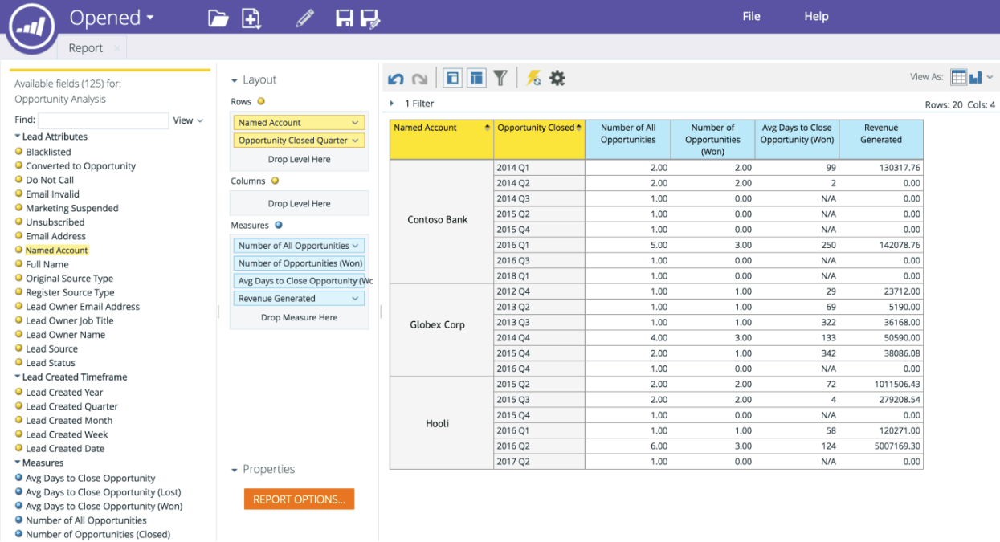

# Dimension de compte nommée dans RCA {#named-account-dimension-in-rca}

Créez des rapports basés sur les recettes à l’aide de la dimension Compte nommé spécifique à l’ABM dans l’analyse du cycle des recettes.

>[!NOTE]
>
>**Dimensions**  - attributs (représentés par des points jaunes) qui donnent différentes vues des mesures.

>[!NOTE]
>
>La dimension Compte nommé dans la CRE peut être utilisée pour mesurer l’impact sur les résultats des comptes ciblés (par exemple, les recettes gagnées, le pipeline généré ou l’accélération du cycle de vente). Cette dimension peut également être utilisée pour identifier les programmes qui se sont comportés correctement par rapport aux comptes nommés.

Les rapports suivants ont accès à la dimension Compte nommé :

* Analyse de courriel
* Analyse de piste
* Analyse des opportunités
* Analyse d&#39;adhésion programme

>[!NOTE]
>
>Vous trouverez ci-dessous quelques exemples d’ABM de Marketo dans les analyses du cycle des recettes.

Accélération du pipeline dans les comptes nommés

Efficacité et succès du canal par des comptes nommés

Efficacité et impact des programmes sur les résultats

Couverture des pistes de qualité et de l&#39;engagement dans des comptes nommés

