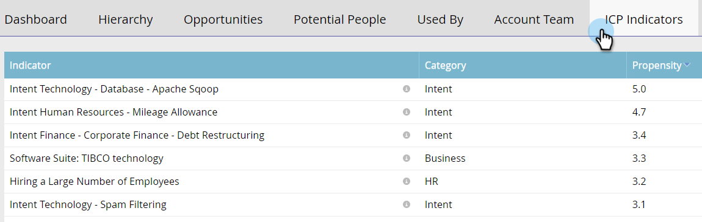

# Statistiques du compte nommé {#named-account-insights}

Le Tableau de bord Compte nommé fournit une vue de 360 degrés d’un compte de cible.

## Tableau de bord {#dashboard}

L&#39;tableau de bord agrégat des informations clés au niveau d&#39;un compte de toutes les personnes d&#39;un compte donné, évitant ainsi de devoir aller à chaque personne pour évaluer leur progression. Vous pouvez approfondir l&#39;analyse de l&#39;activité des courriels en utilisant [Email Insights](http://docs.marketo.com/display/DOCS/Filtering+in+Email+Insights#FilteringinEmailInsights-AccountBasedMarketing).

>[!NOTE]
>
>Les graphiques présentent les statistiques des 90 derniers jours.

**Engagement du compte dans le** tempsCliquez sur la liste  **** déroulante de droite pour modifier votre vue. Outre la note de compte, vous pouvez effectuer une vue par Recettes totales...

...ou Pipeline.

<table> 
 <tbody> 
  <tr> 
   <td><strong>Note de compte</strong></td> 
   <td>
Affichez l’engagement semaine après semaine en fonction de tous les scores de compte que vous avez créés dans Admin. Vous pouvez comparer ces scores de compte côte à côte. Pour déterminer l’engagement hebdomadaire, nous prenons l’engagement maximum de n’importe quel jour de la semaine.
</td> 
  </tr> 
  <tr> 
   <td><strong>Pipeline</strong></td> 
   <td>Consultez le pipeline au fil du temps. Pour déterminer le pipeline au fil du temps, nous prenons le pipeline le dernier jour.</td> 
  </tr> 
  <tr> 
   <td><strong>Recettes</strong></td> 
   <td>Voir les recettes au fil du temps. Pour déterminer les recettes au fil du temps, nous prenons la somme de toutes les recettes gagnées au cours de cette semaine.</td> 
  </tr> 
 </tbody> 
</table>

**Moments intéressants**

Disponible pour les utilisateurs de [Marketing Sales Insight](http://docs.marketo.com/display/DOCS/Marketo+Sales+Insight), consultez les moments intéressants cumulés au niveau du compte.

**Principales personnes**

Ces personnes sont calculées en fonction de priorités basées sur la récence ou l’urgence des personnes de comptes nommés (comme [Meilleurs paris](http://docs.marketo.com/display/DOCS/Priority,+Urgency,+Relative+Score,+and+Best+Bets) dans Sales Insight), ou Scores définies par l’utilisateur. **La** priorité n’est disponible que pour les utilisateurs de Marketo Sales Insight.

**Inclut les enfants**

Cliquez sur **Inclut les enfants** pour afficher et choisir les comptes enfants du compte nommé sélectionné et vue les analyses de leurs agrégats.

>[!NOTE]
>
>Lors de la sélection de comptes, vous pouvez sélectionner tous les comptes ou sélectionner individuellement jusqu’à 100 comptes.

## Hiérarchie {#hierarchy}

Voir où réside le compte nommé sélectionné par rapport à sa hiérarchie.

## Opportunités {#opportunities}

Vue de cumul de toutes les opportunités ouvertes au niveau du compte, aidant les équipes marketing à se concentrer sur la fermeture d’opportunités spécifiques.

## Personnes potentielles {#potential-people}

La mise en correspondance de pistes/comptes utilise une logique floue pour trouver des correspondances faibles qui peuvent être résolues dans l&#39;onglet Personnes potentielles.

>[!NOTE]
>
>Pour ajouter l’une des personnes répertoriées, sélectionnez-les et cliquez sur **Ajouter les personnes**.

## Utilisé par {#used-by}

Cet onglet indique les campagnes intelligentes, les campagnes Web, les listes actives ou les rapports qui référencent actuellement des comptes ou des listes de compte spécifiques.

## Equipe de compte {#account-team}

Membres de l&#39;équipe du compte de vue, ajouter/supprimer des membres, et même affecter un propriétaire de compte dans cet onglet.

>[!NOTE]
>
>Cliquez sur la liste déroulante **Actions de l&#39;équipe du compte** pour ajouter/supprimer des membres du compte ou affecter un propriétaire de compte.

## Indicateurs du PCI {#icp-indicators}

Vue des indicateurs ICP que vous avez sélectionnés pour l&#39;exportation lorsque vous avez [affiné votre modèle](http://docs.marketo.com/display/DOCS/Account+AI+Overview#AccountAIOverview-ModelTuning).

