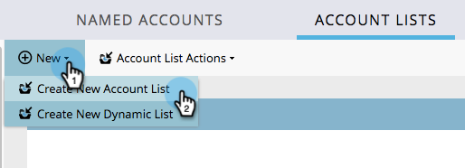

# Listes de compte {#account-lists}

Une liste de compte est un ensemble de comptes nommés qui peuvent être ciblés ensemble. Les listes de compte vous permettent de cible des comptes nommés par secteur, emplacement ou taille de la société.

Outre les listes de compte, vous pouvez également créer des listes de compte dynamiques générées à partir de Vues de compte CRM publiques. Une Vue de compte CRM est un ensemble de règles qui agit comme un filtre lors de l’affichage des comptes. Vous pouvez, par exemple, l’utiliser pour trouver des comptes pour lesquels Industrie est Santé *et les* recettes dépassent 100 millions de dollars.

>[!NOTE]
>
>Les listes de compte créées dans le marketing basé sur les comptes de Marketing Cloud sont automatiquement disponibles lors de la création de listes intelligentes et de campagnes Web dans la personnalisation Web.

## Créer une Liste de compte {#create-a-new-account-list}

1. Cliquez sur la liste déroulante **Nouveau** et sélectionnez **Créer une Liste** de compte.

   

1. Attribuez un nom à votre liste et cliquez sur **Créer**.

   

1. Après avoir créé votre liste de comptes, commencez à [y ajouter des comptes nommés](http://docs.marketo.com/display/DOCS/Add+an+Existing+Named+Account+to+an+Account+List)!

   >[!NOTE]
   >
   >Marketo affiche uniquement les informations concernant les listes de compte avec 2 000 comptes nommés ou moins.

## Créer une Liste de compte dynamique {#create-a-new-dynamic-account-list}

1. Cliquez sur la liste déroulante **Nouveau** et sélectionnez **Créer une Liste** dynamique.

   

1. Dans la boîte de dialogue, sélectionnez une Vue **de compte** CRM dans la liste déroulante ou tapez le nom à rechercher.

   

1. Cliquez sur **Créer**.

   

   >[!NOTE]
   >
   >Dans Salesforce, veillez à fournir des autorisations d’objet de Vue de Liste à l’utilisateur de synchronisation.

## Renommer une Liste de compte {#rename-an-account-list}

>[!NOTE]
>
>Ces étapes s’appliquent uniquement aux listes de compte. *Les listes de compte dynamiques* utilisent le nom de leurs Vues de compte CRM associées.

1. Sélectionnez le compte à renommer, cliquez sur la liste déroulante Actions **de Liste de** compte et sélectionnez **Renommer la Liste** de compte.

   

1. Saisissez le nouveau nom et cliquez sur **Renommer**.

   

   >[!NOTE]
   >
   >La Vue de compte CRM se synchronise avec la liste de compte dynamique toutes les 8 heures. S&#39;ils ne sont pas encore synchronisés, Marketo les synchronisera au cours du cycle suivant.

## Suppression d’une Liste de compte {#delete-an-account-list}

>[!NOTE]
>
>Ces étapes sont identiques pour les listes de compte et les listes de compte dynamiques.

1. Sélectionnez le compte à supprimer, cliquez sur la liste déroulante Actions **de Liste de** compte et sélectionnez **Supprimer la Liste** de compte.

   

1. Cliquez sur **Supprimer**.

   

>[!NOTE]
>
>**Articles connexes**
>
>* [Ajouter un compte nommé existant à une Liste de compte](named-accounts/add-an-existing-named-account-to-an-account-list.md)
>* [Informations sur la Liste de compte](../../../product-docs/account-based-marketing/measure/account-list-insights.md)

>

