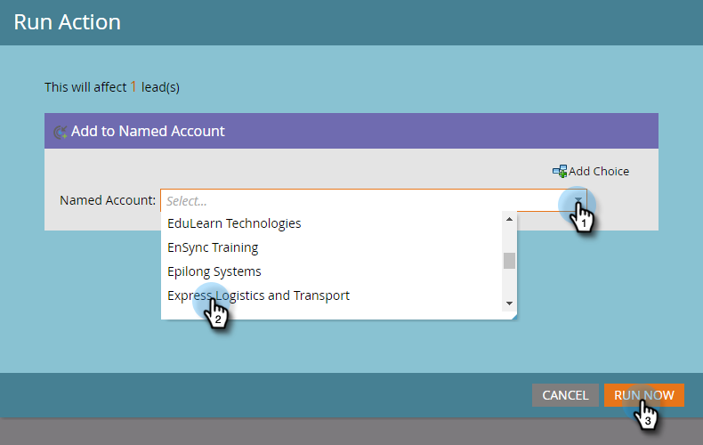

# Ajouter des personnes à un compte nommé {#add-people-to-a-named-account}

Il existe trois façons différentes d&#39;ajouter manuellement des personnes à un compte nommé dans ABM.

## Action de flux unique {#single-flow-action}

1. Cliquez sur **Base de données**.

   

1. Saisissez l’adresse électronique de la personne et appuyez sur Entrée.

   

1. Cliquez sur la personne pour la sélectionner. Cliquez sur la liste déroulante Actions **** personnelles, sur **Marketing** et sélectionnez **Ajouter au compte** nommé.

   

1. Cliquez sur la liste déroulante Compte **** nommé, sélectionnez le compte nommé de votre choix, puis cliquez sur **Exécuter maintenant**.

   

## Étape de flux Campaign intelligent {#smart-campaign-flow-step}

1. Sélectionnez votre Campaign dynamique et cliquez sur **Flux**.

   

1. Dans la zone de recherche, saisissez &quot;Ajouter au compte nommé&quot;.

   

1. Faites glisser le filtre sur la trame.

   

1. Cliquez sur la liste déroulante Compte **** nommé et sélectionnez le compte nommé de votre choix.

   

   C&#39;est tout ! Ensuite, il vous suffit de planifier (ou d’activer) votre campagne intelligente et l’étape de flux début l’ajout de personnes admissibles au compte désigné.

## Importation liste {#list-import}

1. Sélectionnez votre liste, cliquez sur la liste déroulante Actions **** Liste et sélectionnez **Importer la Liste**.

   

1. Après avoir choisi votre fichier et vos paramètres, cliquez sur **Suivant**.

   

1. Faites correspondre les champs de votre choix. Assurez-vous que le champ Compte **** nommé est mappé.

   

1. Choisissez les paramètres de votre choix, puis cliquez sur **Importer**.

   

>[!MORELIKETHIS]
>
>[Correspondance de piste avec compte](/help/marketo/product-docs/account-based-marketing/target/named-accounts/lead-to-account-matching.md)
