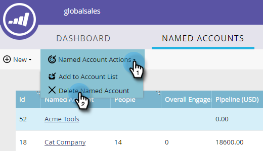

# Supprimer un compte nommé {#delete-a-named-account}

Suivez ces étapes rapides pour supprimer un compte nommé.

1. Sélectionnez la ligne du ou des comptes nommés que vous souhaitez supprimer.

   

   >[!NOTE]
   >
   >Ctrl+clic (Windows) ou Cmd+clic (Mac) pour sélectionner plusieurs comptes nommés.

1. Cliquez sur la liste déroulante **Actions de compte nommé** et sélectionnez **Supprimer le compte nommé**.

   

1. Cliquez sur **Supprimer**.

   

   >[!NOTE]
   >
   >Les comptes qui ont été synchronisés avec votre gestion de la relation client ne peuvent pas être supprimés dans ABM. Si l’option de suppression n’est pas disponible ou si vous recevez un message &quot;Ces comptes ne peuvent pas être supprimés car un ou plusieurs comptes CRM sont sélectionnés&quot;, ils doivent être supprimés directement dans la gestion de la relation client.

