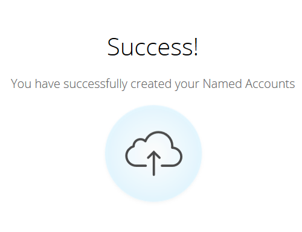

# Comptes Discover {#discover-accounts}

Utilisez l&#39;option Discover pour identifier les comptes de cible potentiels.

## Comptes CRM Discover {#discover-crm-accounts}

Identifiez les comptes de cible potentiels à partir de votre gestion de la relation client.

>[!NOTE]
>
>Une fois que vous avez connecté votre gestion de la relation client à l&#39;ABM de Marketo, **Discover CRM accounts** affiche tous les comptes de gestion de la relation client et les informations pertinentes pour vous aider à choisir les bons comptes nommés. Marketo ajoute des informations supplémentaires sur ce qui est reçu de la gestion de la relation client.

**Personnes**  (dans les comptes de gestion de la relation client de Discover et les Sociétés Discover Marketo) : Inclut les contacts et les pistes. Les pistes peuvent être découvertes à l&#39;aide de la [correspondance de pistes/comptes de Marketo](http://docs.marketo.com/display/DOCS/Lead+to+Account+Matching). **Personnes**  potentielles (dans les comptes de gestion de la relation client de Discover et les Sociétés Discover Marketo) : Indique le nombre de pistes trouvées par Marketo qui pourraient appartenir à un compte CRM.

**Champ**  CRM personnalisé (dans les comptes CRM Discover uniquement) : Cela vous aidera à aligner votre organisation commerciale et marketing pour la sélection de comptes de cible corrects. Une fois que vous avez [mappé le champ CRM personnalisé](http://docs.marketo.com/x/1wnG) avec l&#39;ABM de Marketo, nous vous montrerons les données mappées pour vous aider à identifier vos comptes de cible.

1. Dans Comptes nommés, cliquez sur la liste déroulante **New** et sélectionnez **Discover CRM accounts**.

   

1. Une nouvelle fenêtre/onglet s&#39;ouvre. Sélectionnez le ou les comptes CRM à ajouter à vos comptes nommés et cliquez sur **Suivant**.

   

1. L’écran prévisualisation confirme le nombre de sélections. Cliquez sur **Créer**.

   

   C&#39;est tout ce qu&#39;il y a à ça !

   

## Discover Marketo Sociétés {#discover-marketo-companies}

Identifiez les bonnes sociétés de ciblage.

>[!NOTE]
>
>Dans les Sociétés Discover Marketo, vous verrez les sociétés Marketo qui ne proviennent pas de votre gestion de la relation client.

1. Dans Comptes nommés, cliquez sur la liste déroulante **New** et sélectionnez **Discover Marketo Sociétés**.

   

1. Une nouvelle fenêtre/onglet s&#39;ouvre. Sélectionnez les sociétés à ajouter à vos comptes nommés et cliquez sur **Suivant**.

   

   >[!NOTE]
   >
   >Dans les Sociétés Discover Marketo et Discover CRM, Marketo effectue automatiquement les opérations suivantes :
   >
   > * Recherche les personnes de votre base de données Marketo dont la société est répertoriée dans leur enregistrement. Si vous voyez plusieurs valeurs pour certains attributs (industrie, par exemple), c’est parce que Marketo a trouvé des valeurs différentes répertoriées pour ces personnes. L&#39;attribut avec le plus grand nombre d&#39;accès gagne
   >
   >Dans **Discover CRM** uniquement, Marketo automatiquement :
   >
   > * Synchronise et associe les contacts CRM au compte nommé
   >
   >Dans **Discover Marketo Sociétés** uniquement, Marketo automatiquement :
   >
   > * Filtres de la plupart des Prestataires Internet et des domaines publics (p. ex. [Yahoo.com](https://yahoo.com), [Gmail.com](https://gmail.com)) en tant que noms de société
      >
      > 
   * déduplique les comptes CRM. Si vous avez &quot;Acme&quot; dans un enregistrement et &quot;Acme Inc&quot; (ou l’un des suffixes suivants : Co, Corp, Corporation, Gmbh, Inc, Incorporated, LLC, LLP, LP, Ltd, PA, PC, PLC, PLLC), nous les fusionnerons dans ABM en tant que juste &quot;Acme&quot;
   >
   >Si vous souhaitez que Marketo déduplique les comptes par ID de gestion de la relation client ou propriétaire de compte au lieu de par nom de Société, contactez le [Support marketing](https://nation.marketo.com/t5/Support/ct-p/Support).

1. Cliquez sur la flèche vers le bas située sous la colonne Compte nommé pour afficher la liste déroulante.

   

   >[!CAUTION]
   >
   >À l’avenir, toute nouvelle personne issue de ces sociétés sélectionnées sera automatiquement affectée à ses comptes désignés respectifs. Veuillez vérifier ces sociétés et vous assurer qu&#39;elles sont affectées au compte nommé approprié.

1. Pour sélectionner un compte existant, cliquez sur la liste déroulante **Compte nommé**, sélectionnez le compte de votre choix, puis cliquez sur **Suivant**.

   

   Vous avez également la possibilité de créer un nouveau compte nommé en saisissant le nom de votre choix directement dans la liste déroulante. Cliquez en dehors de la zone lorsque vous avez terminé..

   

   ...et vous verrez votre nouveau compte nommé. À ce stade, il vous suffit de cliquer sur **Suivant** comme à l’étape 4.

   

1. Cliquez sur **Créer**.

   

   Bon travail !

   

>[!NOTE]
>
>Si vous constatez une incompatibilité entre les comptes CRM que vous avez sélectionnés et ce qui se trouve dans la grille de gestion de la relation client de Discover, cela est probablement dû à un ou plusieurs des éléments suivants :
>
>* Disposer de comptes CRM différents avec des noms similaires dédoublés
>* La prochaine synchronisation planifiée n&#39;a pas encore eu lieu.

>[!MORELIKETHIS]
>
>* [Correspondance de piste avec compte](/help/marketo/product-docs/account-based-marketing/target/named-accounts/lead-to-account-matching.md)

