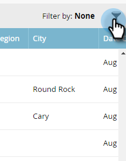

# Filtrage dans les comptes nommés {#filtering-in-named-accounts}

Le filtrage est un excellent moyen de réduire rapidement les données.

>[!NOTE]
>
>Les données des listes déroulantes de filtrage reflètent tous les champs disponibles de votre gestion de la relation client qui ont été synchronisés avec Marketo.

1. Cliquez sur l&#39;icône de filtre.

   

   >[!NOTE]
   >
   >Il existe plusieurs combinaisons de paramètres de recherche. Dans cet exemple, nous recherchons : *Industrie = Banque, Pays = États-Unis, Nombre maximal d&#39;employés = 10000*.

1. Cliquez sur la liste déroulante **Industrie** et sélectionnez **Banking**.

   

1. Cliquez sur la liste déroulante **Pays** et sélectionnez **États-Unis**.

   

1. Sous **Employees**, saisissez &quot;0&quot; dans le champ **Min**, &quot;1000&quot; dans le champ **Max**, puis cliquez sur **Appliquer**.

   

   Et c&#39;est tout ! Les résultats filtrés s’affichent sur le côté gauche de l’écran.

   >[!NOTE]
   >
   >Pour ajouter d’autres filtres à partir desquels choisir, cliquez sur **Ajouter le filtre** en bas à gauche du formulaire.

