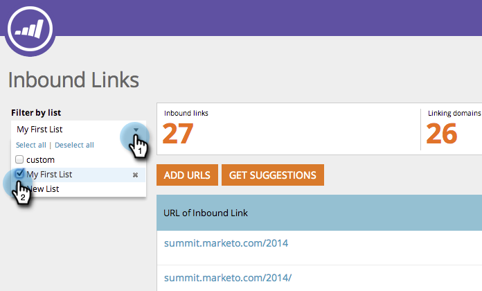

# SEO - Ajouter/supprimer une URL de lien entrant d&#39;une Liste {#seo-add-remove-an-inbound-link-url-from-a-list}

Vous pouvez organiser les URL des liens entrants vers le contenu de votre coeur.

## Ajouter une URL de lien entrant à une Liste {#add-an-inbound-link-url-to-a-list}

1. Accédez à la section Liens entrants.

   

1. Passez la souris sur l’URL du lien entrant que vous souhaitez classer par catégorie. Cliquez sur Ajouter/Supprimer de la liste.

   

1. Cliquez sur la liste à laquelle vous souhaitez accéder à l’URL de votre lien d’entrée.

   

>[!TIP]
>
>Vous pouvez également créer une nouvelle liste pour votre mot-clé. Il vous suffit de taper votre nom dans Créer une nouvelle liste.

## Supprimer une URL de lien entrant d&#39;une Liste {#remove-an-inbound-link-url-from-a-list}

1. Il peut arriver que vous souhaitiez supprimer une URL de lien d’entrée d’une liste.

   

1. Cliquez sur Filtrer par liste dans la liste déroulante. Cliquez sur la liste à nettoyer.

   

1. Passez la souris sur l’URL du lien entrant que vous souhaitez supprimer. Cliquez sur Ajouter/Supprimer de la liste.

   

1. La liste que vous souhaitez organiser sera vérifiée. Cliquez sur le nom de la liste pour supprimer de cette liste l’URL du lien entrant.

   

Tu l&#39;as fait ! Actualisez la page pour mettre à jour l’affichage.
