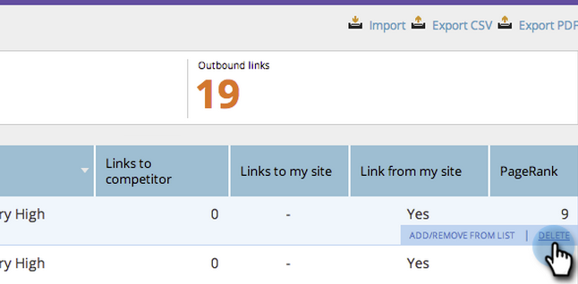

# SEO - Supprimer une URL de lien entrant {#seo-remove-delete-an-inbound-link-url}

Parfois, vous voulez supprimer des liens entrants. Voici comment :

1. Accédez à la section Liens **** entrants.

   

1. Passez la souris sur l’URL du lien entrant que vous souhaitez supprimer.

   
Cliquez sur SUPPRIMER.
   

   Levez-vous ! Vous avez maintenant supprimé ce lien entrant.

