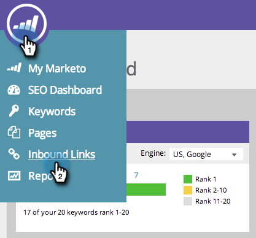

# SEO - Supprimer une URL de lien entrant {#seo-remove-delete-an-inbound-link-url}

Parfois, vous devez supprimer les liens entrants. Voici comment faire.

>[!IMPORTANT]
>
>Le 31 mars 2026, Marketo Engage abandonnera la fonctionnalité Optimisation du moteur de recherche. Veuillez exporter toutes les données pertinentes au plus tard le 30 mars. [En savoir plus](https://nation.marketo.com/t5/product-blogs/marketo-engage-seo-feature-deprecation/ba-p/359060){target="_blank"}.
>
>* [Problèmes d’exportation](https://experienceleague.adobe.com/fr/docs/marketo/using/product-docs/additional-apps/seo/pages/seo-export-issues-to-csv){target="_blank"}
>* [Résultats de l’exportation des mots-clés](https://experienceleague.adobe.com/fr/docs/marketo/using/product-docs/additional-apps/seo/keywords/seo-exporting-keyword-results){target="_blank"}
>* [Tendances de l’exportation des mots-clés](https://experienceleague.adobe.com/fr/docs/marketo/using/product-docs/additional-apps/seo/reports/seo-use-the-keyword-trends-report#exporting-data){target="_blank"}
>* [Exporter les tendances des mots-clés des concurrents](https://experienceleague.adobe.com/fr/docs/marketo/using/product-docs/additional-apps/seo/reports/seo-use-the-competitor-kw-trends-report#exporting-data){target="_blank"}

1. Accédez à la section **[!UICONTROL Liens entrants]**.

   

1. Pointez sur l’URL du lien entrant à supprimer.

   

1. Cliquez sur **[!UICONTROL Supprimer]**.

   

Vous avez maintenant supprimé ce lien entrant.
