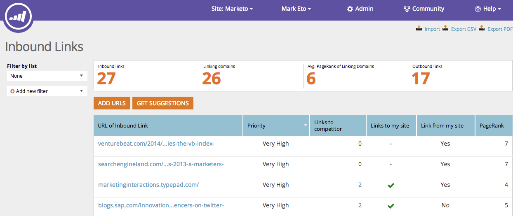

# SEO - Présentation des [!UICONTROL liens entrants] {#seo-understanding-inbound-links}

[!UICONTROL Liens entrants] indiquez aux moteurs de recherche que votre site vaut la peine d’être référencé.

>[!IMPORTANT]
>
>Le 31 mars 2026, Marketo Engage abandonnera la fonctionnalité Optimisation du moteur de recherche. Veuillez exporter toutes les données pertinentes au plus tard le 30 mars. [En savoir plus](https://nation.marketo.com/t5/product-blogs/marketo-engage-seo-feature-deprecation/ba-p/359060){target="_blank"}.
>
>* [Problèmes d’exportation](https://experienceleague.adobe.com/en/docs/marketo/using/product-docs/additional-apps/seo/pages/seo-export-issues-to-csv){target="_blank"}
>* [Résultats de l’exportation des mots-clés](https://experienceleague.adobe.com/en/docs/marketo/using/product-docs/additional-apps/seo/keywords/seo-exporting-keyword-results){target="_blank"}
>* [Tendances de l’exportation des mots-clés](https://experienceleague.adobe.com/en/docs/marketo/using/product-docs/additional-apps/seo/reports/seo-use-the-keyword-trends-report#exporting-data){target="_blank"}
>* [Exporter les tendances des mots-clés des concurrents](https://experienceleague.adobe.com/en/docs/marketo/using/product-docs/additional-apps/seo/reports/seo-use-the-competitor-kw-trends-report#exporting-data){target="_blank"}

## Définition des colonnes {#definition-of-columns}

| Titre de colonne | Description |
|---|---|
| [!UICONTROL  URL du lien entrant ] | La page web en question. |
| [!UICONTROL Priorité] | Quelle valeur cette opportunité a-t-elle pour votre classement de page ? |
| [!UICONTROL Liens avec le concurrent] | Indique si un concurrent est lié à dans cette URL. |
| [!UICONTROL Liens vers mon site] | Indique si votre site est lié à cette URL. |
| [!UICONTROL Liens de mon site] | Indique si votre site renvoie à cette URL. |
| [!UICONTROL PageRank] | Indique que les URL de page ont le rang dans la recherche (1 - 10) |

Maintenant que vous comprenez les liens entrants, nous pouvons suggérer d’autres opportunités de liens entrants pour votre site.

>[!MORELIKETHIS]
>
>[Obtenir des suggestions de lien entrant](/help/marketo/product-docs/additional-apps/seo/inbound-links/seo-get-inbound-link-suggestions.md)
