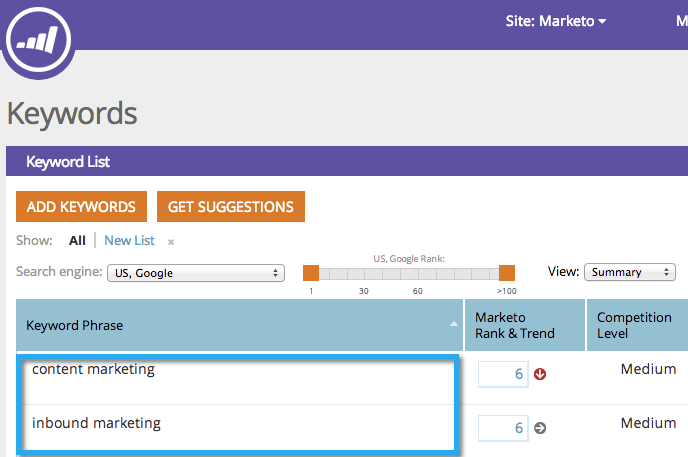

# SEO - Mots-clés d&#39;Ajoute {#seo-add-keywords}

Les mots-clés sont des expressions que les visiteurs saisissent dans les moteurs de recherche. Ajoutez les mots-clés les plus pertinents pour votre activité.

>[!NOTE]
>
>Si vous avez beaucoup de mots-clés, vous pouvez [les importer avec un fichier CSV](/help/marketo/product-docs/additional-apps/seo/keywords/seo-importing-keywords-with-a-csv.md).

1. Accédez à la section **Mots-clés**.

   

1. Saisissez les mots-clés à cible et cliquez sur **Enregistrer**.

   

   >[!TIP]
   >
   >Séparez les mots-clés par des sauts de ligne ou des virgules.

   

   >[!MORELIKETHIS]
   >
   >[Présentation des mots-clés (Vue de résumé)](/help/marketo/product-docs/additional-apps/seo/keywords/seo-understanding-keywords.md)

Bon travail ! Vous devriez maintenant voir vos nouveaux ajouts à la liste de mots-clés.
