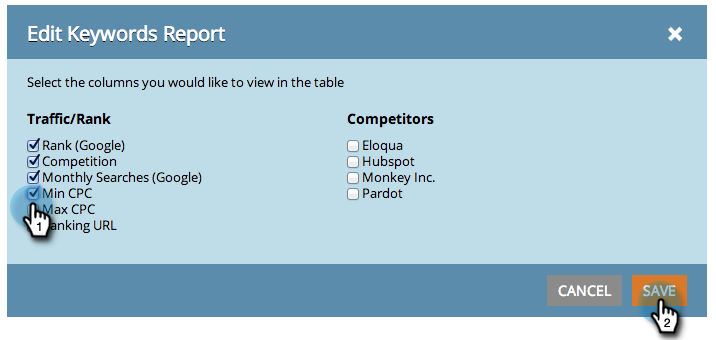

# Optimisation des moteurs de recherche - Ajouter/supprimer des colonnes de votre Vue de mots-clés {#seo-add-remove-columns-from-your-keywords-view}

Vous pouvez ajuster votre vue de mots-clés pour afficher les données qui vous intéressent le plus.

1. Accédez à la section **Mots-clés** .

   

   Il s’agit des colonnes par défaut :

1. 

1. Cliquez sur l’icône représentant un engrenage.

   

1. Sélectionnez ou désélectionnez les colonnes à afficher. Cliquez sur **ENREGISTRER**.

   

   Super ! Vous avez maintenant personnalisé votre vue de mots-clés.

   

   >[!NOTE]
   >
   >**Articles connexes**
   >
   >    
   >    
   >    * [Présentation des mots-clés - Vue de résumé](seo-understanding-keywords.md)

