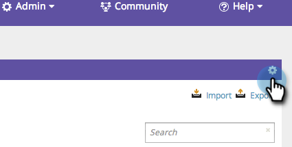

# SEO - Ajouter/supprimer des colonnes dans la vue Mots-clés {#seo-add-remove-columns-from-your-keywords-view}

Vous pouvez ajuster l’affichage des mots-clés pour afficher les données qui vous intéressent le plus.

1. Accédez à la section **[!UICONTROL Mots-clés]**.

   

   Il s’agit des colonnes par défaut :

   

1. Cliquez sur l’icône d’engrenage.

   

1. Sélectionnez ou désélectionnez les colonnes à afficher. Cliquez sur **[!UICONTROL Enregistrer]**

   

   Génial ! Vous avez maintenant personnalisé l’affichage des mots-clés.

   

   >[!MORELIKETHIS]
   >
   >[Présentation des mots-clés - Vue récapitulative](/help/marketo/product-docs/additional-apps/seo/keywords/seo-understanding-keywords.md)
