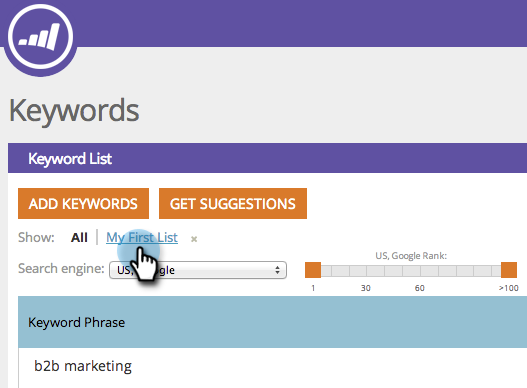

# SEO - Filtrer les résultats des mots-clés {#seo-filter-keyword-results}

Vous pouvez avoir beaucoup de [mots-clés](seo-understanding-keywords.md). Vous pouvez les filtrer de différentes manières :

## Filtrer par liste {#filter-by-list}

1. Accédez à la section **Mots-clés**.

   

1. Cliquez sur le nom de la liste qui vous intéresse.

   

   >[!NOTE]
   >
   >Si vous ne voyez aucune liste, [l](../../../../product-docs/additional-apps/seo/understanding-seo/seo-managing-lists.md) [apprenez comment créer une liste de mots-clés](../../../../product-docs/additional-apps/seo/understanding-seo/seo-managing-lists.md).

Doux ! Vous ne verrez plus que les mots-clés de cette liste.

## Filtrage par classement SERP {#filter-by-serp-rank}

1. Accédez à la section Mots-clés.

   

   Les carrés orange définissent vos limites supérieure (gauche) et inférieure (droite). Le filtre fonctionne sur le [classement SERP](../../../../product-docs/additional-apps/seo/understanding-seo/understanding-search-engine-optimization.md) du mot-clé.

1. Faites glisser les carrés oranges vers la gauche/la droite pour filtrer les résultats.

   

## Filtrer par recherche {#filter-by-search}

Vous pouvez également trouver les mots-clés que vous recherchez en utilisant le champ de recherche dans le coin supérieur droit.

1. Accédez à la section **Mots-clés**.

   

1. Entrez votre mot-clé dans le champ de recherche.

   

   Félicitations ! Vous êtes maintenant un mot-clé filtrant le samouraï guerrier !

