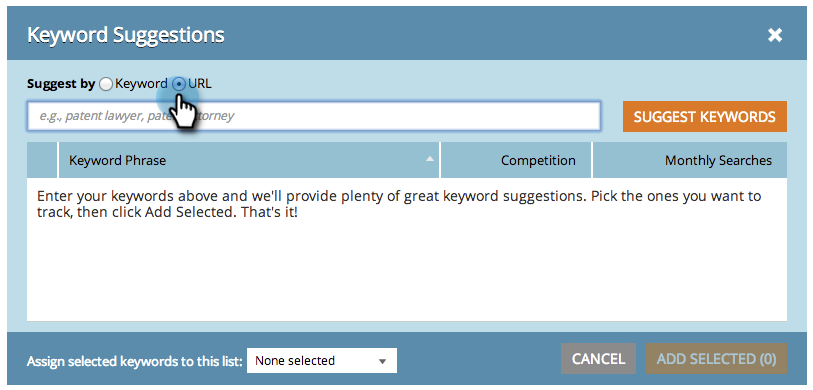

# SEO - Obtenir les mots-clés suggérés {#seo-get-suggested-keywords}

L’optimisation du référencement du marketing peut suggérer quels mots-clés suivre. Nous pouvons faire des suggestions en fonction d&#39;un mot-clé ou de l&#39;URL d&#39;un site. Allez-y !

## Obtenir des suggestions de mots-clés à l&#39;aide d&#39;un mot-clé {#get-keyword-suggestions-using-a-keyword}

1. Accédez à la section **Mots-clés**.

   

1. Cliquez sur **Obtenir des suggestions**.

   

1. Entrez un **mot-clé**. Cliquez sur **Suggérer des mots-clés**.

   

   >[!TIP]
   >
   >Saviez-vous que vous pouvez [ajouter votre mot-clé à une liste nouvelle ou existante](/help/marketo/product-docs/additional-apps/seo/understanding-seo/seo-managing-lists.md) ici ?

1. Sélectionnez le ou les mots-clés suggérés. Cliquez sur **Ajouter sélection**.

   

   Super ! Votre mot-clé a été ajouté.

   

   Yeehaw ! Maintenant que vous savez comment obtenir des suggestions de mots-clés basées sur un mot-clé, essayez d&#39;obtenir des suggestions basées sur une URL.

## Obtenir des suggestions de mots-clés à partir d&#39;une URL {#get-keyword-suggestions-from-a-url}

1. Accédez à la section **Mots-clés**.

   

1. Cliquez sur **Obtenir des suggestions**.

   

1. Définissez **Suggérer par** sur **URL**.

   

1. Saisissez une **URL** et cliquez sur **Suggérer des mots-clés**.

   

   >[!TIP]
   >
   >Saviez-vous que vous pouvez [ajouter votre mot-clé à une liste nouvelle ou existante](/help/marketo/product-docs/additional-apps/seo/understanding-seo/seo-managing-lists.md) ici ?

1. Sélectionnez le ou les mots-clés suggérés. Cliquez sur **Ajouter sélection**.

   

1. Super ! Votre mot-clé a été ajouté.

   

   OK, vous êtes en train de faire un rockin. Continue !

   >[!MORELIKETHIS]
   >
   >* [Présentation des mots-clés (Vue de résumé)](/help/marketo/product-docs/additional-apps/seo/keywords/seo-understanding-keywords.md)
   >* [Ajouter/supprimer des mots-clés d&#39;une Liste](/help/marketo/product-docs/additional-apps/seo/keywords/seo-add-remove-keywords-from-a-list.md)

