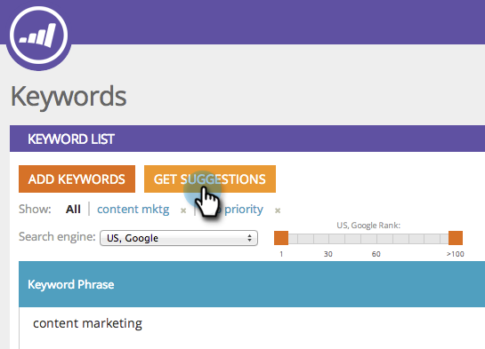

# SEO - Obtenir des suggestions de mots-clés {#seo-get-suggested-keywords}

L’optimisation du moteur de recherche Marketo peut vous suggérer les mots-clés dont vous devez effectuer le suivi. Nous pouvons vous donner des suggestions en fonction d&#39;un mot-clé ou de l&#39;URL d&#39;un site.

>[!IMPORTANT]
>
>Le 31 mars 2026, Marketo Engage abandonnera la fonctionnalité Optimisation du moteur de recherche. Veuillez exporter toutes les données pertinentes au plus tard le 30 mars. [En savoir plus](https://nation.marketo.com/t5/product-blogs/marketo-engage-seo-feature-deprecation/ba-p/359060){target="_blank"}.
>
>* [Problèmes d’exportation](https://experienceleague.adobe.com/en/docs/marketo/using/product-docs/additional-apps/seo/pages/seo-export-issues-to-csv){target="_blank"}
>* [Résultats de l’exportation des mots-clés](https://experienceleague.adobe.com/en/docs/marketo/using/product-docs/additional-apps/seo/keywords/seo-exporting-keyword-results){target="_blank"}
>* [Tendances de l’exportation des mots-clés](https://experienceleague.adobe.com/en/docs/marketo/using/product-docs/additional-apps/seo/reports/seo-use-the-keyword-trends-report#exporting-data){target="_blank"}
>* [Exporter les tendances des mots-clés des concurrents](https://experienceleague.adobe.com/en/docs/marketo/using/product-docs/additional-apps/seo/reports/seo-use-the-competitor-kw-trends-report#exporting-data){target="_blank"}

## Obtenir des suggestions de mots-clés à l’aide d’un mot-clé {#get-keyword-suggestions-using-a-keyword}

1. Accédez à la section **[!UICONTROL Mots-clés]**.

   

1. Cliquez sur **[!UICONTROL Obtenir des suggestions]**.

   

1. Saisissez un **[!UICONTROL Mot-clé]**. Cliquez sur **[!UICONTROL Suggérer des mots-clés]**.

   

   >[!TIP]
   >
   >Saviez-vous que vous pouvez [ajouter votre mot-clé à une liste nouvelle ou existante](/help/marketo/product-docs/additional-apps/seo/understanding-seo/seo-managing-lists.md) ici même ?

1. Sélectionnez le ou les mots-clés suggérés. Cliquez sur **[!UICONTROL Ajouter la sélection]**.

   

   Fantastique ! Votre mot-clé a été ajouté.

   

   Oui ! Maintenant que vous savez comment obtenir des suggestions de mots-clés basées sur un mot-clé, essayez d’obtenir des suggestions basées sur une URL.

## Obtenir des suggestions de mots-clés à partir d’une URL  {#get-keyword-suggestions-from-a-url}

1. Accédez à la section **[!UICONTROL Mots-clés]**.

   

1. Cliquez sur **[!UICONTROL Obtenir des suggestions]**.

   

1. Définissez **[!UICONTROL Suggérer par]** sur **[!UICONTROL URL]**.

   

1. Saisissez une **[!UICONTROL URL]** puis cliquez sur **[!UICONTROL Suggérer des mots-clés]**.

   

   >[!TIP]
   >
   >Saviez-vous que vous pouvez [ajouter votre mot-clé à une liste nouvelle ou existante](/help/marketo/product-docs/additional-apps/seo/understanding-seo/seo-managing-lists.md) ici même ?

1. Sélectionnez le ou les mots-clés suggérés. Cliquez sur **[!UICONTROL Ajouter la sélection]**.

   

Fantastique ! Votre mot-clé a été ajouté.

>[!MORELIKETHIS]
>
>* [Présentation des mots-clés (vue Résumé)](/help/marketo/product-docs/additional-apps/seo/keywords/seo-understanding-keywords.md)
>* [Ajouter/supprimer des mots-clés d’une liste](/help/marketo/product-docs/additional-apps/seo/keywords/seo-add-remove-keywords-from-a-list.md)
