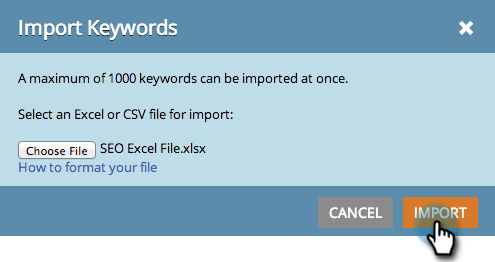

# SEO - Importation de mots-clés avec un fichier CSV {#seo-importing-keywords-with-a-csv}

1. Vous pouvez [ajouter des mots-clés](seo-add-keywords.md) manuellement, [obtenir des suggestions](seo-get-suggested-keywords.md) de mots-clés et même importer des mots-clés à partir d’un fichier CSV. Voici comment procéder à l&#39;importation.
1. Accédez à la section **Mots-clés** .

   

1. Cliquez sur **Importer**.

   

1. Choisissez un fichier Excel à importer.

   

1. Cliquez sur **Choisir un fichier**.

   

   >[!NOTE]
   >
   >Les limites d’importation varient selon votre abonnement. Contactez votre représentant commercial pour plus d&#39;informations.

1. Cliquez sur **IMPORTER**.

   

   Les nouveaux mots-clés doivent s&#39;afficher dans votre liste de mots-clés par ordre alphabétique.

   

   Le chargement de toutes les données associées à chaque mot-clé peut prendre quelques minutes. Méditez sur le sens de la vie.

   >[!NOTE]
   >
   >**Articles connexes**
   >
   >    
   >    
   >    * [Présentation des mots-clés (Vue de résumé)](seo-understanding-keywords.md)
   >    * [Ajouter/supprimer des mots-clés d&#39;une Liste](seo-add-remove-keywords-from-a-list.md)

